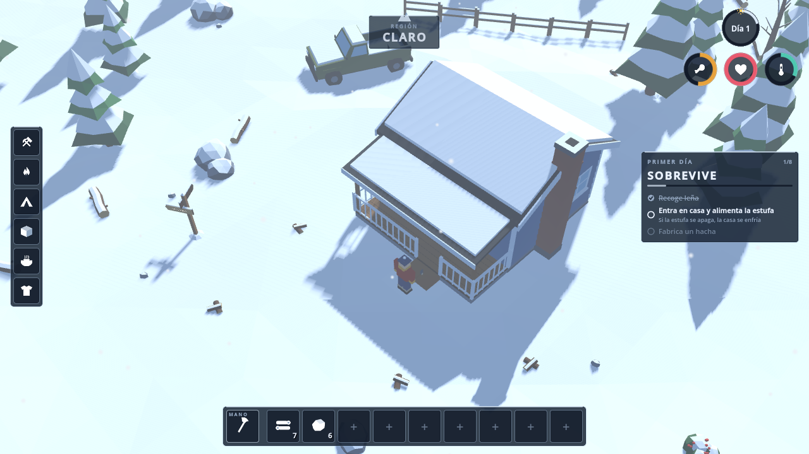
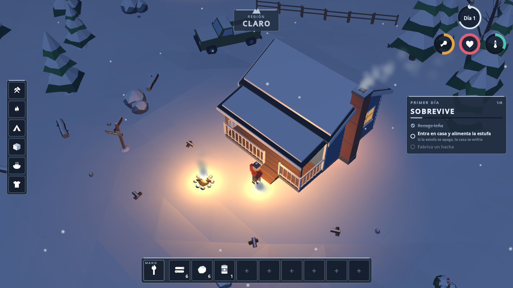
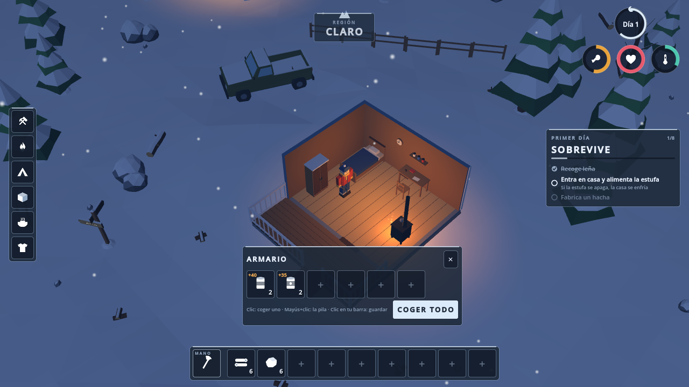
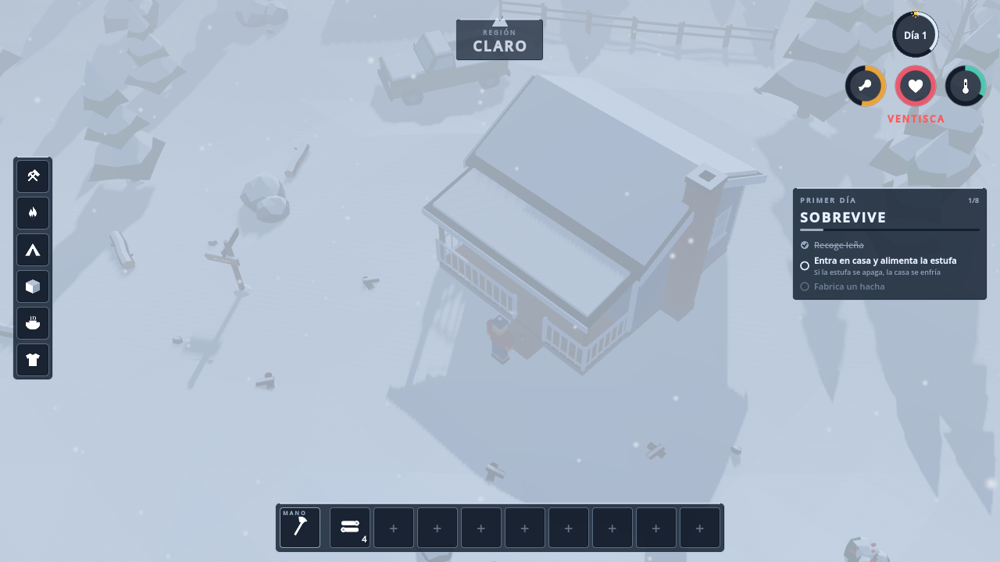
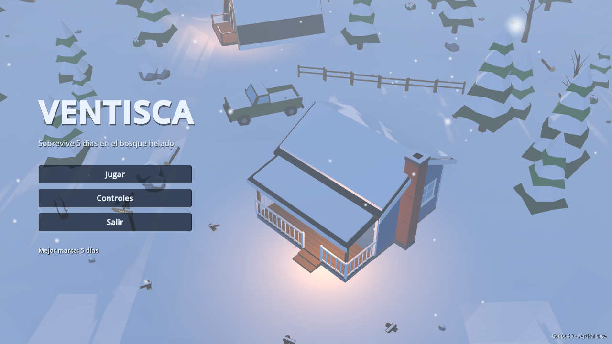

# VENTISCA

*Sobrevive cinco días en el bosque helado.* Juego de supervivencia invernal low-poly hecho con **Godot 4.7.2** (GDScript).

Documentación de diseño y técnica en `docs/` (`GDD.md`, `ARCHITECTURE.md`, `ASSET_SPEC.md`).
El plan para la versión de mundo abierto con zombis y cooperativo de 1–4 jugadores está en
`docs/PLAN_MAESTRO.md` (con el diseño, la arquitectura y el contrato de arte v2 en `docs/v2/`).

| Día | Noche | Interior (corte) |
|---|---|---|
|  |  |  |
| **Ventisca** | **Menú** | |
|  |  | |

## Abrir el proyecto

1. Instala Godot **4.7.2** (renderizador Forward+ recomendado; también funciona en Compatibility/OpenGL).
2. Abre `winter-survival/project.godot` desde el gestor de proyectos (o `godot --path winter-survival`).
3. Pulsa *Ejecutar* (F5). La escena principal es `scenes/main/main_menu.tscn`.

Los modelos `.glb` de `assets/models/` son opcionales: si falta alguno, el juego usa un
sustituto de primitivas con los mismos nombres de nodo (`scripts/data/placeholders.gd`).

## Controles

| Acción | Teclado / ratón | Mando |
|---|---|---|
| Moverse | W A S D / flechas | Stick izquierdo |
| Correr | Mayús (mantener) | L3 |
| Interactuar / atacar lo que hay bajo el cursor | Clic izquierdo (R: lo más cercano) | X |
| Atacar al lobo más cercano | Espacio | RT |
| Cancelar / cerrar panel | Clic derecho, Esc | B |
| Pausa | Esc | Start |
| Girar cámara | Q / E | LB / RB |
| Zoom | Rueda del ratón | D-pad arriba/abajo |
| Ranuras de la barra | Teclas 1–9 | D-pad izq/der + A |
| Fabricación | Tab | Y |
| Equipar/guardar antorcha | T | D-pad abajo (mantener) |
| Comer lo mejor disponible | F | — |

## Reconstruir los modelos 3D (Blender)

```bash
cd winter-survival/blender && python3 build_all.py
```

Genera `assets/models/*.glb` y ejecuta `verify_assets.py`. Después, reimporta en Godot
(`godot --headless --path winter-survival --import`).

## Multijugador (M1)

Siempre hay un **servidor dedicado autoritativo** (PLAN C14): *Jugar* lanza este mismo ejecutable como proceso hijo
(`--headless -- --server --config user://server.cfg`) y se conecta a `127.0.0.1:7777`; *Unirse a servidor* conecta a
`ip:puerto` con contraseña (nonce + HMAC‑SHA256, versión y protocolo comprobados, identidad en `user://identity.cfg`).
En la web (o con `--offline`) el servidor corre dentro del mismo proceso (`OfflineMultiplayerPeer`), que es también el
modo de las pruebas. Chat: Intro. HUD de red: F3 (RTT, pérdida, kB/s, correcciones/s).

```bash
godot --headless --path . -- --server --config server/server.cfg.example   # servidor dedicado (UDP 7777, admin TCP 127.0.0.1:7778)
server/admin.sh status | players | save | save-and-quit | "say hola" | "rule friendly_fire full"
```

`server.cfg` (`server/server.cfg.example`): nombre, contraseña, puerto, `max_players`, `admin_port`/`admin_token`,
semilla, `day_length_sec`, y las reglas `pvp` / `friendly_fire` (`off|reduced|full`) que solo lee `DamageResolver`.
El apagado limpio es siempre por el socket de admin (`save-and-quit`): el headless muere al instante con SIGTERM.

## Pruebas

```bash
cd winter-survival
./tests/run_all.sh [--shots]         # todas las puertas M0+M1: import, parse, humo (servidor local), contrato de arte, perf, red [, capturas]
./tests/run_smoke.sh                 # importa + prueba de humo sin pantalla (SMOKE TEST OK / FAILED); offline = servidor local en proceso
./tests/net/run_net_test.sh --clients 4 --duration 60 --soak 90   # 1 servidor + 4 clientes headless: se ven moverse, chat, FF bloqueado, reconexión, ≤ 5 kB/s, soak
./tests/run_screenshots.sh [carpeta] # capturas day/night/blizzard/interior/menu con xvfb + OpenGL (preset `multi` = cliente unido a un servidor)
./tests/run_perf.sh [--placeholders] # sonda de rendimiento (draw calls, objetos, ms) → tests/perf/last.json vs tests/perf_budgets.json
godot --headless --path . -s tests/inspect_models.gd [++ --quiet] [--placeholders]  # contrato ASSET_SPEC v2 de cada .glb (o de los placeholders)
```

Convenciones v2 (`docs/v2/`): frente de los modelos = **+Z** (`Vector3.MODEL_FRONT`), color de vértice + material
compartido `assets/materials/world_vcol.tres` (`snow_amount` global), física **Jolt**, partículas GPU y presets de
calidad `alto/medio/compat` (autoload `Quality`, `user://settings.cfg`).
