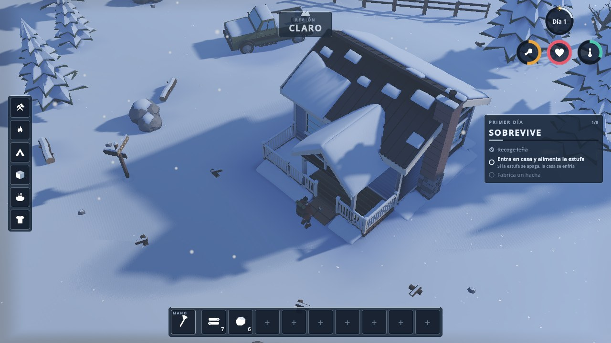
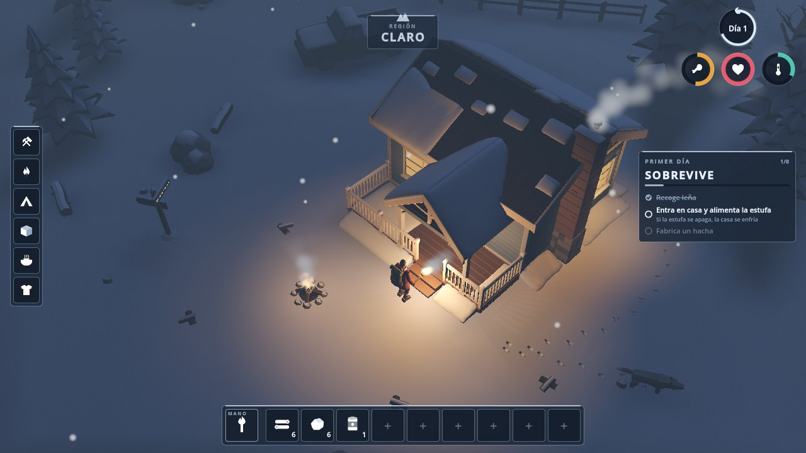
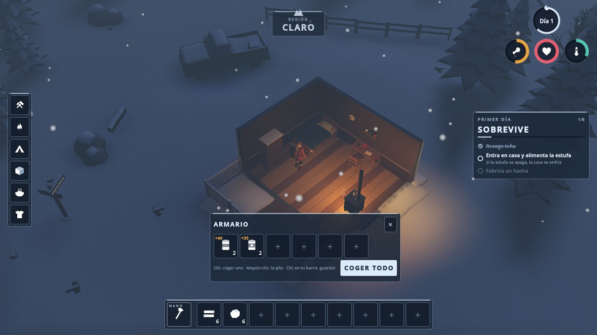
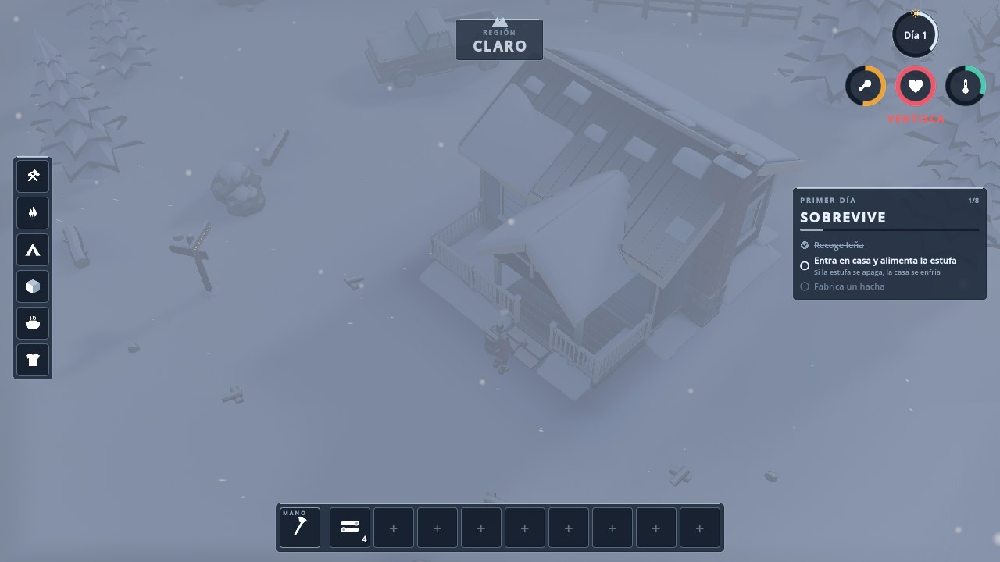
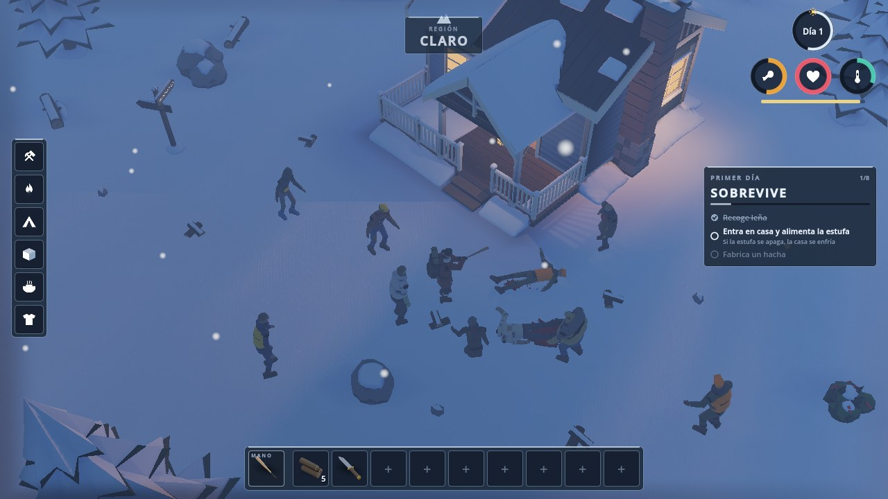

# VENTISCA

*Sobrevive cinco días en el bosque helado.* Juego de supervivencia invernal low-poly hecho con **Godot 4.7.2** (GDScript).

Documentación de diseño y técnica en `docs/` (`GDD.md`, `ARCHITECTURE.md`, `ASSET_SPEC.md`).
El plan para la versión de mundo abierto con zombis y cooperativo de 1–4 jugadores está en
`docs/PLAN_MAESTRO.md` (con el diseño, la arquitectura y el contrato de arte v2 en `docs/v2/`).

Capturas con los gráficos de G1 (Forward+):

| Día | Noche | Interior (corte) | Ventisca |
|---|---|---|---|
|  |  |  |  |

Comparación con la referencia: `docs/screenshots/g1/referencia_vs_g1.jpg`. Las capturas del slice original
(antes de G1) siguen en `docs/screenshots/*.png`.

## Abrir el proyecto

1. Instala Godot **4.7.2** (renderizador Forward+ recomendado; también funciona en Compatibility/OpenGL).
2. Abre `winter-survival/project.godot` desde el gestor de proyectos (o `godot --path winter-survival`).
3. Pulsa *Ejecutar* (F5). La escena principal es `scenes/main/main_menu.tscn`.

Los modelos `.glb` de `assets/models/` son opcionales: si falta alguno, el juego usa un
sustituto de primitivas con los mismos nombres de nodo (`scripts/data/placeholders.gd`).

## Controles

| Acción | Teclado / ratón | Mando |
|---|---|---|
| Moverse | W A S D / flechas | Stick izquierdo |
| Correr | Mayús (mantener) | L3 |
| Interactuar / atacar lo que hay bajo el cursor | Clic izquierdo (R: lo más cercano) | X |
| Golpe cargado (con un arma en la mano) | Mantener clic o Espacio | Mantener RT |
| Atacar al más cercano (zombi o lobo) | Espacio | RT |
| Empujar | V | LT |
| Pisotear a un zombi derribado o a un reptador | Clic sobre él | X / RT |
| Ejecución silenciosa (cuchillo) | Clic sobre un zombi congelado o que no te ha visto | X / RT |
| Agacharse (sigilo) | Ctrl | R3 |
| Reanimar a un compañero derribado | Mantener R a su lado | Mantener X |
| Rendirse (derribado) | Mantener X (3 s) | Mantener Y |
| Chat / comandos | Intro | — |
| Cancelar / cerrar panel | Clic derecho, Esc | B |
| Pausa | Esc | Start |
| Girar cámara | Q / E | LB / RB |
| Zoom | Rueda del ratón | D-pad arriba/abajo |
| Ranuras de la barra | Teclas 1–9 | D-pad izq/der + A |
| Fabricación | Tab | Y |
| Equipar/guardar antorcha | T | D-pad abajo (mantener) |
| Comer lo mejor disponible | F | — |

## Pruebas

```bash
tests/run_all.sh                 # parse, unit (persistencia), smoke, inspect_models, perf, red (basic/shared_world/far/zombies), determinismo, perf walk, perf horde
tests/run_smoke.sh               # solo el smoke test (servidor local en el mismo proceso)
tests/net/run_net_test.sh --clients 4 --duration 60 --soak 90                              # escenario basic (M1)
tests/net/run_net_test.sh --clients 3 --duration 60 --soak 90 --scenario shared_world      # mundo compartido (M2)
tests/net/run_net_test.sh --clients 2 --duration 30 --soak 45 --scenario far --port 7797   # 2 jugadores a 1 km (M3)
tests/run_determinism.sh         # 50 chunks generados por cliente y servidor en dos procesos: hashes iguales (M3)
tests/run_perf_walk.sh --cpu     # 2.26 km a 25 m/s: coste de streaming ≤ 2 ms/frame (headless); sin --cpu: xvfb + llvmpipe
tests/net/run_net_test.sh --clients 4 --duration 62 --soak 70 --scenario zombies --port 7807   # zombis y combate en red (M4)
tests/run_perf_horde.sh          # servidor dedicado + 4 bots + 200 zombis: tick mediano ≤ 8 ms (M4)
RENDER=forward tests/run_screenshots.sh /tmp/shots   # capturas (Compatibility por defecto; Forward+ con lavapipe)
RENDER=forward tests/run_screenshots.sh /tmp/shots zombies   # la pelea al atardecer delante de la cabaña (M4)
tests/run_multi_shot.sh /tmp/shots/multi.png         # captura con 2 jugadores remotos (chaquetas distintas)
```

## Reconstruir los modelos 3D (Blender)

```bash
cd winter-survival/blender && python3 build_all.py
```

Genera `assets/models/*.glb` y ejecuta `verify_assets.py`. Después, reimporta en Godot
(`godot --headless --path winter-survival --import`).

## Multijugador (M1)

Siempre hay un **servidor dedicado autoritativo** (PLAN C14): *Jugar* lanza este mismo ejecutable como proceso hijo
(`--headless -- --server --config user://server.cfg`) y se conecta a `127.0.0.1:7777`; *Unirse a servidor* conecta a
`ip:puerto` con contraseña (nonce + HMAC‑SHA256, versión y protocolo comprobados, identidad en `user://identity.cfg`).
En la web (o con `--offline`) el servidor corre dentro del mismo proceso (`OfflineMultiplayerPeer`), que es también el
modo de las pruebas. Chat: Intro. HUD de red: F3 (RTT, pérdida, kB/s, correcciones/s).

```bash
godot --headless --path . -- --server --config server/server.cfg.example   # servidor dedicado (UDP 7777, admin TCP 127.0.0.1:7778)
server/admin.sh status | players | save | save-and-quit | "say hola" | "rule friendly_fire full"
```

`server.cfg` (`server/server.cfg.example`): nombre, contraseña, puerto, `max_players`, `admin_port`/`admin_token`,
semilla, `day_length_sec`, y las reglas `pvp` / `friendly_fire` (`off|reduced|full`) que solo lee `DamageResolver`.
El apagado limpio es siempre por el socket de admin (`save-and-quit`): el headless muere al instante con SIGTERM.

## Mundo compartido (M2)

Todo lo que hace el slice (talar, recoger, estufa, armario, fabricar, colocar, comer, cazar) lo valida el servidor por
`wid` (`NetWorld.request_interact(wid, acción, arg)`: distancia + tolerancia, herramienta, acción declarada por el
objeto, *rate limit*, infracciones). El estado del mundo que se aparta de la semilla vive en un `ChunkDelta` por chunk
(el claro son los chunks 23–25): los cambios se difunden como eventos y el que entra tarde recibe cada chunk comprimido.
Los armarios y la camioneta son de uso exclusivo ("en uso" para los demás). El servidor dedicado guarda perfiles,
reloj y deltas en `world_save.json` (`FileBackend`, escritura atómica; SQLite llegará en M5) y los reaplica al arrancar:
un árbol talado sigue talado. El jugador es ya el **superviviente esquelético** (`chars/survivor_*.glb`, una chaqueta
distinta por jugador, `AnimationTree` con el ciclo escalado a la velocidad real, cabeza que sigue al cursor, herramienta
en la mano). Con `debug_commands=true` en `server.cfg` (o sin red) el chat acepta `/kit`, `/give <item> <n>` y
`/tp <x> <z>`.

## Mundo abierto por chunks (M3)

El mundo mide **3 × 3 km**: 48 × 48 chunks de 64 m alrededor del claro, que queda en el centro exactamente como era.
Alrededor hay un bosque determinista generado con la semilla del servidor, que el cliente recibe al conectarse y con
la que genera el mismo mundo. Tiene:

- el relieve del plano macro (`data/world/macro_map.png`, generado por `tools/gen_macro_map.gd` a partir del mapa
  de PLAN §4.2);
- el Lago de las Ánimas, de hielo plano y transitable, al suroeste;
- lechos de carretera con roderas;
- 4 cabañas aisladas y una torre de vigilancia (con corte al entrar), y restos de acampada;
- un muro con niebla en el borde (±1450 m).

Los chunks se generan en hilos de fondo (`WorkerThreadPool`). En el hilo principal solo se montan, en pasos de
≤ 2 ms por frame: el anillo 1 completo y el anillo 2 precargado, con prioridad hacia donde vas. Los árboles son
MultiMesh; uno se convierte en árbol real solo cuando lo golpeas, y el talado persiste por chunk.

En red, cada jugador recibe solo lo que pasa en los 3 × 3 chunks a su alrededor: poses, animales, eventos e
instantáneas. El servidor hiberna los chunks vacíos al cabo de 60 s. Con `debug_commands`, `/tp <x> <z>` lleva
a cualquier punto (por ejemplo, `/tp -780 340` al lago).

### Probar el cooperativo con amigos (hasta 4)

1. **Descarga la versión de escritorio.** En GitHub, pestaña *Actions* → última ejecución de **VENTISCA** del PR →
   sección *Artifacts* → `ventisca-windows` (o `ventisca-linux`). Descomprime y abre `Ventisca.exe`
   (`ventisca.x86_64` en Linux). Cada cambio del PR genera una versión nueva.
2. **Anfitrión:** pulsa **Jugar**. El juego arranca un servidor dedicado propio en segundo plano (UDP 7777). En
   Windows, acepta el aviso del cortafuegos para las redes privadas.
3. **Amigos en la misma red:** **Unirse a servidor** → IP local del anfitrión (`ipconfig` en Windows) → puerto 7777.
4. **Amigos por internet**, una de estas tres:
   - una VPN de juego (Tailscale, ZeroTier o Radmin VPN) y la IP que os dé;
   - redirigir **UDP 7777** del router al PC del anfitrión y usar su IP pública;
   - un servidor dedicado en un VPS Linux: `./ventisca.x86_64 --headless -- --server --config server.cfg`
     (plantilla en `server/server.cfg.example`; ponle contraseña).
5. Todos deben usar **la misma versión** (el servidor rechaza versiones distintas). `F3` muestra ping y tráfico.

La demo del navegador es solo para un jugador: el navegador no puede abrir conexiones UDP.

## Zombis y combate (M4)



La captura se genera con `RENDER=forward tests/run_screenshots.sh <carpeta> zombies`.

**Solo el servidor simula los zombis** (`ZombieSystem`, con los datos en arrays). Hay cinco tipos:

- **Caminante**: el zombi normal.
- **Corredor**: esprinta unos segundos y luego se cansa y trota.
- **Reptador**: se arrastra por el suelo; se remata con un pisotón.
- **Congelado**: está quieto en la nieve hasta que lo despierta un ruido fuerte cerca, alguien que se le acerca o el calor.
- **Hinchado**: al morir revienta en una nube que roba calor.

Cada zombi pasa por estos estados: reposo, deambular, investigar, perseguir, atacar, aturdido, derribado, muerto
y congelado. Detecta a los jugadores así:

- **Vista**: un cono de 120° que alcanza 25 m de día, 12 m de noche y 6 m en ventisca.
- **Oído**: cada golpe o empujón es un `SoundEvent`, y en pantalla aparece como un anillo blanco. Los pasos
  también se oyen: 2 m si vas agachado, 6 m andando y 14 m corriendo.
- **Olfato**: a pocos metros, solo si estás sangrando.
- **Memoria**: recuerda dónde te vio por última vez y va a buscarte allí.

**Navegación.** Cada chunk tiene su propia navmesh (Recast), que se hornea en hilos de fondo y se une con las de
los chunks vecinos. Si el camino está despejado, el zombi va en línea recta. Si no, pide una ruta para rodear la
cabaña, los árboles, las rocas y la camioneta. Se hacen como mucho 40 consultas por tick, y un grupo que persigue
a la misma persona comparte la ruta.

**Población y director.** Cada chunk tiene su densidad de zombis. En el bosque hay zombis durmientes, y fuera,
congelados. El director reparte la presión en tres fases: acumulación, pico y alivio. También manda hordas
errantes. El primer día es suave: de día no aparece ninguno, y la primera noche solo unos pocos rondan el claro.
Con `/director off` se apaga.

**Red.** Cada jugador solo recibe los zombis de los chunks que tiene cerca: el servidor avisa cuando uno entra o
sale de su zona. Las instantáneas ocupan 9 B por zombi y se envían con más frecuencia cuanto más cerca está el
zombi, con un fotograma completo cada segundo. Con 4 jugadores y 100 zombis se gastan unos 5 kB/s por cliente
(el límite de la prueba es 15 kB/s). El cliente dibuja hasta 48 zombis (24 en la web), con animaciones más
sencillas para los que están lejos.

### Combate cuerpo a cuerpo

El servidor valida cada golpe: que el zombi esté en el cono de 110° delante de ti y dentro del alcance del arma
más 0.5 m. También retrocede hasta 150 ms para ver dónde estaba el zombi en tu pantalla. El daño llega en el
momento del impacto de la animación (`data/anim_events.json`): 0.27 s con armas de una mano, 0.36 s con las de dos.

| Arma | Daño | Cadencia | Alcance | Notas |
|---|---|---|---|---|
| Puños | 6 | 0.6 s | 1.1 m | — |
| Cuchillo | 18 | 0.4 s | 1.2 m | silencioso; ejecuta a congelados y a los que no te han visto |
| Palanca | 28 | 0.7 s | 1.6 m | 15 % de crítico |
| Bate | 30 | 0.65 s | 1.7 m | 2 objetivos, derriba (35 %) |
| Bate con clavos | 38 | 0.65 s | 1.7 m | 2 objetivos, derriba, se gasta antes |
| Machete | 38 | 0.55 s | 1.5 m | 20 % de crítico |
| Hacha | 45 | 0.9 s | 1.7 m | 30 % de crítico, también tala |

- Los críticos hacen ×3 de daño. Si un crítico mata, revienta la cabeza. Las armas contundentes hacen +50 %
  contra los congelados.
- El **golpe cargado** hace ×1.5 de daño y más ruido, y gasta 12 de aguante (necesitas al menos 20). El golpe
  ligero gasta 8 y el empujón, 8. Sin aguante no puedes correr ni cargar.
- Las armas tienen **durabilidad** (se ve en la ranura) y se gastan con cada golpe que acierta.
- **Reglas del servidor** (`server.cfg`, solo las aplica `DamageResolver`):
  - `pvp`: `off` / `on`. Con `off`, los jugadores se atraviesan.
  - `friendly_fire`: `off` / `reduced` / `full`.

### Derribado, reanimación y muerte

- **Derribado.** Si el daño de combate te deja a 0 PV, caes derribado. Te arrastras a 0.8 m/s y te desangras en
  60 s (40 s si tienes frío). Todos ven una calavera con la cuenta atrás. Cada mordisco te quita 5 s más.
- **Reanimación.** Un compañero te levanta si mantiene R (en el mando, X) 4 s a tu lado. Si juegas solo en el
  servidor, te levantas tú mismo una vez al día.
- **Rendirse.** Mantén X (en el mando, Y) durante 3 s.
- **Muerte.** El frío y el hambre matan directamente, sin pasar por derribado. Al morir dejas una mochila con todo
  tu inventario, que cualquiera puede recoger durante 2 días de juego. Tras una cuenta atrás de 20 s, reapareces
  junto a la cama de la cabaña.

### Comandos de prueba

Funcionan sin red o con `debug_commands=true` en `server.cfg`:

| Comando | Qué hace |
|---|---|
| `/zombies <n> [walker\|runner\|crawler\|frozen\|bloater] [radio]` | Crea zombis a tu alrededor |
| `/zombies clear` | Borra todos los zombis |
| `/zombies freeze` | Congela a los zombis que tienes a menos de 60 m |
| `/armas` | Te da cuchillo, palanca, bate y machete |
| `/hurt <n>` | Te hace n de daño de combate |
| `/rule pvp on` | Cambia una regla (también `friendly_fire full`, `zombie_count_scale 2`, `noise_scale 0.5` o `cold_scale 1`) |
| `/hora <h>` | Cambia la hora del día |
| `/director on\|off` | Enciende o apaga el director y la población por chunks |

**Web (sin hilos):** hay como mucho 120 zombis (40 con cuerpo físico y 24 vistas), la población y el director
bajan al 60 %, y la navmesh se hornea con celdas de 0.5 m, un chunk cada 0.3 s. El streaming sigue con su
presupuesto de 2 ms por frame.

## Pruebas

```bash
cd winter-survival
./tests/run_all.sh [--shots] [--no-walk-render]   # todas las puertas M0–M4: import, parse, persistencia, humo, contrato de arte, perf, red (basic, shared_world, far, zombies), determinismo, perf walk, perf horde [, capturas]; en una máquina compartida: taskset -c 0,1 ./tests/run_all.sh
./tests/run_perf_horde.sh [--zombies=200] [--seconds=20]   # M4: servidor dedicado + 4 bots + 200 zombis → tests/perf/horde.json (tick mediano ≤ 8 ms, p99 informativo)
./tests/run_smoke.sh                 # importa + prueba de humo sin pantalla (SMOKE TEST OK / FAILED); offline = servidor local en proceso
./tests/net/run_net_test.sh --clients 4 --duration 60 --soak 90   # 1 servidor + 4 clientes headless: se ven moverse, chat, FF bloqueado, reconexión, ≤ 5 kB/s, soak
./tests/run_screenshots.sh [carpeta] [presets] # capturas day/dusk/night/blizzard/interior/menu con xvfb + OpenGL; RENDER=forward = Forward+ con lavapipe (presets extra: `multi` = cliente unido a un servidor, `overview` = vista aérea del lago y una carretera, M3; `zombies` = la pelea al atardecer delante de la cabaña, M4)
python3 tools/contact_sheet.py hoja.png 3 "ref=…jpg" "antes=…png" "después=…png"   # hoja de comparación (Pillow)
./tests/run_perf.sh [--placeholders] # sonda de rendimiento (draw calls, objetos, ms) → tests/perf/last.json vs tests/perf_budgets.json
godot --headless --path . -s tests/inspect_models.gd [++ --quiet] [--placeholders]  # contrato ASSET_SPEC v2 de cada .glb (o de los placeholders)
```

Convenciones v2 (`docs/v2/`): frente de los modelos = **+Z** (`Vector3.MODEL_FRONT`), color de vértice + material
compartido `assets/materials/world_vcol.tres` (`snow_amount` global; desde G1 el alfa de `COLOR_0` es AO horneada),
física **Jolt**, partículas GPU y presets de calidad `alto/medio/compat` (autoload `Quality`, `user://settings.cfg`).

Look G1 (`docs/research/06_graficos_render.md`, sección "G1 integrado"): tonemap Filmic con exposición por hora
(`DayNight.KEYS`) y por renderizador (`Quality.exposure_scale`: Compatibility ×0.5), sol bajo a contraluz, ambiente
azul, terreno liso con AO horneada (`Terrain.bake_ao`) y shader `assets/shaders/terrain.gdshader`, huellas en mapa de
rastro (`Footprints`, `DrawableTexture2D`), derrame de ventanas (`WindowSpill`) y cámara a 24 m por defecto (zoom 16–38).
Presets: `alto` = PCSS + SSAO + niebla volumétrica en ventisca + 2 luces omni con sombra; `medio` = SSAO bajo, sin PCSS;
`compat` = Compatibility (sin SSAO/volumétrica/proyectores; la AO horneada lleva el look).
