# VENTISCA

*Sobrevive cinco días en el bosque helado.* Juego de supervivencia invernal low-poly hecho con **Godot 4.7.2** (GDScript).

Documentación de diseño y técnica en `docs/` (`GDD.md`, `ARCHITECTURE.md`, `ASSET_SPEC.md`).
El plan para la versión de mundo abierto con zombis y cooperativo de 1–4 jugadores está en
`docs/PLAN_MAESTRO.md` (con el diseño, la arquitectura y el contrato de arte v2 en `docs/v2/`).

Capturas con los gráficos de G1 (Forward+):

| Día | Noche | Interior (corte) | Ventisca |
|---|---|---|---|
| 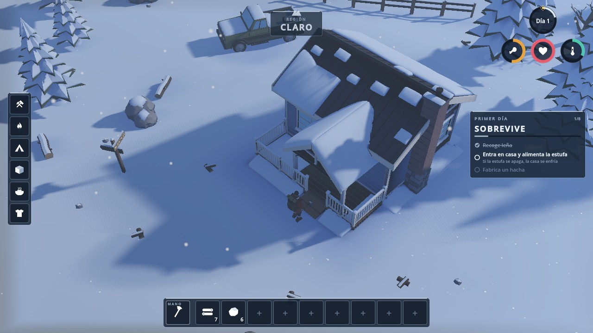 | 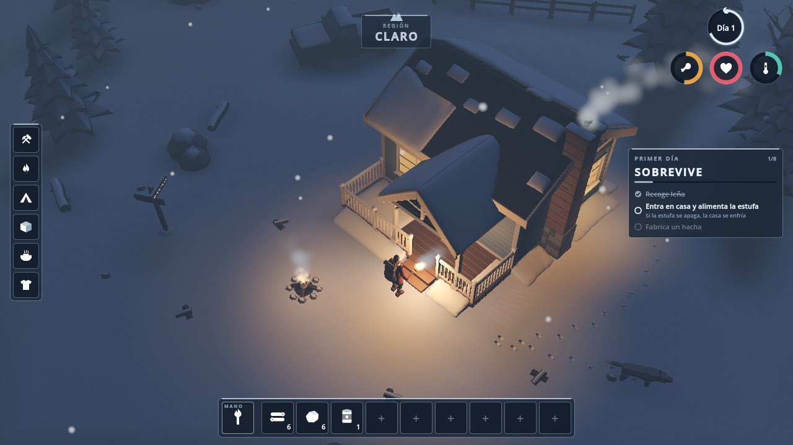 | 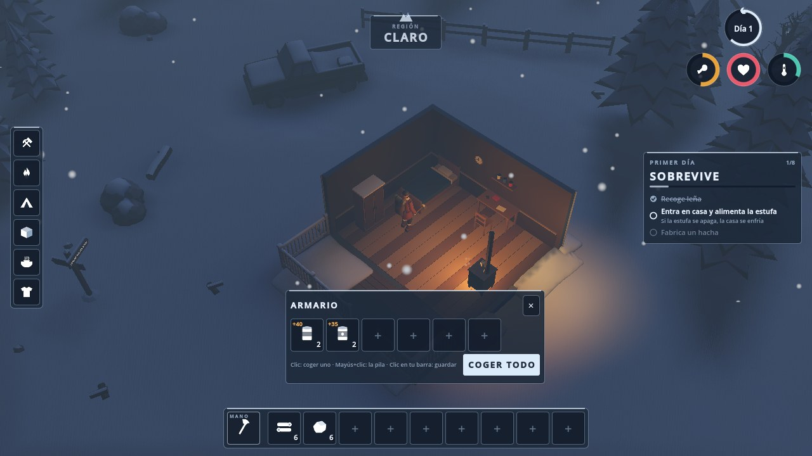 | 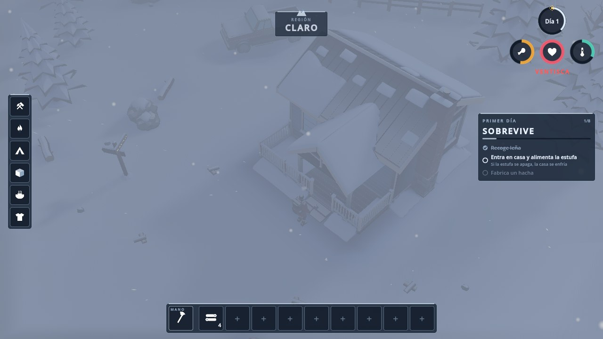 |

Comparación con la referencia: `docs/screenshots/g1/referencia_vs_g1.jpg`. Las capturas del slice original
(antes de G1) siguen en `docs/screenshots/*.png`.

## Abrir el proyecto

1. Instala Godot **4.7.2** (renderizador Forward+ recomendado; también funciona en Compatibility/OpenGL).
2. Abre `winter-survival/project.godot` desde el gestor de proyectos (o `godot --path winter-survival`).
3. Pulsa *Ejecutar* (F5). La escena principal es `scenes/main/main_menu.tscn`.

Los modelos `.glb` de `assets/models/` son opcionales: si falta alguno, el juego usa un
sustituto de primitivas con los mismos nombres de nodo (`scripts/data/placeholders.gd`).

## Controles

| Acción | Teclado / ratón | Mando |
|---|---|---|
| Moverse | W A S D / flechas | Stick izquierdo |
| Correr | Mayús (mantener) | L3 |
| Interactuar / atacar lo que hay bajo el cursor | Clic izquierdo (R: lo más cercano) | X |
| Golpe cargado (con un arma en la mano) | Mantener clic o Espacio | Mantener RT |
| Atacar al más cercano (zombi o lobo) | Espacio | RT |
| Empujar | V | LT |
| Pisotear a un zombi derribado o a un reptador | Clic sobre él | X / RT |
| Ejecución silenciosa (cuchillo) | Clic sobre un zombi congelado o que no te ha visto | X / RT |
| Agacharse (sigilo) | Ctrl | R3 |
| Reanimar a un compañero derribado | Mantener R a su lado | Mantener X |
| Rendirse (derribado) | Mantener X (3 s) | Mantener Y |
| Chat / comandos | Intro | — |
| Cancelar / cerrar panel | Clic derecho, Esc | B |
| Pausa | Esc | Start |
| Girar cámara | Q / E | LB / RB |
| Zoom | Rueda del ratón | D-pad arriba (pulsar) / abajo |
| Ranuras de la barra | Teclas 1–9 | D-pad izq/der + A |
| Fabricación | Tab (pulsar) | Y |
| Info: misiones, hora, temperatura y grupo | Mantener Tab | Mantener D-pad arriba |
| Seguir otra misión (con Info abierta) | R | Y |
| Mapa y diario | M (Q / E: pestaña, rueda: zoom) | Back (LB / RB, D-pad) |
| Equipar/guardar antorcha | T | D-pad abajo (mantener) |
| Comer lo mejor disponible | F | — |

## Pruebas

```bash
tests/run_all.sh                 # parse, unit (persistencia), smoke, inspect_models, perf, red (basic/shared_world/far/zombies), determinismo, perf walk, perf horde
tests/run_smoke.sh               # solo el smoke test (servidor local en el mismo proceso)
tests/net/run_net_test.sh --clients 4 --duration 60 --soak 90                              # escenario basic (M1)
tests/net/run_net_test.sh --clients 3 --duration 60 --soak 90 --scenario shared_world      # mundo compartido (M2)
tests/net/run_net_test.sh --clients 2 --duration 30 --soak 45 --scenario far --port 7797   # 2 jugadores a 1 km (M3)
tests/run_determinism.sh         # 50 chunks generados por cliente y servidor en dos procesos: hashes iguales (M3)
tests/run_perf_walk.sh --cpu     # 2.26 km a 25 m/s: coste de streaming ≤ 2 ms/frame (headless); sin --cpu: xvfb + llvmpipe
tests/net/run_net_test.sh --clients 4 --duration 62 --soak 70 --scenario zombies --port 7807   # zombis y combate en red (M4)
tests/run_perf_horde.sh          # servidor dedicado + 4 bots + 200 zombis: tick mediano ≤ 8 ms (M4)
RENDER=forward tests/run_screenshots.sh /tmp/shots   # capturas (Compatibility por defecto; Forward+ con lavapipe)
RENDER=forward tests/run_screenshots.sh /tmp/shots zombies   # la pelea al atardecer delante de la cabaña (M4)
tests/run_multi_shot.sh /tmp/shots/multi.png         # captura con 2 jugadores remotos (chaquetas distintas)
tests/run_hud_coverage.sh --moments=idle,action,zone,blizzard,info   # H1: el HUD en reposo ocupa ≤ 3 % de 1080p (solo la capa del HUD)
godot --headless --path . -s tests/hud_test.gd       # H1: las comprobaciones del HUD sin el resto del humo
RENDER=forward tests/run_screenshots.sh /tmp/shots hud_idle hud_action hud_zone hud_blizzard hud_info   # H1, a 1080p
godot --headless --path . -s tests/unit/zone_tracker_test.gd   # H2: zonas (histéresis, jerarquía, enfriamientos, cartel, 20 puntos W1, nombres)
tests/net/run_discovery_test.sh --backend sqlite     # H2: descubrimiento del grupo y reinicio del servidor
RENDER=forward tests/run_screenshots.sh /tmp/shots zone_card zone_sign_vehicle   # H2, a 1080p
```

## Reconstruir los modelos 3D (Blender)

```bash
cd winter-survival/blender && python3 build_all.py
```

Genera `assets/models/*.glb` y ejecuta `verify_assets.py`. Después, reimporta en Godot
(`godot --headless --path winter-survival --import`).

## Multijugador (M1)

Siempre hay un **servidor dedicado autoritativo** (PLAN C14): *Jugar* lanza este mismo ejecutable como proceso hijo
(`--headless -- --server --config user://server.cfg`) y se conecta a `127.0.0.1:7777`; *Unirse a servidor* conecta a
`ip:puerto` con contraseña (nonce + HMAC‑SHA256, versión y protocolo comprobados, identidad en `user://identity.cfg`).
En la web (o con `--offline`) el servidor corre dentro del mismo proceso (`OfflineMultiplayerPeer`), que es también el
modo de las pruebas. Chat: Intro. HUD de red: F3 (RTT, pérdida, kB/s, correcciones/s).

```bash
godot --headless --path . -- --server --config server/server.cfg.example   # servidor dedicado (UDP 7777, admin TCP 127.0.0.1:7778)
server/admin.sh status | players | save | save-and-quit | "say hola" | "rule friendly_fire full"
```

`server.cfg` (`server/server.cfg.example`): nombre, contraseña, puerto, `max_players`, `admin_port`/`admin_token`,
semilla, `day_length_sec`, y las reglas `pvp` / `friendly_fire` (`off|reduced|full`) que solo lee `DamageResolver`.
El apagado limpio es siempre por el socket de admin (`save-and-quit`): el headless muere al instante con SIGTERM.

## Mundo compartido (M2)

Todo lo que hace el slice (talar, recoger, estufa, armario, fabricar, colocar, comer, cazar) lo valida el servidor por
`wid` (`NetWorld.request_interact(wid, acción, arg)`: distancia + tolerancia, herramienta, acción declarada por el
objeto, *rate limit*, infracciones). El estado del mundo que se aparta de la semilla vive en un `ChunkDelta` por chunk
(el claro son los chunks 23–25): los cambios se difunden como eventos y el que entra tarde recibe cada chunk comprimido.
Los armarios y la camioneta son de uso exclusivo ("en uso" para los demás). El servidor dedicado guarda perfiles,
reloj y deltas en `world_save.json` (`FileBackend`, escritura atómica; SQLite llegará en M5) y los reaplica al arrancar:
un árbol talado sigue talado. El jugador es ya el **superviviente esquelético** (`chars/survivor_*.glb`, una chaqueta
distinta por jugador, `AnimationTree` con el ciclo escalado a la velocidad real, cabeza que sigue al cursor, herramienta
en la mano). Con `debug_commands=true` en `server.cfg` (o sin red) el chat acepta `/kit`, `/give <item> <n>` y
`/tp <x> <z>`.

## Mundo abierto por chunks (M3)

El mundo medía **3 × 3 km**: 48 × 48 chunks de 64 m alrededor del claro, que queda en el centro exactamente como era
(desde W1 este valle es el cuadrante noroeste del mundo de 6 km: ver «Mundo de 6 km (W1)»).
Alrededor hay un bosque determinista generado con la semilla del servidor, que el cliente recibe al conectarse y con
la que genera el mismo mundo. Tiene:

- el relieve del plano macro (`data/world/macro_map.png`, generado por `tools/gen_macro_map.gd` a partir del mapa
  de PLAN §4.2);
- el Lago de las Ánimas, de hielo plano y transitable, al suroeste;
- lechos de carretera con roderas;
- 4 cabañas aisladas y una torre de vigilancia (con corte al entrar), y restos de acampada;
- un muro con niebla en el borde (±1450 m).

Los chunks se generan en hilos de fondo (`WorkerThreadPool`). En el hilo principal solo se montan, en pasos de
≤ 2 ms por frame: el anillo 1 completo y el anillo 2 precargado, con prioridad hacia donde vas. Los árboles son
MultiMesh; uno se convierte en árbol real solo cuando lo golpeas, y el talado persiste por chunk.

En red, cada jugador recibe solo lo que pasa en los 3 × 3 chunks a su alrededor: poses, animales, eventos e
instantáneas. El servidor hiberna los chunks vacíos al cabo de 60 s. Con `debug_commands`, `/tp <x> <z>` lleva
a cualquier punto (por ejemplo, `/tp -780 340` al lago).

### Probar el cooperativo con amigos (hasta 4)

1. **Descarga la versión de escritorio.** En GitHub, pestaña *Actions* → última ejecución de **VENTISCA** del PR →
   sección *Artifacts* → `ventisca-windows` (o `ventisca-linux`). Descomprime y abre `Ventisca.exe`
   (`ventisca.x86_64` en Linux). Cada cambio del PR genera una versión nueva.
2. **Anfitrión:** pulsa **Jugar**. El juego arranca un servidor dedicado propio en segundo plano (UDP 7777). En
   Windows, acepta el aviso del cortafuegos para las redes privadas.
3. **Amigos en la misma red:** **Unirse a servidor** → IP local del anfitrión (`ipconfig` en Windows) → puerto 7777.
4. **Amigos por internet**, una de estas tres:
   - una VPN de juego (Tailscale, ZeroTier o Radmin VPN) y la IP que os dé;
   - redirigir **UDP 7777** del router al PC del anfitrión y usar su IP pública;
   - un servidor dedicado en un VPS Linux: `./ventisca.x86_64 --headless -- --server --config server.cfg`
     (plantilla en `server/server.cfg.example`; ponle contraseña).
5. Todos deben usar **la misma versión** (el servidor rechaza versiones distintas). `F3` muestra ping y tráfico.

La demo del navegador es solo para un jugador: el navegador no puede abrir conexiones UDP.

## Zombis y combate (M4)

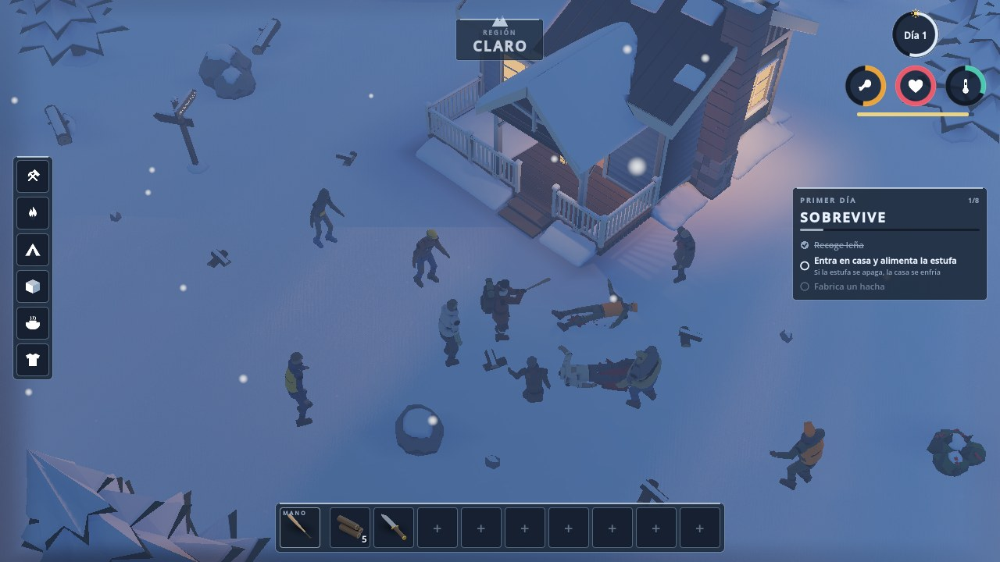

La captura se genera con `RENDER=forward tests/run_screenshots.sh <carpeta> zombies`.

**Solo el servidor simula los zombis** (`ZombieSystem`, con los datos en arrays). Hay cinco tipos:

- **Caminante**: el zombi normal.
- **Corredor**: esprinta unos segundos y luego se cansa y trota.
- **Reptador**: se arrastra por el suelo; se remata con un pisotón.
- **Congelado**: está quieto en la nieve hasta que lo despierta un ruido fuerte cerca, alguien que se le acerca o el calor.
- **Hinchado**: al morir revienta en una nube que roba calor.

Cada zombi pasa por estos estados: reposo, deambular, investigar, perseguir, atacar, aturdido, derribado, muerto
y congelado. Detecta a los jugadores así:

- **Vista**: un cono de 120° que alcanza 25 m de día, 12 m de noche y 6 m en ventisca.
- **Oído**: cada golpe o empujón es un `SoundEvent`, y en pantalla aparece como un anillo blanco. Los pasos
  también se oyen: 2 m si vas agachado, 6 m andando y 14 m corriendo.
- **Olfato**: a pocos metros, solo si estás sangrando.
- **Memoria**: recuerda dónde te vio por última vez y va a buscarte allí.

**Navegación.** Cada chunk tiene su propia navmesh (Recast), que se hornea en hilos de fondo y se une con las de
los chunks vecinos. Si el camino está despejado, el zombi va en línea recta. Si no, pide una ruta para rodear la
cabaña, los árboles, las rocas y la camioneta. Se hacen como mucho 40 consultas por tick, y un grupo que persigue
a la misma persona comparte la ruta.

**Población y director.** Cada chunk tiene su densidad de zombis. En el bosque hay zombis durmientes, y fuera,
congelados. El director reparte la presión en tres fases: acumulación, pico y alivio. También manda hordas
errantes. El primer día es suave: de día no aparece ninguno, y la primera noche solo unos pocos rondan el claro.
Con `/director off` se apaga.

**Red.** Cada jugador solo recibe los zombis de los chunks que tiene cerca: el servidor avisa cuando uno entra o
sale de su zona. Las instantáneas ocupan 9 B por zombi y se envían con más frecuencia cuanto más cerca está el
zombi, con un fotograma completo cada segundo. Con 4 jugadores y 100 zombis se gastan unos 5 kB/s por cliente
(el límite de la prueba es 15 kB/s). El cliente dibuja hasta 48 zombis (24 en la web), con animaciones más
sencillas para los que están lejos.

### Combate cuerpo a cuerpo

El servidor valida cada golpe: que el zombi esté en el cono de 110° delante de ti y dentro del alcance del arma
más 0.5 m. También retrocede hasta 150 ms para ver dónde estaba el zombi en tu pantalla. El daño llega en el
momento del impacto de la animación (`data/anim_events.json`): 0.27 s con armas de una mano, 0.36 s con las de dos.

| Arma | Daño | Cadencia | Alcance | Notas |
|---|---|---|---|---|
| Puños | 6 | 0.6 s | 1.1 m | — |
| Cuchillo | 18 | 0.4 s | 1.2 m | silencioso; ejecuta a congelados y a los que no te han visto |
| Palanca | 28 | 0.7 s | 1.6 m | 15 % de crítico |
| Bate | 30 | 0.65 s | 1.7 m | 2 objetivos, derriba (35 %) |
| Bate con clavos | 38 | 0.65 s | 1.7 m | 2 objetivos, derriba, se gasta antes |
| Machete | 38 | 0.55 s | 1.5 m | 20 % de crítico |
| Hacha | 45 | 0.9 s | 1.7 m | 30 % de crítico, también tala |

- Los críticos hacen ×3 de daño. Si un crítico mata, revienta la cabeza. Las armas contundentes hacen +50 %
  contra los congelados.
- El **golpe cargado** hace ×1.5 de daño y más ruido, y gasta 12 de aguante (necesitas al menos 20). El golpe
  ligero gasta 8 y el empujón, 8. Sin aguante no puedes correr ni cargar.
- Las armas tienen **durabilidad** (se ve en la ranura) y se gastan con cada golpe que acierta.
- **Reglas del servidor** (`server.cfg`, solo las aplica `DamageResolver`):
  - `pvp`: `off` / `on`. Con `off`, los jugadores se atraviesan.
  - `friendly_fire`: `off` / `reduced` / `full`.

### Derribado, reanimación y muerte

- **Derribado.** Si el daño de combate te deja a 0 PV, caes derribado. Te arrastras a 0.8 m/s y te desangras en
  60 s (40 s si tienes frío). Todos ven una calavera con la cuenta atrás. Cada mordisco te quita 5 s más.
- **Reanimación.** Un compañero te levanta si mantiene R (en el mando, X) 4 s a tu lado. Si juegas solo en el
  servidor, te levantas tú mismo una vez al día.
- **Rendirse.** Mantén X (en el mando, Y) durante 3 s.
- **Muerte.** El frío y el hambre matan directamente, sin pasar por derribado. Al morir dejas una mochila con todo
  tu inventario, que cualquiera puede recoger durante 2 días de juego. Tras una cuenta atrás de 20 s, reapareces
  junto a la cama de la cabaña.

### Comandos de prueba

Funcionan sin red o con `debug_commands=true` en `server.cfg`:

| Comando | Qué hace |
|---|---|
| `/zombies <n> [walker\|runner\|crawler\|frozen\|bloater] [radio]` | Crea zombis a tu alrededor |
| `/zombies clear` | Borra todos los zombis |
| `/zombies freeze` | Congela a los zombis que tienes a menos de 60 m |
| `/armas` | Te da cuchillo, palanca, bate y machete |
| `/hurt <n>` | Te hace n de daño de combate |
| `/rule pvp on` | Cambia una regla (también `friendly_fire full`, `zombie_count_scale 2`, `noise_scale 0.5` o `cold_scale 1`) |
| `/hora <h>` | Cambia la hora del día |
| `/director on\|off` | Enciende o apaga el director y la población por chunks |

**Web (sin hilos):** hay como mucho 120 zombis (40 con cuerpo físico y 24 vistas), la población y el director
bajan al 60 %, y la navmesh se hornea con celdas de 0.5 m, un chunk cada 0.3 s. El streaming sigue con su
presupuesto de 2 ms por frame.

## Corte urbano y gráficos G2 (W0)

Infraestructura de render para la ciudad de **Altavega** (hito W0 + G2a; diseño en `docs/research/09_ciudad_mundo_vivo.md`
§3 y `docs/research/08_graficos_g2.md`, nota vinculante en `docs/v2/ARQUITECTURA_V2.md` §9.7). Aún no hay ciudad en el
mapa (llega con W1/C1): todo se prueba en el banco `tests/city_bench/`, una calle‑cañón con torres de 6–40 plantas
(procedurales, listas para corte, y las torres, coches y farolas winterizados de arte de `assets/models/city/` cuando
están; si faltan, unas copias CC0 de prueba en `tests/city_bench/models/`), el jugador a pie de calle y un grupo de zombis.

| Día (perfil de ciudad, 24 m) | Noche (ventanas por celda, charcos de luz) | Corte: cámara a 38 m pegada a una torre de 30 plantas |
|---|---|---|
| 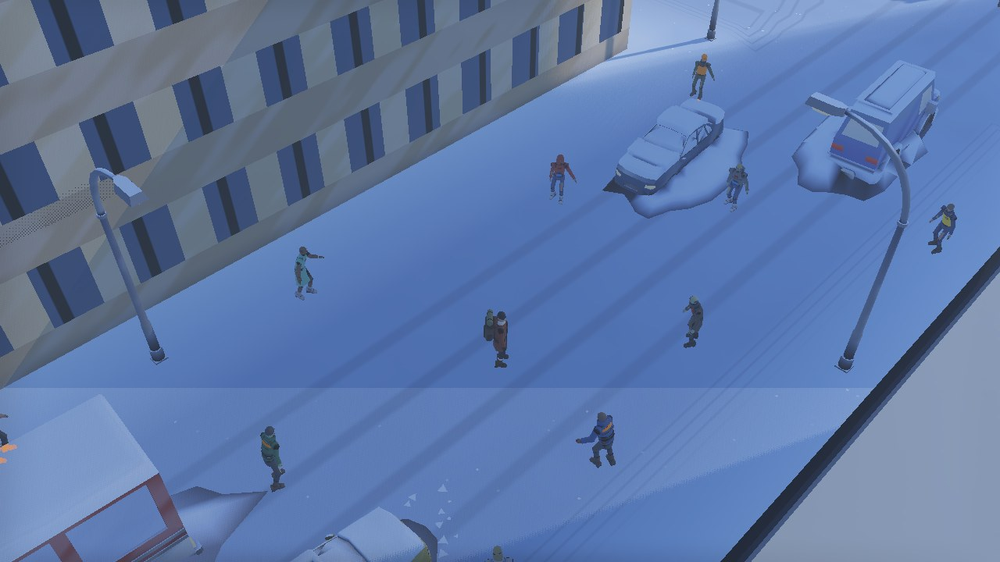 | 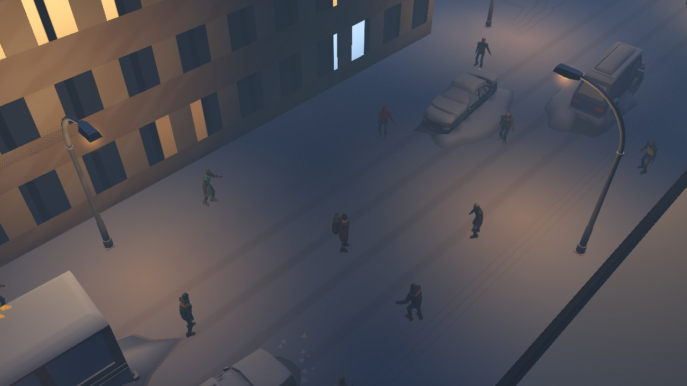 | 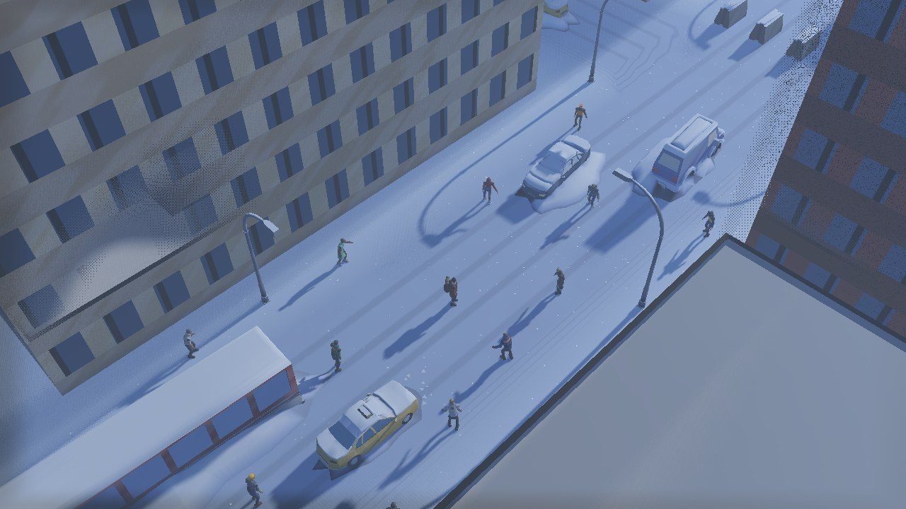 |

Perfil de cámara por defecto (izquierda: −48°, 24 m y 38 m) frente al de ciudad (derecha: −43°, 24 m y 44 m):
`docs/screenshots/w0/profile_compare.jpg` (y cada vista por separado, `profile_*.jpg`). Dentro de un edificio (planta
tercera, tejado solo como sombra): `city_inside.jpg`; en una azotea con el perfil `rooftop`: `city_rooftop.jpg`; la
silueta de distrito (HLOD) desde un mirador: `city_hlod.jpg`.

- **Corte urbano** (`assets/shaders/city_cut.gdshaderinc` + `scripts/world/city/city_cut.gd`): con la cámara alta, lo
  que queda entre la cámara y el jugador por encima de la losa de la planta siguiente a la suya se descarta con tramado
  (pasillo cámara→jugador, zona de 16–26 m alrededor del jugador, cápsula cámara→pecho); la torre que contiene o roza la
  cámara se corta entera por encima de ese forjado; dentro de un edificio, su tejado y sus plantas superiores quedan
  solo como sombra y los muros del lado de la cámara bajan a 0.6 m. Lo cortado se ve **macizo, como una planta**
  (tapas oscuras en el grosor de muros y tabiques, suelo de la losa siguiente iluminado). Nunca se corta en el pase de
  sombras (la calle sigue en sombra). Sin stencil ni `instance uniform` (en Compatibility solo caben 256 instancias):
  10 globales por frame y el origen de cada pieza. Funciona igual en Forward+, Compatibility y Web.
- **Siluetas**: los jugadores siempre (color de su chaqueta) y los zombis que el jugador **percibe** (línea de vista,
  ≤ 24 m) se ven a través de lo que los tape (`Silhouettes`, `material_overlay`).
- **Materiales**: `world_vcol` (lo de siempre, sin corte), `world_vcol_struct` (estructura de ciudad), `world_vcol_capsule`
  (props de ciudad, solo cápsula), `window_city` (vidrio de fachada), `light_pool` / `light_halo` (farolas).
- **Nieve por normal v2** en toda la familia `world_vcol`: borde roto por ruido, abrigo por la AO horneada, nieve a
  barlovento (`snow_wind`, global que escribe `DayNight` desde el viento del servidor) y `snow_base` por familia. Con tiempo
  despejado el bosque se ve exactamente como en G1.
- **Noche de ciudad**: ventanas por celda (encendidas por *hash*, cálidas / frías / con parpadeo, velas sin corriente),
  mapa de potencia con manzanas **con generador**, charcos de luz falsos y halos en `MultiMesh` y luces reales solo en
  las farolas más cercanas (`alto` 12, `medio` 6, `compat`/Web 0).
- **Torres por piezas** `Base` / `Shaft_<n>` / `Roof` / `ShadowProxy` con `visibility_range` y **HLOD por chunk**
  (`CityHlod`, solo para miradores y menús).
- **Perfiles de cámara** por región (`CameraZone`): en un distrito la cámara baja a −43° y deja alejarse hasta 44 m; en
  una azotea, −40° y 50 m. Se mezclan suavemente y el corte mantiene al jugador visible.
- **P1**: capa de bruma a pie de calle con los perfiles de ciudad (`DayNight.city_haze`) y nieve arrastrada por el
  viento a ras de suelo (`SnowDrift`).

**Contrato de edificio de ciudad** (para el arte; lo comprueba `CityBuilding.validate()`; detalle en ARQ §9.7):

| Nodo / dato | Qué |
|---|---|
| raíz `Node3D` | origen = centro de la huella a nivel de calle; `CityBuilding.attach(raíz)` la registra (grupo `city_building`) |
| metadatos | `floor_h` 3.0, `ground_h` 3.3 (4.3 con bajos comerciales de 4 m; cualquier otra rejilla vale, p. ej. las torres de A1 con 3.8 m), `foundation` 0.3, `floors`, `generator`, `enterable`, `kind` |
| `Base` (alias `Tower_Base`) | zócalo y plantas bajas (hasta ≈ 24 m), el detalle |
| `Shaft` o `Shaft_<n>` (alias `Tower_Shaft_<n>`) | fuste en grupos de ≤ 4 plantas; extras `floor_from` (obligatorio) / `floor_to` |
| `Roof` (alias `Tower_Top`) | coronación, peto, casetas, depósitos, nieve |
| `ShadowProxy` (alias `Tower_Shadow`) | prisma cerrado de 12–400 tris, sin material: el único que proyecta sombra (el código lo pone en `SHADOWS_ONLY` y apaga la sombra de las demás piezas) |
| `Floor<k>`, `Walls<k>_*`(+`_Stub`), `Interior<k>`, `Door_n`, `Window_n`, `Spawn_*`, `Col*` | parte enterable (ASSET_SPEC v2 §8.4) |

Los nombres canónicos son los de la izquierda; los alias `Tower_*` (nombres provisionales de la primera exportación de
arte) se aceptan igual (`CityBuilding.canonical()`). Reglas: piezas sin desplazamiento en Y ni escala (solo giro en Y); volúmenes cerrados, muros exteriores con grosor,
una losa por planta en `ground_h + n·floor_h`, tabiques con grosor y núcleos abiertos por arriba; material
`palette_vcol` para la estructura y `window`/`glass` para el vidrio de fachada (una celda por vano de 2.4 m y planta);
AO horneada ≤ 0.3 en losas y muros interiores.

Pruebas (se ejecutan en `tests/run_all.sh`; en CI el banco en Compatibility bloquea y el de Forward+ informa):

```bash
godot --headless --path . -s tests/render_checks.gd     # corte (espejo GDScript), contrato de edificio, corte de POIs, perfiles de cámara, luces, siluetas, HLOD, cursor
tests/run_city_bench.sh gate                            # visibilidad del jugador y los zombis (16–50 m, calle, cruce, azotea, dentro), sombras, draw calls
RENDER=forward tests/run_city_bench.sh gate             # lo mismo en Forward+ con lavapipe
RENDER=forward tests/run_city_bench.sh shots /tmp/w0   # city_day, city_night, city_cut, city_inside, city_rooftop, city_hlod, profile_compare
RENDER=forward tests/run_screenshots.sh /tmp/w0 city_day city_night city_cut   # los mismos presets desde el script de capturas
```

Resultados (banco, 1280 × 720, rasterizadores por software: los tiempos solo valen como proporción):

| Puerta | Compatibility (llvmpipe) | Forward+ (lavapipe) |
|---|---|---|
| Jugador visible con el corte (15 vistas: calle, cruce, azotea, dentro de un edificio, junto a una torre de arte de 100 m; 16–50 m; perfiles default / city / rooftop; puerta ≥ 99 % desde 24 m) | 99.7–101.2 % | 99.6–100.3 % |
| Jugador visible **sin** corte (calle‑cañón a 24 / 38 / 44 m, junto a la torre de arte a 38 / 44 m, dentro) | 0 % | 0 % |
| Zombis legibles en la calle (visibles o con silueta), 24–38 m (puerta ≥ 95 %) | 100.0–100.1 % | 99.9–100.1 % |
| Sombra de la torre cortada en la calle (luminancia con corte / solo sombras) | 1.000 | 1.000 |
| *Draw calls* / primitivas, día · noche (presupuesto 700 · 1 000) | 117 / 343 k · 53 / 128 k | 116 / 350 k · 97 / 331 k |
| Coste del corte frente al material de G1, día / noche (informativo; presupuesto del doc 09: 10 %) | +57 / +60 % evaluándolo (+40 % ya por `cull_disabled` + `discard` sin pre‑pase) | +5.1 / +7.4 % |
| `CityCut.update` con 300 edificios registrados (CPU, *headless*) | 0.02–0.04 ms por frame (rejilla de 32 m) | |

## HUD «Susurro» (H1)

| En reposo | Acción | Título de zona | Ventisca | Info (misiones) |
|---|---|---|---|---|
| 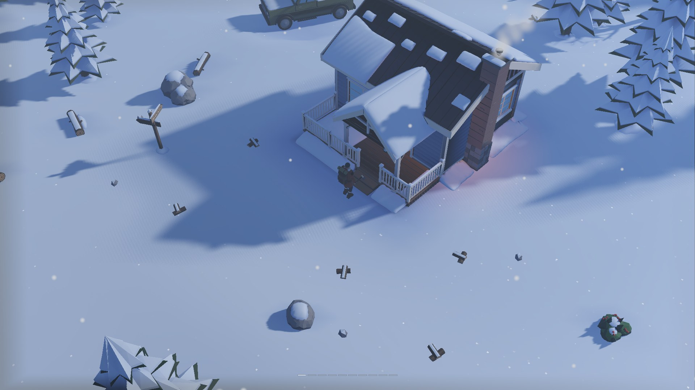 | 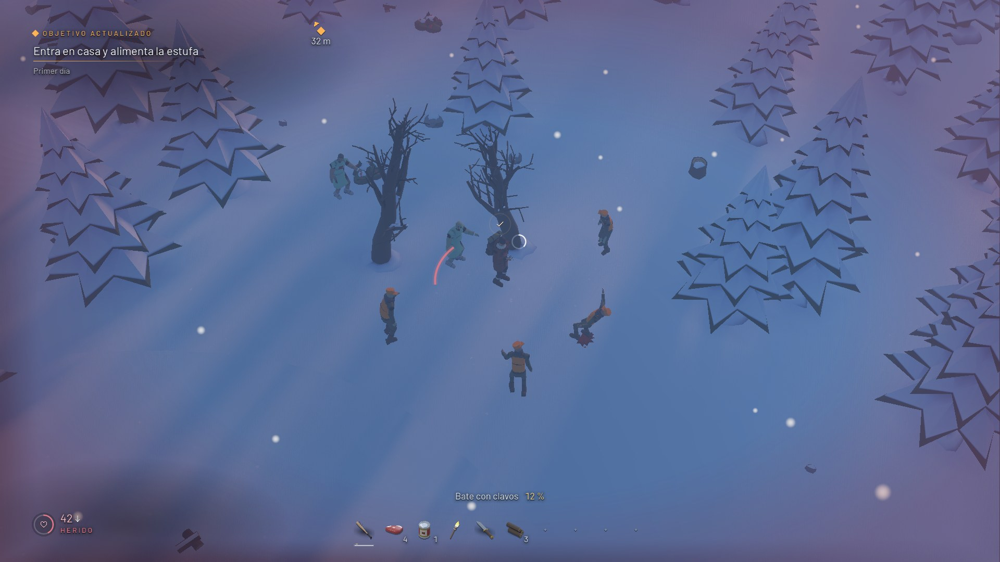 | 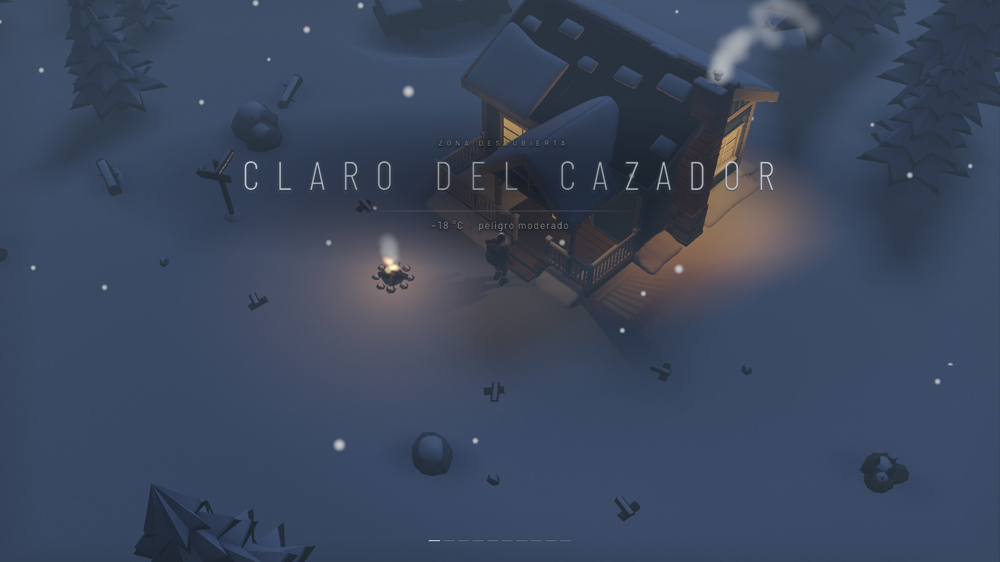 | 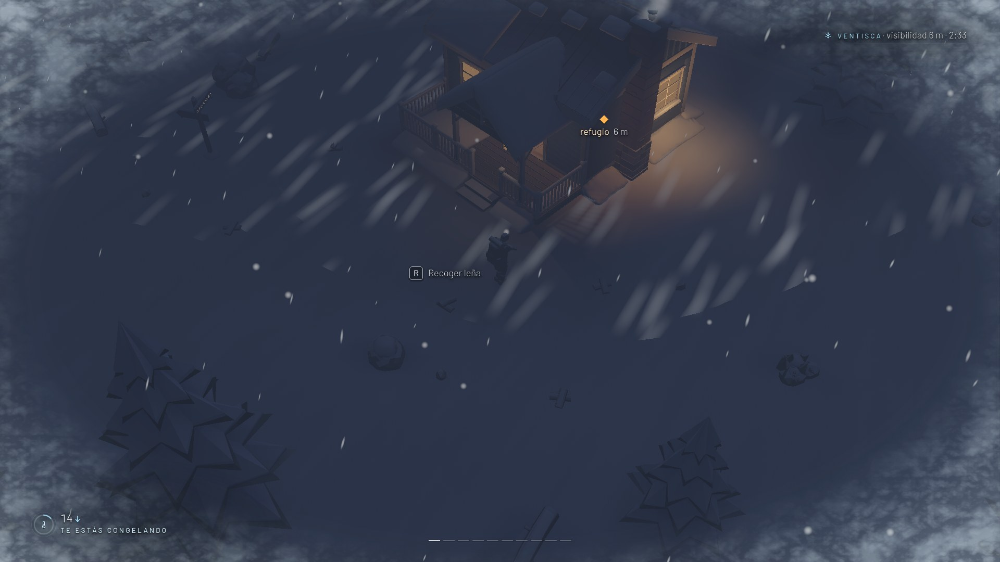 | 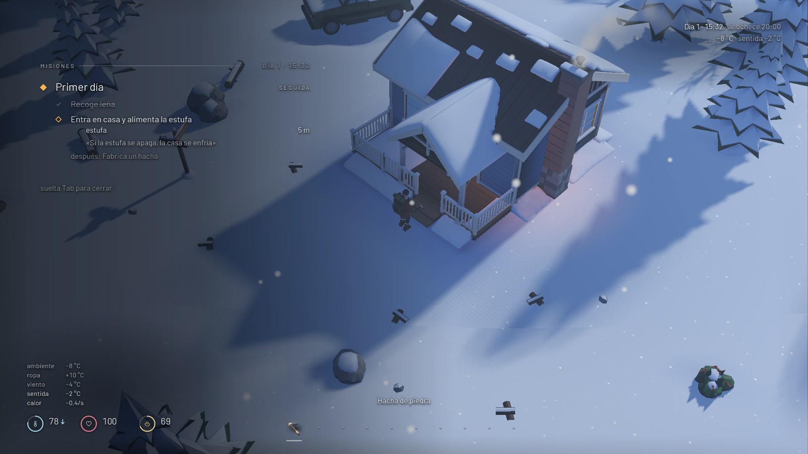 |

| Mapa de papel (P1) | Diario (P1) |
|---|---|
| 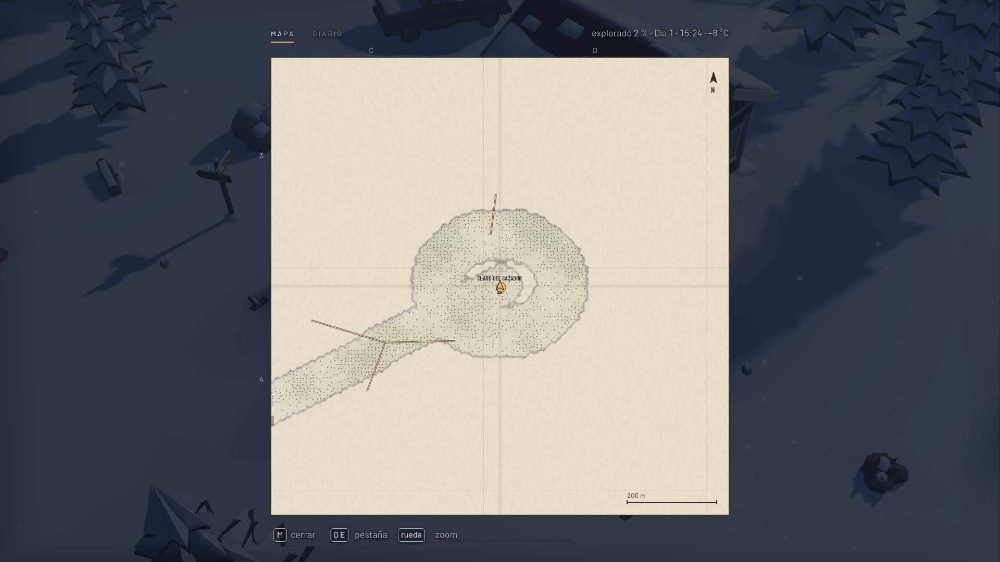 | 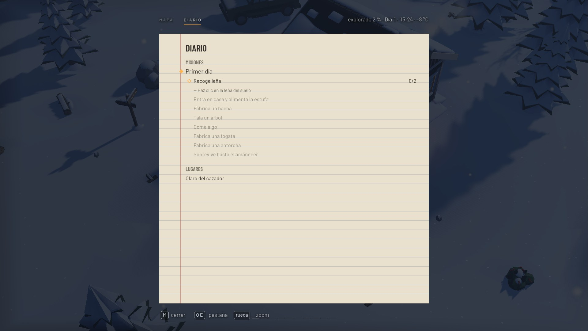 |

Capturas Forward+ a 1920 × 1080: `RENDER=forward tests/run_screenshots.sh <carpeta> hud_idle hud_action hud_zone
hud_blizzard hud_info hud_map hud_journal` (los presets `hud_*` salen a 1080p). Son la dirección v2 «Susurro» de
`docs/research/10_hud_ux.md` §V; la comparación con sus maquetas `v2_*.jpg` está en
`docs/screenshots/h1/maqueta_vs_h1.jpg`.

**El mundo es la imagen.** En reposo solo queda la barra rápida plegada en 10 trazos de 2 px: el HUD ocupa el
**0,08 %** de la pantalla (medido por `tests/run_hud_coverage.sh`, que renderiza solo la capa del HUD sobre negro y
sobre blanco; el límite es 3 %). Todo lo demás aparece cuando cambia y se funde a los 3–5 s, o se pide:

- **Info** (mantener Tab / D‑pad ↑): la lista de misiones sobre un velo lateral (misiones, encargos, en la radio), la
  hora y la temperatura arriba a la derecha, el grupo en una línea, las constantes con número y el desglose térmico, y
  los demás destinos en el borde. Pulsar Tab sigue abriendo la fabricación y pulsar D‑pad ↑ sigue acercando la cámara;
  con Info abierta, R / Y sigue otra misión. En *Interfaz y accesibilidad* se puede cambiar a pulsar para alternar.
- **Barra rápida**: se despliega en iconos sin ranuras al usarla (1–9, D‑pad + A, clic, cambio de arma, algo nuevo en
  la barra) con el nombre encima («Bate con clavos 12 %», en `warn` por debajo del 20 %), y se pliega a los 3 s. La
  selección con mando se dibuja (antes no se veía).
- **Constantes** (abajo a la izquierda, solo la que importa): Calor < 40 o bajando ≥ 1/s o sentida ±5 °C, Salud < 50 o
  un cambio ≥ 2, Hambre < 30 o al comer. Anillo fino, número con tendencia y una palabra («te estás congelando»,
  «herido»; «sangrando» y «mojado 40 %» llegan por `Events.status_changed`). Aguante: un arco junto al hombro. Golpe:
  arco rojo en el suelo hacia quien te muerde y un destello en los bordes; Salud < 25: latido.
- **Misiones**: el checklist del día es una misión principal del modelo nuevo (`scripts/data/missions.gd`: principal /
  secundaria / dinámica, pasos con progreso y objetivos en el mundo). Línea «objetivo actualizado» arriba a la
  izquierda con el filete ámbar (5 s), ✓ en el mundo al completar un paso, rombo de 10 px sobre el objetivo en
  pantalla y **un único indicador de borde** con su distancia.
- **Un solo acento ámbar**, por prioridad: compañero derribado > fuente de calor más cercana si te congelas (Calor <
  30: «refugio 4 m») > objetivo seguido.
- **Título de zona** cinematográfico sin caja (Barlow Condensed ExtraLight 76 px, el espaciado se cierra de .78 a .42
  em): «zona descubierta», el nombre y una línea de datos («Altavega · sin electricidad · −18 °C · peligro alto»,
  según lo que se sepa del lugar). Se entra estando 12 m dentro durante 1,5 s y se sale 12 m fuera: ya no parpadea al
  cruzar un borde de chunk. La re‑entrada muestra solo el nombre al 60 %. En combate espera. Desde H2 los lugares son
  los de W1 (Altavega y sus distritos incluidos): ver «Zonas: entrar y salir (H2)».
- **Avisos**: un aviso central con prioridad y cola (P0 interrumpe, «2 avisos en espera»), una columna lateral para
  lo recogido y fabricado con contadores que se suman («Madera +3 (5)»), y los peligros en una línea: prevista →
  se acerca → «❄ VENTISCA · visibilidad 6 m · 2:40» → a los 5 s solo el icono y el tiempo.
- **Compañeros**: nada si están cerca; punto y nombre si están lejos (> 25 m, 10 m en ventisca), tienen frío o hablan
  (su línea de chat encima 6 s). Derribado: un indicador ámbar con el anillo de desangrado, «Ana 38 s» y «mantén X
  para reanimar · 6 m», que llena el anillo mientras reanimas.
- **Frío**: viñeta de escarcha en los bordes (intensidad 1 − Calor/40): «la interfaz también tiene frío».
- **Avisos de interacción** a menos de 2,5 m, anclados al objeto con la tecla o el botón del dispositivo actual y un
  anillo para las acciones que se mantienen; con ratón sigue la etiqueta junto al cursor.
- **Mapa de papel y diario** (M / Back): el mapa se dibuja con tinta solo donde has estado (niebla de 8 m que se
  guarda por mundo), con carreteras, lugares, la cabaña, tu flecha, el grupo y el objetivo; tres zooms. El diario
  lista las misiones con sus pasos y los lugares descubiertos.

**Interfaz y accesibilidad** (menú de pausa): preajuste Mínimo (por defecto) / Estándar (constantes y barra siempre)
/ Completo (más la línea de misión y la hora), escala 80–150 % (115 % en Steam Deck), margen de pantalla, ancho del
HUD en 21:9, Info mantener o alternar, movimiento reducido, destellos reducidos, texto reforzado, fondo del texto
opaco y marcadores y colores para daltonismo. Se guarda en `user://settings.cfg` (`[hud]`).

Fuentes Barlow y Barlow Condensed (OFL, `assets/fonts/` con su licencia), tokens en `scripts/ui/ui_tokens.gd`, tema
en `assets/ui/susurro_theme.tres` (`godot --headless --path . -s tools/gen_hud_theme.gd`), componentes en
`scripts/ui/hud/`. Pruebas: los pasos de `tests/hud_steps.gd` (dentro del humo, o solos con
`godot --headless --path . -s tests/hud_test.gd`) y `tests/run_hud_coverage.sh [--moments=idle,action,zone,blizzard,info]`.
Detalles técnicos en `docs/v2/ARQUITECTURA_V2.md` §17.5.

## Mundo de 6 km (W1)

El mundo mide ahora **6 144 × 6 144 m** (96 × 96 chunks de 64 m). El valle de M3 no se ha movido ni cambiado: sigue en
el **cuadrante noroeste**, con sus coordenadas, sus índices de chunk (`CENTER_CHUNK = 24`) y sus `wid`, y el mundo crece
hacia el este (+x) y el sur (+z). Los muros jugables van por eje: **x, z ∈ [−1 450, +4 420] m**; la niebla del borde se
espesa según la distancia al muro más cercano.

Lo que hay (doc 09 §4.2–4.3; nombres definitivos, C36):

- **Sierra del Cierzo** (el antiguo borde este) con la **Carretera del Puerto**: sale de la Gasolinera Norte, sube el
  puerto (≤ 9 % de pendiente, jalones de nieve y guardarraíles) y baja al **Control del Puerto** y a la Gran Vía.
- **Altavega** como terreno: casco viejo, ensanche, Las Torres, barriada de San Lázaro, polígono y puerto, con la Gran
  Vía, las rondas norte y sur y la **A‑14**; aún **no hay edificios** (llegan en C0/C1). Los sitios de los POI héroe
  (catedral, hospital, estación, estadio, presa, base aérea…) son *pads* planos reservados.
- **Río Albo**, la **dársena** del puerto fluvial, el **embalse del Cierzo** y el **ibón**: hielo plano y seguro (el hielo
  fino llega con E1). Las carreteras se cortan en las orillas: los puentes son POI de C1.
- **Sierra de Peña Blanca** (el antiguo borde sur) con el **túnel de Peña Roya** (boca norte derrumbada, boca sur
  abierta), el desfiladero de la N‑140 sur, las pistas de esquí, el ferrocarril del Albo y **La Vega** con la base aérea.

Datos: `data/world/poi_registry.gd` (mapa 48 × 48, regiones con los datos de `LocationInfo` para H2, *pads*, agua),
`data/world/macro_map.png` (768² a 8 m/px, biomas 0–15) y `data/world/macro_roads.json` (carreteras y ferrocarril),
generados por `godot --headless --path . -s tools/gen_macro_map.gd` (`++ --check` comprueba que se reproducen byte a
byte). Población de zombis por chunk para los 96²: `scripts/world/population_table.gd`.

| Plano macro | Carretera del Puerto | Río Albo en la Gran Vía | Dársena | Túnel de Peña Roya (boca sur) |
|---|---|---|---|---|
| 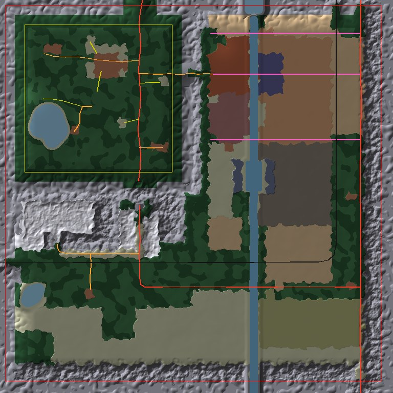 | 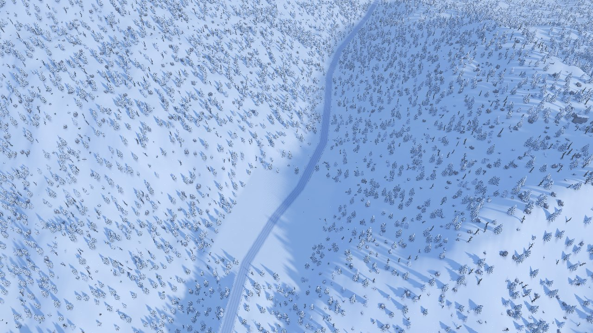 | 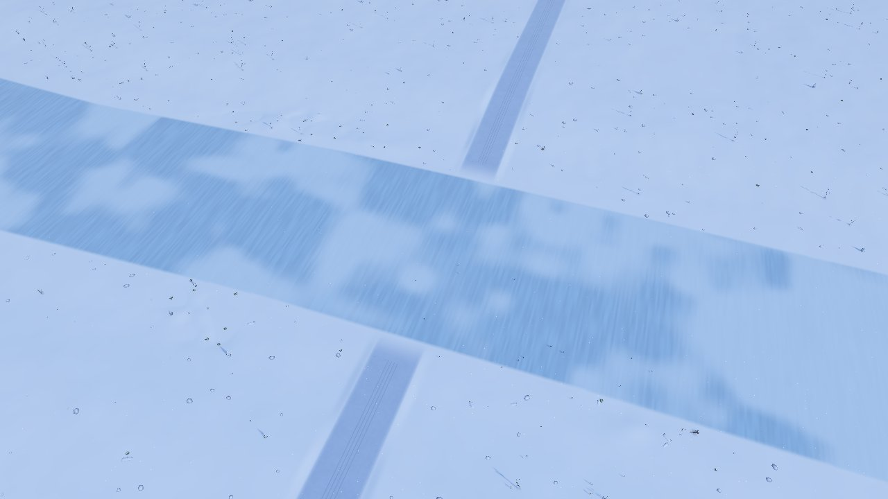 | 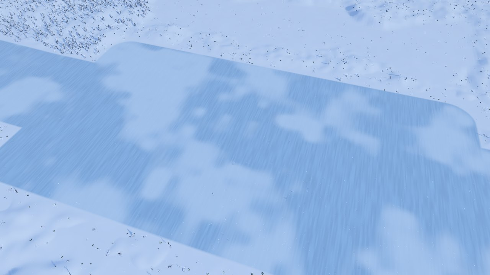 | 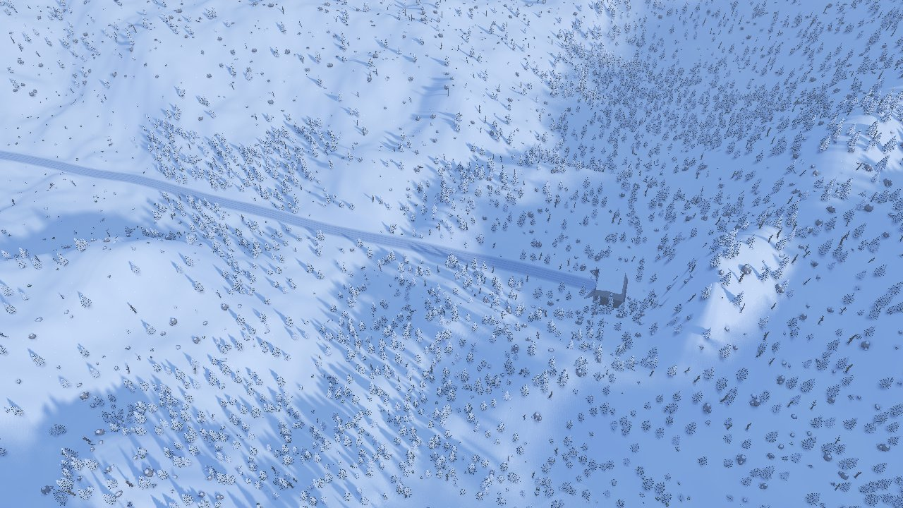 |

(`python3 tools/macro_preview.py salida.png` dibuja el plano macro con biomas, relieve, carreteras y muros.)

Para visitarlo con `debug_commands`: `/tp 1480 -384` (el puerto), `/tp 2432 -384` (el río en la Gran Vía),
`/tp 2432 1216` (la dársena), `/tp 640 1760` (el túnel sur), `/tp 3264 3520` (la base aérea).

Pruebas de W1: `godot --headless --path . -s tests/w1_world.gd` (muros, mapa, 20 puntos de banner, hielo, *pads*,
carreteras, población), `godot --headless --path . -s tests/valley_unchanged.gd` («el valle no cambia»: los 1 225 chunks
con |x|, |z| < 1 152 m idénticos a antes de W1 salvo la lista cerrada de la Carretera del Puerto),
`tests/run_determinism.sh` (60 chunks en los cuatro cuadrantes), `tests/run_perf_walk.sh --cpu` (6.5 km a 25 m/s por
los cuatro cuadrantes; `--route=m3` es la ruta de M3; `--sched` añade el diagnóstico del planificador) y
`tests/net/run_net_test.sh --clients 4 --duration 40 --soak 55 --scenario far` (4 clientes en 4 cuadrantes, hasta 5 km;
RSS del servidor ≤ 400 MB). Capturas: `RENDER=forward tests/run_screenshots.sh carpeta overview_pass overview_city
overview_port overview_sw overview_se` (en `docs/screenshots/w1/`). Detalles técnicos en `docs/v2/ARQUITECTURA_V2.md`
§8.10.

## Escaparate de Altavega (C0)

La primera manzana de Altavega ya está en su sitio: la **supermanzana LT‑01 de Las Torres** (112 × 80 m, al norte de
la Gran Vía y justo al este del río Albo, x 2 624–2 736, z −486…−406). Cuatro **zócalos** no enterables de 2–3 plantas
con **cinco torres** CC0 de A1 encima (20, 26, 26, 34 y 40 plantas, de 78 a 156 m), la **Gran Vía** con un **atasco**
de coches de A1 que se quedó mirando al oeste, farolas, semáforos, una marquesina, el **control militar** al final del
puente y un **Puente de Hierro** provisional (un bloque: terraplenes de piedra y una celosía sobre el hielo). En la
azotea del zócalo suroeste hay un **mirador** provisional (se sube por la escalera de su fachada oeste): quédate junto
al poste naranja y **mantén V 1 s** — la cámara se levanta a −7°, ve a 1,5 km y enseña el *skyline* de la ciudad
(las siluetas de distrito v0); Q / E giran la vista y cualquier otra tecla la devuelve. El **menú principal** tiene ahora
de fondo el *skyline* de Altavega de noche visto desde el Puente de Hierro.

Llegar con `debug_commands`: `/tp 2650 -402` (la acera de la Gran Vía delante de la manzana), `/tp 2432 -384` (el puente),
`/tp 2626 -446` (el pie de la escalera del mirador).

| Día (Forward+) | Noche | Mirador | Vista aérea | Menú |
|---|---|---|---|---|
| 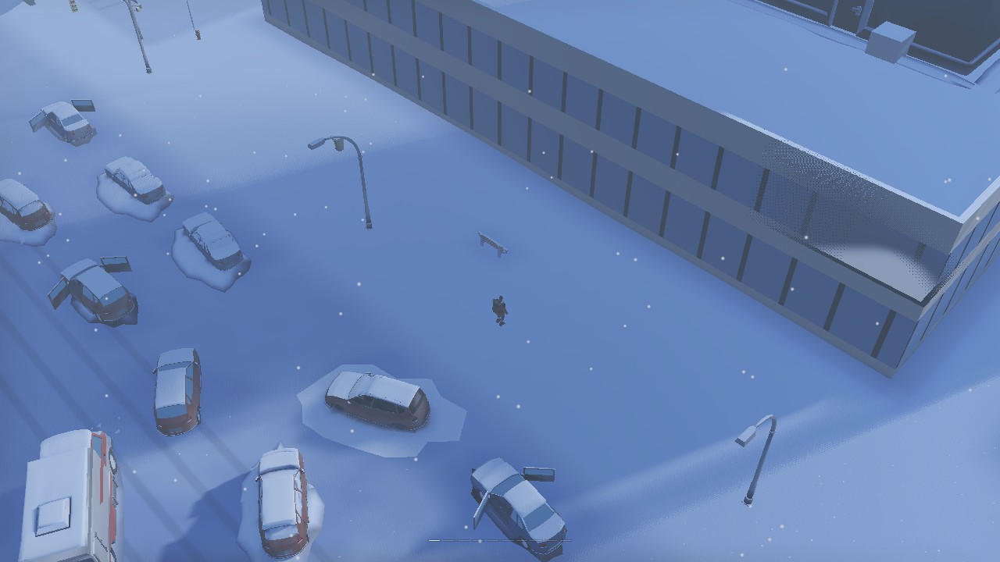 | 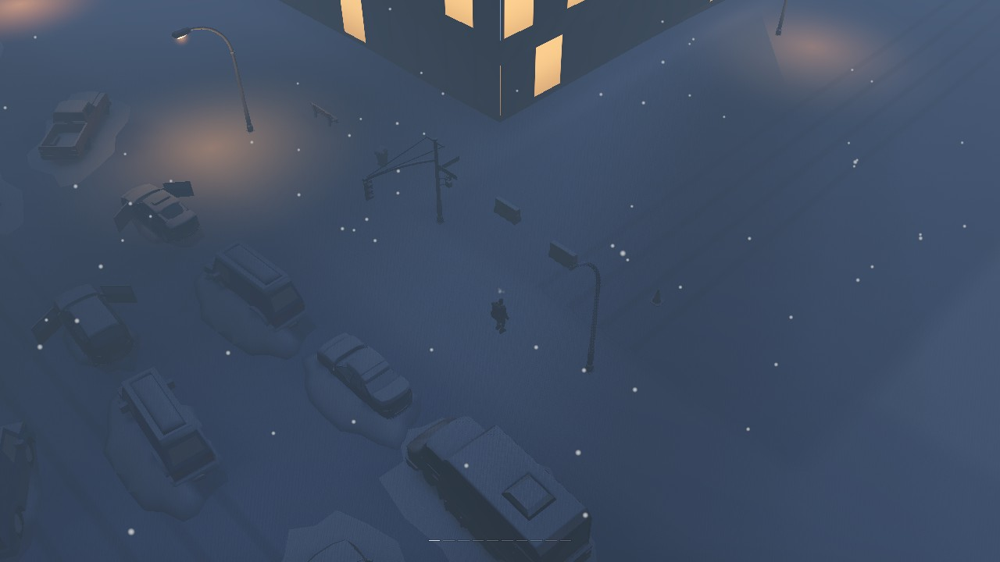 | 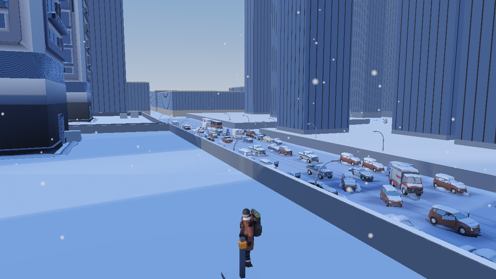 | 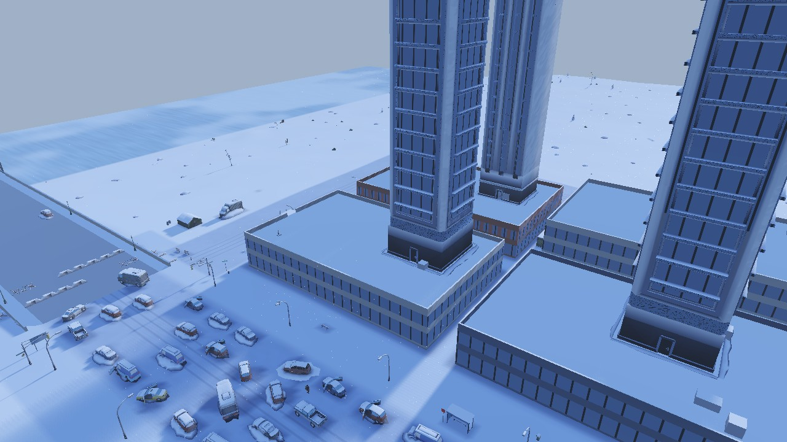 | 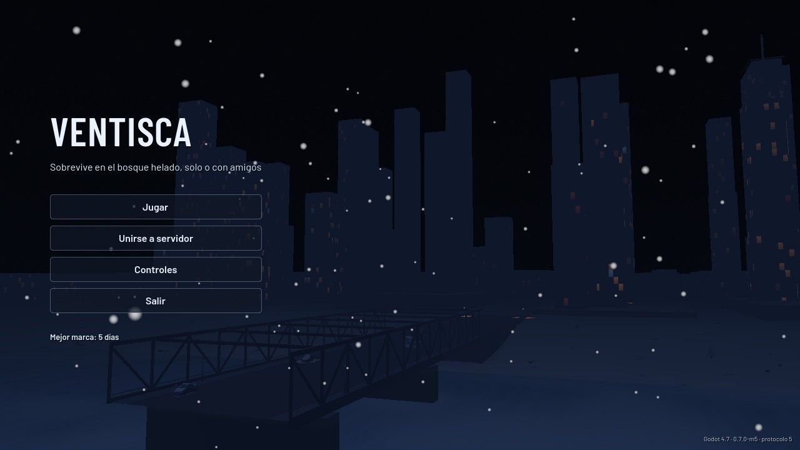 |

Cómo está hecho (detalles en `docs/v2/ARQUITECTURA_V2.md` §9.8):

- **Datos**: `data/world/city/altavega_lots.json` v0, escrito a mano, `city_version = 0` (= `WorldConst.CITY_VERSION`,
  lo que M5 guarda en `world_meta`). Coordenadas en cm enteros: zócalos, torres (familia A1 + número de grupos de
  plantas), puente, atascos (el vestido sale de `hash64(semilla, GEN_CITY, atasco, carril, hueco)`), coches y props
  fijos, filas de farolas, calles y aceras (se pintan en la máscara del terreno), zonas de cámara, el mirador, la
  potencia (apagón con dos lotes con generador) y las reglas de las siluetas de distrito. El trazado es el mismo en
  todos los servidores; el cliente y el servidor calculan los mismos objetos (la puerta de determinismo lo compara).
- **Código** (`scripts/world/city/`): `CityLots` (carga, valida, hashes, objetos por chunk), `TowerAssembler` (torre =
  `Base` + N `Shaft_<n>` de 4 plantas + `Roof` + `ShadowProxy`, los grupos extra son copias desplazadas del último
  grupo del modelo), `CityProcedural` (zócalos listos para el corte, escalera, puente, sustitutos sin arte),
  `CityChunk` (lo que el `ChunkJob` prepara en el hilo y el `WorldChunk` monta por pasos dentro de los 2 ms:
  edificios con `CityBuilding.attach`, `CityHlod.build_for`, coches y props en `MultiMesh`, colisiones, farolas en
  `CityLights`), `CitySilhouettes` (siluetas v0 + terreno lejano), `Mirador` y `CityWorld` (zonas de cámara, potencia,
  siluetas y el fondo del menú).
- **Web**: desde que la demo parte los datos en trozos (`index.pck.N.txt`, cada uno bajo el límite de 16 MB del
  hospedaje) los modelos de ciudad van también en el preset Web; los sustitutos procedurales siguen como respaldo si
  falta el arte (misma colocación, colisiones y corte).

Pruebas de C0: `godot --headless --path . -s tests/c0_city.gd` (fichero de lotes, ensamblador y contrato, atasco,
puente, *streaming* → `CityBuilding` / `CityHlod`, escalera, siluetas), `tests/run_citycut_probe.sh` (corte urbano en 5
puntos fijos de la manzana a 24 y 38 m), `tests/run_perf.sh --scene=altavega_c0 --hour=11` (y `--hour=22.5`;
`RENDER=forward` para Forward+; `--zoom=44` para el zoom máximo), `tests/run_pcss_probe.sh` (R23: la misma torre en el
origen y a 2,7 km, Forward+), `tests/run_perf_walk.sh --cpu --route=c0` (Carretera del Puerto → Las Torres a 25 m/s) y
`tests/run_determinism.sh` (ahora incluye los objetos de la ciudad y el hash del fichero). Capturas:
`RENDER=forward tests/run_screenshots.sh docs/screenshots/c0 altavega_c0_day altavega_c0_night mirador
altavega_c0_aerial menu_skyline`.

## Armas de fuego, botín y servidor (M5)

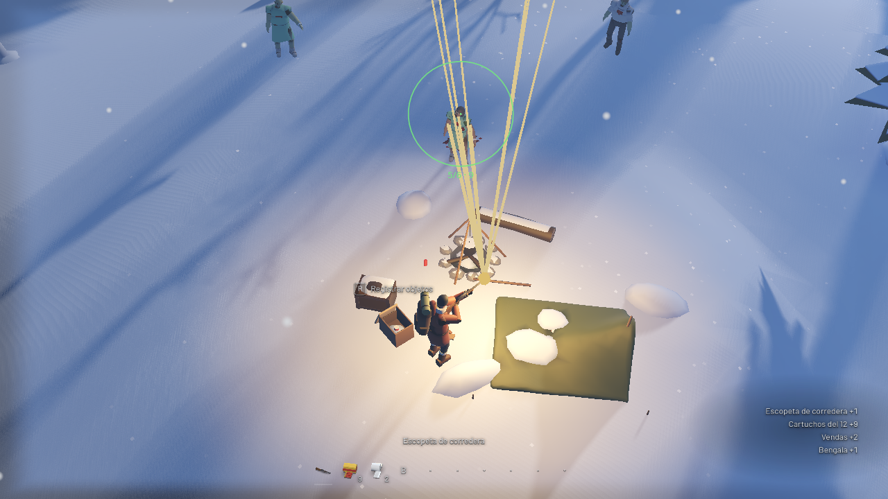

La captura se genera con `RENDER=forward tests/run_screenshots.sh <carpeta> firearms` (`tests/m5_shots.gd`).

### Armas de fuego y arco

Con un arma en la mano, el **clic dispara** (si no hay nada con qué interactuar bajo el cursor). **R** recarga o
desencasquilla y **G** lanza una lata o una bengala hacia el cursor (12 m como mucho). El arco se tensa mientras
mantienes el botón y suelta la flecha al soltarlo: cuanto más tenso, más daño y alcance. La cámara se inclina hacia el
cursor 3 m (6 m con el rifle).

| Arma | Daño | Cadencia | Alcance | Cargador | Ruido | Notas |
|---|---|---|---|---|---|---|
| Pistola 9 mm | 25 | 0.25 s | 15 m (máx. 40) | 15 | 80 m | 15 % de crítico |
| Revólver .357 | 45 | 0.5 s | 18 m (máx. 45) | 6 | 90 m | atraviesa 2 en línea |
| Escopeta del 12 | 8 × 12 perdigones | 0.9 s | 10 m (máx. 22) | 6 | 150 m | cono de 10°, carga cartucho a cartucho, derriba |
| Rifle .308 | 90 | 1.5 s | 45 m (máx. 60) | 5 | 120 m | 40 % de crítico, atraviesa 2 |
| Arco | 40 | tensado 1.4 s | 25 m (máx. 30) | 1 | 5 m | la flecha vuela (proyectil); se recupera el 60 % |

- **Retícula.** El anillo es la dispersión en el punto de mira y se cierra en ≤ 0.8 s quieto: **verde** < 4°
  (+15 % de crítico), **ámbar** 4–8°, **rojo** > 8°, **gris** si un aliado está en la línea de tiro sin fuego amigo.
  Andar suma 3°, correr 8°, agachado −1°, con Calor < 15 ×1.5, y cada disparo suma el retroceso del arma. El cursor se
  «pega» a un zombi a menos de 1.2 m.
- **El servidor decide cada disparo.** Comprueba arma, munición, cadencia y atasco, retrocede a los objetivos lo que el
  tirador los veía (RTT + interpolación, **como mucho 200 ms**) y traza el rayo en 2D contra zombis, jugadores y
  animales (radio 0.4 m), con los muros y el terreno como oclusión. Los perdigones salen de una semilla por disparo,
  así que todos ven el mismo abanico.
- **Atascos y munición.** Cada disparo gasta durabilidad; con frío (< −15 °C) y sin aceite de arma, o con el arma
  gastada, puede encasquillarse (R para limpiarla, 1.5 s). La munición es escasa, pesa y no se repone en los
  contenedores. La recarga cuenta en el evento de la animación (`mag_in`, `shell_in`, `bolt_close` en
  `data/anim_events.json`); empujar la interrumpe.
- **Ruido.** Cada disparo es un `SoundEvent` con el radio del arma (`noise_scale` en las reglas lo escala): atrae a
  los zombis y se ve como un anillo. La lata hace 15 m de ruido donde cae; la bengala no hace ruido, pero atrae a los
  zombis a 40 m hacia su luz durante 30 s y da +5 de calor cerca.
- **Peso.** Llevas 20 kg: por encima del 80 % vas ×0.85, por encima del 100 % ×0.6 y sin correr, y por encima del
  120 % no te mueves. El arma de la mano cuenta la mitad.
- **Botiquín.** Vendas (+15 PV), analgésicos (+8), botiquín (+50); el aceite de arma protege de los atascos por frío un
  día de juego. Ropa v0: abrigo, guantes y gorro (se ponen desde la mochila; el arco pide guantes con Calor < 15).

La retícula y la munición completas son del carril de interfaz (H3): el juego publica `Events.reticle_changed` y
`Events.weapon_state_changed`, y `ReticleHook` dibuja por ahora un anillo y «15/15 · 30».

### Botín

Los POI traen contenedores en sus *empties* `Spawn_Container_*` (mochila, baúl, caja, armario de cocina…) y objetos
sueltos en `Spawn_Loot_*`. El `wid` de cada uno sale de la semilla, el POI y el índice del *empty*, así que es el mismo
en el servidor y en los clientes. El contenedor se **tira la primera vez que alguien lo abre** (`Loot.roll`,
determinista por semilla + `wid` + día) con su tabla (`data/loot/loot_tables.gd`: cabaña, mirador, campamento, cocina,
sueltos, cazador y las de ciudad para M6+) y lo que queda se guarda en el delta del chunk: al volver está como lo
dejaste. Hay **topes por región** (munición, armas…) que crecen con los jugadores (×1 a ×1.75). Con
`personal_loot_bags=true` cada jugador tira su propia bolsa en cada contenedor. Un contenedor que nadie toca en 3 días
de juego puede reponerse (`loot_respawn`, 60 % por defecto; nunca munición). La tapa se abre mientras alguien lo
registra.

### Guardado (SQLite)

El servidor dedicado guarda en **SQLite** (`godot-sqlite` v4.9, MIT, fijado con SHA‑256 en
`tools/fetch_godot_sqlite.sh`; no está en el repositorio, se descarga con ese script) en modo WAL:

- **Esquema versionado** (`user_version`, `scripts/persistence/migrations/NNN_*.gd`). La versión 2 añade la tabla de
  topes del botín, las bolsas personales y `world_meta.world_version = 2` (el mundo de 96² chunks de W1). Un fichero de
  un servidor más nuevo se rechaza; uno viejo se migra al abrirlo. Un `world_save.json` de M2 se importa solo.
- **Autoguardado** cada `autosave_seconds` (60 s) en **una transacción** con todo lo cambiado; si el proceso muere a
  mitad, la base vuelve al último autoguardado completo. Al cerrar un contenedor se guarda su chunk en el momento.
- **Copia diaria** (`VACUUM INTO`) en `<carpeta del guardado>/backups/world-AAAAMMDD.db`; se conservan 7.
- Sin la extensión (Linux arm64, o si no se ha descargado) el servidor usa `FileBackend` (un JSON atómico) y lo dice
  en el log. La web no la lleva (el export Web la excluye) y juega sin guardar, como antes.

### Servidor dedicado

```bash
tools/fetch_godot_sqlite.sh              # una vez: la extensión SQLite (con caché en ~/.cache/ventisca)
server/build_server.sh                   # exporta export/server/ (preset "Dedicated Server", 79 MB, sin gráficos) + scripts
```

**systemd** (`server/ventisca.service`):

```bash
sudo useradd -r -m -d /srv/ventisca ventisca
sudo cp -r export/server/* /srv/ventisca/ && sudo chown -R ventisca: /srv/ventisca
sudo cp server/ventisca.service /etc/systemd/system/ && sudo systemctl daemon-reload && sudo systemctl enable --now ventisca
journalctl -u ventisca -f                # el log ([NET] / [EVT] / [ADMIN])
sudo -u ventisca /srv/ventisca/admin.sh status
```

La primera vez `run_server.sh` crea `/srv/ventisca/server.cfg` desde `server.cfg.example`, con un `admin_token`
aleatorio. Edítalo y reinicia.

**Docker** (`server/Dockerfile`, `server/docker-compose.yml`):

```bash
docker build -t ventisca-server -f server/Dockerfile export/server
docker run -d --name ventisca -p 7777:7777/udp -v ventisca-data:/data --restart unless-stopped ventisca-server
docker exec ventisca /srv/ventisca/admin.sh status
docker stop ventisca                     # guarda y sale (save-and-quit), código 0
# o bien: server/build_server.sh && docker compose -f server/docker-compose.yml up -d --build
```

La imagen no instala nada: `admin.sh` usa `/dev/tcp` de bash si no hay `nc`. El mundo y `server.cfg` viven en el
volumen `/data`. Si Docker Hub limita las descargas: `--build-arg BASE=mirror.gcr.io/library/debian:bookworm-slim`.

**Apagado.** `systemctl stop`, `docker stop` y Ctrl+C mandan SIGTERM a `run_server.sh`, que lo convierte en
`admin.sh save-and-quit`: guarda, avisa a los jugadores, cierra la base y sale con 0. Si algo lo mata de golpe, se
pierde como mucho lo posterior al último autoguardado. `Restart=always` (o `--restart unless-stopped`) lo levanta
tras un fallo.

**`server.cfg`** (`server/server.cfg.example`, todas las claves comentadas):

- `[server]`: nombre, contraseña, puerto UDP, jugadores, `motd`, `admin_port`/`admin_token` (TCP solo en 127.0.0.1),
  `admin_tokens` (jugadores que pueden usar los comandos de admin en el chat), `infractions_kick` y
  `debug_commands`.
- `[world]`: `seed`, `backend` (`sqlite`/`file`/`memory`), `save_path`, `autosave_seconds`, `backup_keep`,
  `day_length_sec`, `great_blizzard_days` y `difficulty`.
- `[rules]`: `pvp`, `friendly_fire`, `loot_respawn`, `personal_loot_bags`, `noise_scale`, `zombie_count_scale`,
  `cold_scale`… Se cambian en caliente con `rule`.
- `[net]`: `send_rate`, `zombie_rate`, `interest_chunks` y `max_kbps_per_client`.

**Comandos de admin** (`server/admin.sh <comando>`, o en el chat con `/` para los `admin_tokens` y siempre sin red):

| Comando | Qué hace |
|---|---|
| `status`, `players`, `stats`, `dbinfo` | Estado, jugadores (con el principio de su `token_hash`), red y la base (esquema, `world_version`, WAL, `quick_check`) |
| `save`, `backup` | Guarda ya; copia de seguridad ahora |
| `save-and-quit`, `quit` | Guarda y apaga; `quit` apaga sin guardar (los dos solo por el socket) |
| `say <texto>` / `broadcast <texto>` | Mensaje del servidor a todos |
| `kick <jugador> [motivo]` | Expulsa |
| `ban <jugador\|token_hash\|ip> [motivo]`, `unban …`, `bans` | Veta (por identidad o IP), quita el veto, lista |
| `rule <clave> <valor>`, `rules`, `pvp on\|off`, `ff off\|reduced\|full` | Reglas en caliente (se replican al HUD) |
| `time <h>`, `day <n>`, `weather clear\|blizzard [s]` | Reloj y clima |
| `give <jugador> <item> [n]`, `tp <jugador> <x> <z>` | Soporte (el `tp` respeta los muros del mundo de 6 km) |

Pruebas de M5:

- `tests/net/run_net_test.sh --clients 2 --duration 25 --soak 38 --scenario hitscan --net-sim 150,20,2`: un relé UDP
  (`tests/net/net_sim.gd`) mete 150 ms de ping, ±20 ms y un 2 % de pérdida; B cruza la línea de tiro de A a 10 m. Pasa
  con 13–15 aciertos de 15 (sin la compensación, 7–12) y rechaza el disparo sin munición.
- `tests/net/run_restart_test.sh [--backend sqlite|file]`: un jugador en el cuadrante SE (3 500, 3 600) tala, enciende
  dos hogueras, saquea la mochila del campamento y dispara. Tras `save-and-quit` y un servidor nuevo, todo sigue igual:
  posición, inventario, cargador, hogueras, pino talado y contenedor vacío, con `world_version = 2`.
- `godot --headless --path . -s tests/unit/persistence_m5_test.gd`: 64 comprobaciones de SQLite, migraciones y un
  proceso matado a mitad de transacción.
- `godot --headless --path . -s tests/unit/m5_units_test.gd`: 34 comprobaciones de botín y matemáticas de armas.
- `NET_BACKEND=sqlite SERVER_BIN=export/server/ventisca_server.x86_64 tests/net/run_net_test.sh --quick`: el servidor
  exportado.

Detalles técnicos en `docs/v2/ARQUITECTURA_V2.md` §15.5.

## Zonas: entrar y salir (H2)

| Título de zona, 1.ª visita (maqueta v2 c, fotograma 2) | Cartel de autovía (móvil rápido en la A‑14) |
|---|---|
| 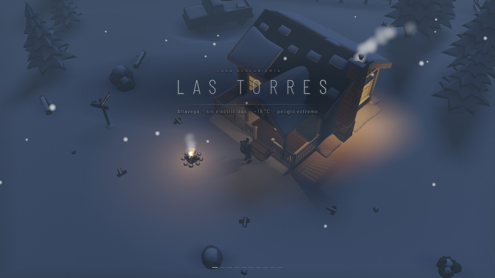 | 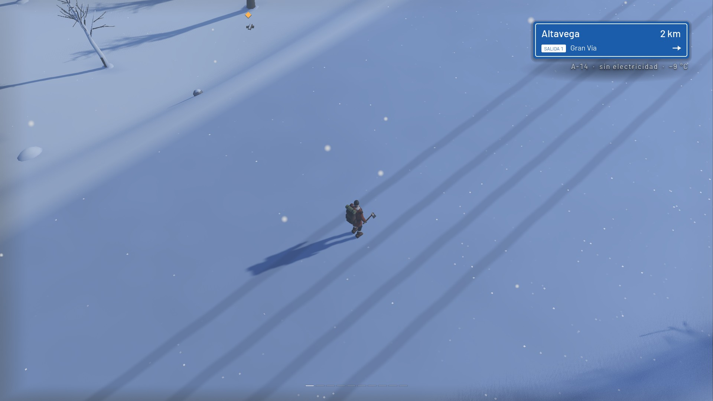 |

Capturas Forward+ a 1920 × 1080; la comparación con la maqueta v2 c (con sus tres fotogramas: 0,5 s, 1,8 s y 4,6 s, y el
cartel en vehículo) está en `docs/screenshots/h2/maqueta_vs_h2.jpg`. El título de Las Torres se muestra sobre el claro de
noche, como en la maqueta, porque Altavega aún no tiene edificios (C1).

Al entrar en un lugar aparece su nombre como en un AAA, sin cajas y sin parpadeos (PLAN C35, nombres definitivos C36):

- **Primera visita**: «zona descubierta», el nombre en Barlow Condensed ExtraLight de 76 px cuyo espaciado se cierra de
  .78 a .42 em (`FontVariation.spacing_glyph` animado), un filete y **una** línea de datos: «Altavega · sin
  electricidad · −18 °C · peligro alto» (zona padre · electricidad · temperatura · peligro, +1 de noche). 5,6 s y el
  sonido `ui_zone_discover`. **Re‑entrada**: solo el nombre al 60 % durante 2,5 s, sin sonido; nada en zonas naturales
  y carreteras.
- **Cuándo**: se entra estando **12 m dentro durante 1,5 s** (medido en la posición del jugador) y se sale 12 m fuera:
  ir y venir sobre un borde no cambia nada. Manda la zona más profunda: PDI ⊂ distrito ⊂ ciudad (en Las Torres sale
  «Las Torres» con «Altavega» de dato), después el agua, las carreteras con nombre, las áreas amplias (sierras, La
  Vega), Las Cumbres, Pinos Altos y el Bosque profundo. **90 s** por zona y **20 s** entre títulos; si se cruzan varias
  zonas en ese margen solo queda en cola la última. **En combate** (un golpe, un golpe dado o un zombi persiguiendo en
  los últimos 5 s) y **con un P0** (derribado, congelación, un aviso P0 en pantalla) el título espera; con P0 pasa a
  compacto. Si ya te has ido, se descarta.
- **Cartel de autovía**: a más de **40 km/h sobre una carretera** (el vehículo de M7; hoy cualquier móvil rápido) el
  título se sustituye por un cartel de 3 s arriba a la derecha, con el estilo español: azul en la autovía, blanco con la
  placa roja «N‑140» en la nacional, blanco en las avenidas. Fila 1: el destino por delante y su distancia («Altavega
  2 km»); fila 2: «SALIDA n» (punto kilométrico) y adónde lleva («Gran Vía →», o el distrito en el que entras); debajo,
  una línea de datos («A‑14 · sin electricidad · −8 °C»). Las carreteras con nombre dan su cartel la primera vez también
  a pie.
- **Al salir** no hay título: una línea P3 en la columna lateral solo si la situación mejora («Has salido del Control
  militar km 12»: el peligro baja de alto o extremo y no entras en algo que está dentro de lo que dejas).
- **Descubrimiento del grupo**: lo decide el servidor (comprueba que de verdad estás allí) y, con la regla
  `shared_discovery = true` (por defecto, `server.cfg` `[rules]`), vale para todo el grupo: los demás ven en la columna
  lateral «Ana descubrió: Granja del Molino» y, cuando llegan, el título compacto. Se guarda en el almacén del servidor
  (tabla `discoveries`, esquema 3: SQLite y JSON) y sobrevive a reiniciarlo; en solitario sin servidor, en
  `user://hud_discovered.cfg` por semilla. Con `shared_discovery = false` cada jugador descubre lo suyo.
- **Info** (mantener Tab / D‑pad ↑) dice dónde estás («Las Torres · Altavega») junto a la hora y la temperatura.
- **Cámara**: la señal `Events.zone_entered` (la zona confirmada, fuera de combate) elige el perfil de cámara urbano
  (C28) en los distritos, avenidas y PDI de Altavega; una `CameraZone` (azoteas, banco de ciudad) sigue mandando.
- Se retiró lo que quedaba del banner permanente del slice: el `RegionBanner` ya no existía desde H1 y ningún elemento
  de interfaz escucha `region_changed` (el `RegionTracker` del mundo sigue emitiéndolo como dato).

Datos: **`LocationInfo`** (`scripts/data/location_info.gd`: tipo, zona padre, círculo / rectángulo / polígono / varias
partes, peligro, temperatura, electricidad, perfil de cámara, artículo) y **`Locations`** (`scripts/data/locations.gd`,
70 zonas migradas de `PoiRegistry`: las 16 del valle, las 43 de W1 —37 reservadas para C1–C3—, el agua, las 7 carreteras
con nombre sobre sus propias trazas y las naturales). Código: `scripts/ui/hud/zone_tracker.gd`, `zone_title.gd`,
`zone_sign.gd`, `scripts/net/shared/zone_discovery.gd`, `scripts/persistence/migrations/003_discoveries.gd`. Sonido
provisional: `assets/audio/ui/ui_zone_discover.wav`, sintetizado por `tools/gen_ui_sounds.py` (obra propia, CC0,
`assets/audio/ui/LICENSE.txt`).

Pruebas:

- `godot --headless --path . -s tests/unit/zone_tracker_test.gd`: 38 comprobaciones — zigzag sobre un borde (0
  cambios), 12 m durante 1,5 s (1 cambio), distrito sobre ciudad, enfriamientos y cola de 1, combate y P0, línea de
  salida, cartel para un móvil rápido en la A‑14, `zone_entered` → perfil de cámara, **títulos correctos en los 20
  puntos de prueba de W1**, tiempos del título y del cartel, almacén de descubrimientos (memoria, JSON y SQLite, y
  migración desde el esquema 2), el sonido y el **test de nombres** (C36: ninguna palabra «Albarr» / «Albar» en
  `data/`, `scripts/` ni `scenes/`).
- `tests/run_smoke.sh` (paso 19, `tests/h2_smoke_steps.gd`): entra en 2 zonas reales tras un `/tp`, sale del control
  militar (línea P3) y lleva al jugador a 90 km/h por la N‑140 hasta el Área de descanso (cartel), sin `SCRIPT ERROR`.
- `tests/net/run_discovery_test.sh [--backend sqlite|file]`: A descubre la Granja del Molino, B ve «A descubrió: …» y
  al llegar el título compacto; tras `save-and-quit` y un servidor nuevo, C (un jugador nuevo) ya la conoce.
- Capturas: `RENDER=forward tests/run_screenshots.sh carpeta zone_card zone_sign_vehicle` (1920 × 1080; también
  `zone_card_t05` y `zone_card_t46`, los otros dos fotogramas de la maqueta), en `docs/screenshots/h2/`.

Detalles técnicos en `docs/v2/ARQUITECTURA_V2.md` §17.6.

## Kit modular y calle de prueba (M6a)

| La Calle Mayor de día | De noche | Dentro de una casa |
|---|---|---|
| 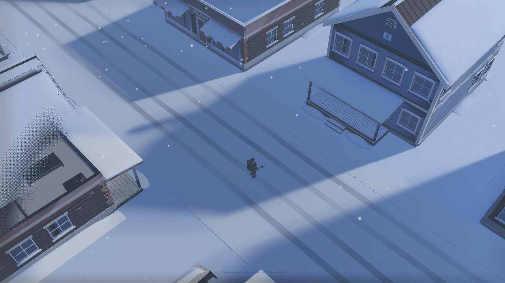 | 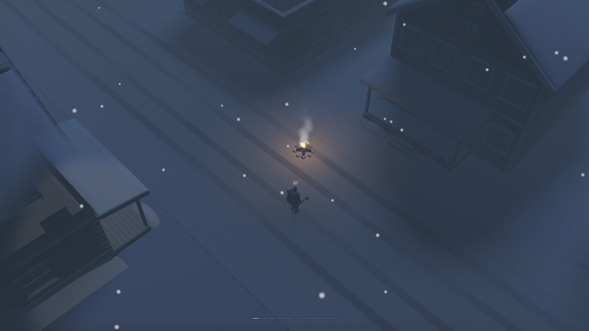 | 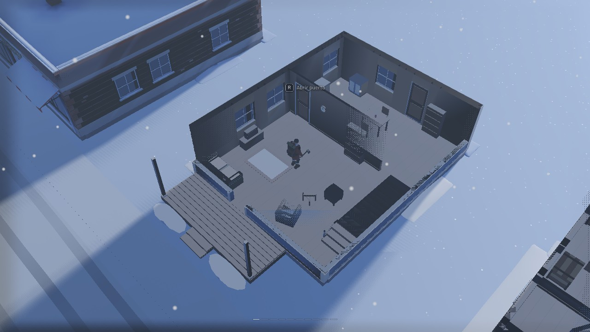 |

Capturas Forward+ del juego (1280 × 720; también `street_signs.jpg`: la entrada del pueblo a 24 m). La **Calle Mayor de
Santa María del Puerto** es la calle de prueba del kit de edificios: 7 edificios de 5 plantillas en 3 estilos, con sus
números, el rótulo de la tienda, placas de calle y la señal de entrada al pueblo. Para ir: `/tp -128 3072`.

- **Kit listo para el corte urbano** (`blender/lib/kit.py`, contrato W0): muros con grosor y volúmenes cerrados, una
  losa por planta (con el hueco de la escalera), tapas `cap_color`, escaleras de 17 peldaños con colisión en rampa,
  tejados a dos aguas o planos con peto, porches, escaparates con marquesina, chimeneas y el mobiliario de siempre
  fusionado en cada planta. Estilos `wood_blue`, `brick` y `concrete`.
- **Plantillas** (tris con los muñones ocultos incluidos): `house_small_A` 8 × 10 (13,0 k / 13,1 k), `house_small_B` 6 × 8
  (11,7 k / 11,5 k), `house_two_story_A` 8 × 10, 2 plantas (25,8 k / 24,6 k), `shop_general` 10 × 12 (13,4 k / 13,7 k)
  y `apartment_small` 10 × 10, 3 plantas (30,0 k ladrillo / 25,2 k hormigón).
- **Carteles diegéticos**: el texto es geometría (una fuente de mallas hecha con Barlow Condensed, sin texturas),
  iluminada como el tablero y con mayúsculas de 0,30–0,45 m: se lee a 24 m.
- **Entrar**: al cruzar la puerta, el tejado y las plantas de arriba desaparecen **conservando su sombra** (la
  habitación sigue en penumbra) y las fachadas del lado de la cámara bajan a un muñón; en la escalera se pasa de planta.
  Desde la calle, el corte urbano de W0 recorta las casas que se interponen entre la cámara y tú. Las cabañas del bosque
  (`cabin_small`, torre de vigilancia) usan ya el mismo corte.
- **Puertas**: clic sobre la puerta (o R, la más cercana): «Abrir puerta» / «Cerrar puerta». Las decide el servidor y todos las ven igual (también quien
  llega después); las de la calle abren hacia dentro, las interiores hacia el otro lado de quien abre; hacen ruido
  (6 m). Las ventanas aún no se rompen.

Código: `scripts/world/buildings/` (`KitStreets`, `KitStreet`, `KitBuilding`, `KitDoor`, `CutawayManager`,
`SignText`); datos `data/buildings/streets/calle_mayor.json` y `data/buildings/templates/`; arte
`blender/kits/`, `blender/props/build_signs.py` (`python3 build_all.py --only m6a`).

Pruebas:

- `godot --headless --path . -s tests/m6a_checks.gd`: 75 comprobaciones (la calle, el corte por plantas, puertas,
  carteles, wids deterministas, POIs del bosque con el tejado solo sombra).
- `tests/run_street_bench.sh gate`: `citycut_probe` en la calle (jugador visible ≥ 99 % desde 24 m en calle, patio,
  hueco entre casas y dentro de cada planta; zombis legibles ≥ 95 %; medido 100 %) y sombra interior de una casa
  cortada y de `cabin_small` ±5 % (medido 1,000). `tests/run_street_bench.sh shots carpeta` da las capturas del banco.
- `tests/net/run_net_test.sh --clients 3 --duration 62 --soak 100 --scenario street --port 7877`: A abre, B ve y cierra,
  A reabre, C llega 34 s tarde y la encuentra abierta.
- `RENDER=forward tests/run_screenshots.sh docs/screenshots/m6a street_day street_night street_signs house_inside`.

Detalles técnicos en `docs/v2/ARQUITECTURA_V2.md` §9.9 y en la sección «M6a» de `docs/v2/ASSET_SPEC_V2.md`.

## Sonido (S1)

Todo el juego suena: armas (disparo cercano + capa lejana por distancia + cola del entorno — bosque, nieve abierta,
cañón urbano, interior —, corredera y cerrojo, vainas en nieve o en duro, recargas paso a paso con los eventos de
animación, encasquillado, impactos por material, silbido de bala), cuerpo a cuerpo (*swings* por peso, impacto +
carne + reacción), zombis (gemidos con presupuesto de 6 voces — ganan los más cercanos —, «te he visto», ataques,
muertes, pasos arrastrados, congelados que se sueltan del hielo, el hinchado que revienta), lobos, pasos del jugador
por superficie (nieve, nieve pisada, hielo, madera, hormigón, metal), respiración en el frío, fuego, estufa, bengala,
tala y caída del árbol, puertas, cofres, y un **director de ambiente** que funde lechos por lugar (bosque del valle,
puerto de montaña, río helado, Altavega, puerto, interior), hora, viento y ventisca, con *one-shots* dispersos
(cuervos, búho, alarmas y perros lejanos, disparos y gritos que no ves). Música mínima: solo *stingers*.

- **Escucha la demo**: [`docs/audio/demo_mix.ogg`](docs/audio/demo_mix.ogg) (42 s).
- Volúmenes (General, Efectos, Ambiente, Interfaz, Música): menú de pausa → **Sonido** (`user://settings.cfg`).
- Diseño, mapa de sonidos, mezcla, oyente y licencias: [`docs/AUDIO.md`](docs/AUDIO.md). Todo es **CC0** u obra
  propia CC0 (`assets/audio/LICENSES.md` lista cada fichero y sus grabaciones).
- Reconstruir los sonidos (Python 3 + numpy, scipy, pyloudnorm y ffmpeg con libvorbis — `pip install numpy scipy
  pyloudnorm imageio-ffmpeg`):

```bash
tools/audio/fetch_sources.sh                 # grabaciones CC0 (Kenney, OpenGameArt) fijadas por commit → ~/.cache/ventisca/audio_src
python3 tools/audio/build_audio.py [grupo]   # weapons creatures player world ambience ui → assets/audio/*, manifest.json, LICENSES.md
python3 tools/audio/render_demo.py           # docs/audio/demo_mix.ogg
godot --headless --path . -s tools/audio/gen_bus_layout.gd   # default_bus_layout.tres
godot --headless --path . -s tests/unit/audio_test.gd        # la prueba del audio
```

## Pruebas

```bash
cd winter-survival
./tests/run_all.sh [--shots] [--no-walk-render]   # todas las puertas M0–M5 + W0 + W1 + H2 (zone_tracker_test, discovery sqlite + file) + S1 (audio_test): godot-sqlite fijado, import, parse, persistencia, humo, contrato de arte, perf, render (W0, headless), banco de ciudad (W0, xvfb), red (basic, shared_world, far con 4 clientes en 4 cuadrantes, zombies, hitscan con --net-sim, restart sqlite + file), unitarias M5, determinismo (60 chunks), mundo W1, «el valle no cambia», macro reproducible, perf walk (6.5 km), perf horde [, capturas]; en una máquina compartida: taskset -c 0,1 ./tests/run_all.sh
./tests/run_perf_horde.sh [--zombies=200] [--seconds=20]   # M4: servidor dedicado + 4 bots + 200 zombis → tests/perf/horde.json (tick mediano ≤ 8 ms, p99 informativo)
./tests/run_smoke.sh                 # importa + prueba de humo sin pantalla (SMOKE TEST OK / FAILED); offline = servidor local en proceso
./tests/net/run_net_test.sh --clients 4 --duration 60 --soak 90   # 1 servidor + 4 clientes headless: se ven moverse, chat, FF bloqueado, reconexión, ≤ 5 kB/s, soak
./tests/run_screenshots.sh [carpeta] [presets] # capturas day/dusk/night/blizzard/interior/menu con xvfb + OpenGL; RENDER=forward = Forward+ con lavapipe (presets extra: `multi` = cliente unido a un servidor, `overview` = vista aérea del lago y una carretera, M3; `zombies` = la pelea al atardecer delante de la cabaña, M4)
python3 tools/contact_sheet.py hoja.png 3 "ref=…jpg" "antes=…png" "después=…png"   # hoja de comparación (Pillow)
./tests/run_perf.sh [--placeholders] # sonda de rendimiento (draw calls, objetos, ms) → tests/perf/last.json vs tests/perf_budgets.json
godot --headless --path . -s tests/inspect_models.gd [++ --quiet] [--placeholders]  # contrato ASSET_SPEC v2 de cada .glb (o de los placeholders)
```

Convenciones v2 (`docs/v2/`): frente de los modelos = **+Z** (`Vector3.MODEL_FRONT`), color de vértice + material
compartido `assets/materials/world_vcol.tres` (`snow_amount` global; desde G1 el alfa de `COLOR_0` es AO horneada),
física **Jolt**, partículas GPU y presets de calidad `alto/medio/compat` (autoload `Quality`, `user://settings.cfg`).

Look G1 (`docs/research/06_graficos_render.md`, sección "G1 integrado"): tonemap Filmic con exposición por hora
(`DayNight.KEYS`) y por renderizador (`Quality.exposure_scale`: Compatibility ×0.5), sol bajo a contraluz, ambiente
azul, terreno liso con AO horneada (`Terrain.bake_ao`) y shader `assets/shaders/terrain.gdshader`, huellas en mapa de
rastro (`Footprints`, `DrawableTexture2D`), derrame de ventanas (`WindowSpill`) y cámara a 24 m por defecto (zoom 16–38).
Presets: `alto` = PCSS + SSAO + niebla volumétrica en ventisca + 2 luces omni con sombra; `medio` = SSAO bajo, sin PCSS;
`compat` = Compatibility (sin SSAO/volumétrica/proyectores; la AO horneada lleva el look).
