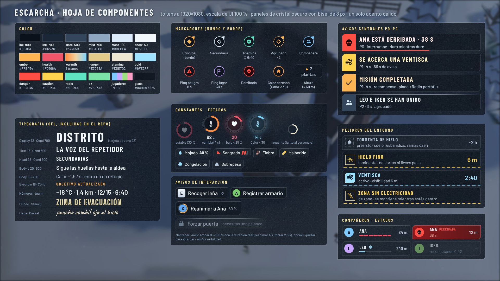
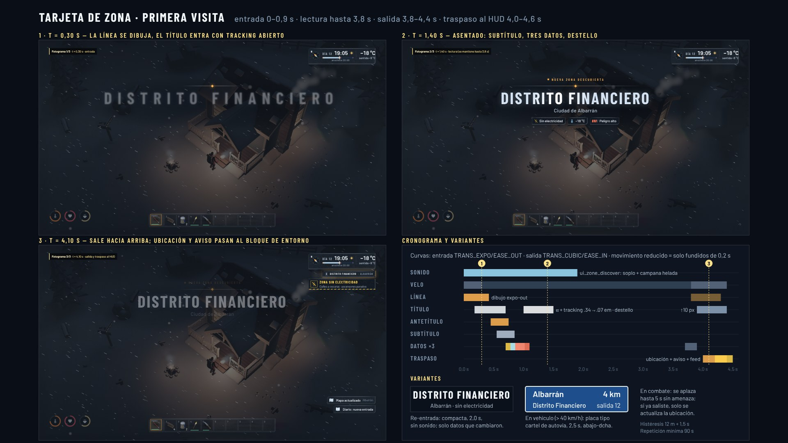
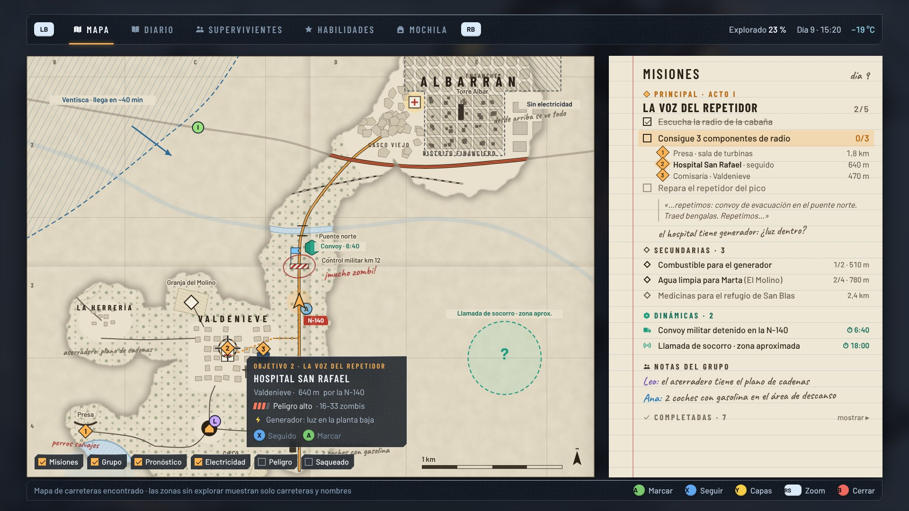

# 10 — HUD, misiones y señalización: auditoría, investigación y guía de estilo «ESCARCHA»

> Proyecto VENTISCA (Godot 4.7.2; cámara alta tipo isométrica: inclinación −48°, guiñada en pasos de 45°, FOV 36°,
> 24 m por defecto y 16–38 m con zoom, según `scripts/data/balance.gd`; cooperativo 1–4; todo el texto en español).
> Fecha: 26‑sep‑2026. Autor: dirección de UI/UX (agente de investigación). Estado: **investigación cerrada, dirección
> elegida, guía de estilo y maquetas en alta fidelidad**. No se ha tocado código del juego.
>
> Pedido del propietario: *«que el HUD, las misiones y los carteles y avisos al entrar o salir de un sitio sean mucho
> mejores, como en un juego AAA»*, y que se planifique bien antes de implementar. Contexto nuevo que este documento ya
> asume: el mundo crece a **unos 6 × 6 km**, con una ciudad con rascacielos (**Albarrán**, nombre de trabajo), pueblos,
> bosque, autovía y un río helado. El postapocalipsis estará habitado: supervivientes NPC, convoyes militares y eventos
> dinámicos. Habrá peligros de invierno como ventiscas, tormentas de hielo, barrios a oscuras por apagones o hielo fino.
>
> Complementa `docs/v2/GDD_MUNDO_ABIERTO.md` §3, §11.4, §12 y §13, y `docs/PLAN_MAESTRO.md` §4 y §7. Donde esta
> propuesta cambia algo que ya decide el GDD, se indica en §10 para que lo confirme el propietario.

---

## 0. Resumen ejecutivo

| Pregunta | Respuesta |
|---|---|
| ¿Qué falla hoy? | El HUD del slice es **correcto pero de prototipo**. Usa una fuente por defecto con negrita sintética y rótulos de 7–9 px sobre una base de 1280×720, así que en Steam Deck quedan por debajo del mínimo de 9 px. El banner de región es permanente, calcula la región por chunk y no tiene histéresis. La ventisca se anuncia con un rótulo rojo parpadeante. Los *toasts* no tienen prioridad. La selección de la barra con mando no se dibuja (bug), el número de los anillos solo aparece al pasar el ratón y el icono de hambre se lee como una llave. No hay interfaz de compañeros, marcadores ni mapa, aunque el cooperativo existe desde M1. Los carteles del mundo tienen letras de 0,08 m, ilegibles a 24 m (§1). |
| Dirección elegida | **«ESCARCHA»**: paneles de **cristal oscuro esmerilado** con bisel de 8 px, fríos, con **un solo acento cálido** (`ember #FFB454`, que ya es el acento del slice). **El papel** queda solo para el mapa y el diario (objetos del mundo) y **el estarcido** solo para la señalización del mundo. Principio de maquetación: **arriba está el mundo** (dónde, cuándo, qué pasa) y **abajo estás tú** (cuerpo, manos, mochila). Además, **la interfaz también tiene frío**: con Calor < 30 la escarcha invade los bordes de los paneles (§3). |
| ¿Brújula, minimapa o nada? | **Ni minimapa ni barra de brújula.** Con esta cámara, la pantalla ya es un plano cenital de unos 28 × 23 m. Usamos **marcadores en el mundo**, un **carril de indicadores en el borde de la pantalla**, una **rosa de rumbo** pequeña que gira con la cámara y el **mapa de papel** (M). También hay **guía diegética**: carteles, pintadas, humo y bengalas (§4). |
| Entrar en una zona | **Tarjeta de zona** en el tercio superior. La primera visita dura **4,4 s** en total y la re‑entrada muestra una versión compacta de 2 s. Incluye tipo, nombre, zona padre y **tres datos**: electricidad, temperatura y peligro. Se dispara con **histéresis de 12 m y 1,5 s**, se aplaza en combate y tiene sonido propio. Al salir, la información pasa al bloque de entorno (§6.1, maquetas c1–c3). |
| Misiones | Tres tipos que se distinguen por **forma y color**: principal (◆ ámbar), secundaria (◇ escarcha) y dinámica (⬡ verde radio, con cuenta atrás). El rastreador compacto muestra 1 principal y 2 más. Al actualizar un objetivo se amplía unos 6 s con la animación «Objetivo actualizado» de 1,5 s, sincronizada con el marcador del mundo (§6.2–6.3, maqueta d). |
| Avisos | Dos canales y un enrutador. El **banner central** tiene prioridades P0–P2, cola, prelación y fusión. La **pila lateral** recoge objetos, fabricación, niveles y grupo, con fusión de contadores. Los peligros son **píldoras con estado**: previsto → inminente → activo (§6.5, §6.7, maquetas b y e). |
| Constantes | Se conservan los **tres anillos** del original, pero pasan **abajo a la izquierda** con visibilidad dinámica: 30 % si están estables, 100 % durante 4 s tras un cambio y pulso por debajo del 25 %. Se añaden **estados con severidad** (al estilo de los *moodles* de Project Zomboid) y el **desglose de temperatura sentida** (al estilo de The Long Dark). El aguante pasa a ser un **arco junto al personaje** (§6.6). |
| Tipografía | **Barlow y Barlow Condensed** (OFL) para toda la UI, con cifras tabulares y versalitas reales. **Big Shoulders Stencil** (OFL) solo para rótulos del mundo y **Caveat** (OFL) solo para notas a lápiz en el mapa. Todas se descargaron de `google/fonts` en GitHub, cubren el español entero (Á…Ñ, ¿¡, °, −) y están en `10_hud_ux/mockups/fonts/` con su licencia (§5.2). |
| Implementación | Siete hitos, UI‑0 a UI‑6, de unos **7 pases de agente**. Van de los cimientos (tokens, fuentes, `Theme`, área segura y escala) a la accesibilidad, pasando por disposición v2, zonas, avisos y grupo, misiones y marcadores, y mapa y diario. Cada hito se engancha a las señales actuales de `Events` mediante adaptadores, sin romper el slice (§8). |
| Maquetas | 10 imágenes a 1920×1080 (JPG de 140 a 400 kB) sobre capturas reales del juego, sin el HUD antiguo (§9). |

---

## 1. Auditoría del HUD actual

Material revisado: `scripts/ui/*.gd` (hud, region_banner, quest_panel, quest_mark, toast, ring_meter, day_clock, hotbar,
hotbar_slot, category_bar, craft_panel, game_over, controls_panel, chat_box, ui_theme, ui_icons),
`scripts/world/region_tracker.gd`, `scripts/data/regions.gd`, `data/world/poi_registry.gd`,
`scripts/player/quest_component.gd`, `scripts/data/quests.gd`, `assets/icons/` (24 SVG planos y 20 PNG renderizados en
`items/`), `assets/shaders/frost_vignette.gdshader`, las capturas `docs/screenshots/g1/*.jpg`, `m4/zombies.jpg`,
`*.png` y `g1/referencia_vs_g1.jpg`.

### 1.1 Inventario y medidas

Base del proyecto: `window/size = 1280×720` con `stretch/mode = canvas_items` y `aspect = expand`. Todos los tamaños del
código están en píxeles de 720p. A 1080p se multiplican por 1,5 y en Steam Deck (1280×800) por 1,0.

| Elemento | Dónde / tamaño (720p) | Observación |
|---|---|---|
| Barra de categorías | izquierda, 6 botones de 42 px (≈ 50 × 290 px) | Siempre visible aunque se usa poco. `FOCUS_NONE`: no se puede navegar con mando. |
| Banner de región | arriba al centro, «REGIÓN» a **8 px** y nombre a 18 px | Permanente al 80 % de opacidad. Solo sube al 100 % durante 3 s tras un cambio. |
| Reloj | arriba a la dcha., disco de 64 px con «Día N» y anillo de 06:00 a 06:00 | No muestra la hora. El sol o la luna son la única pista de la noche (a las 20:00). |
| Anillos | Hambre, Salud y Calor, de 56 px, arriba a la dcha. | Siempre visibles. El número **solo aparece al pasar el ratón**. Por debajo del 25 % laten a 1,2 Hz (bien). |
| Rótulo «VENTISCA» | bajo los anillos, **rojo peligro**, parpadeo sinusoidal | Usa el rojo de daño y sangre para el clima. No dice cuánto dura ni qué hacer. |
| Aguante | barra de 150 × 5 px bajo los anillos | Aparece lejos del personaje y del foco de la acción. |
| Panel de misiones | derecha, 250 px: pequeño 9 px, grande 17, filas 11, pistas 9 | Buena estructura: anterior, actual y siguiente, con progreso. El tachado es un `ColorRect` medido a mano y las filas se destruyen y recrean en cada cambio, así que no se pueden animar. |
| *Toasts* | arriba al centro bajo el banner, máximo 3 y 3 s | Sin prioridad, sin fusión y sin canal. «Sin aliento» y «Se acerca una ventisca…» tienen el mismo peso. |
| Barra rápida | abajo, 10 ranuras de 52 px (≈ 575 px, **el 45 % del ancho**) | La referencia ocupa el 37 %. 10 signos «+» en las ranuras vacías. Rótulo «MANO» a **7 px**. |
| Etiqueta de contexto | sobre la barra, 12 px | Útil con ratón. Con mando no hay aviso anclado al objeto. |
| Viñetas | `frost_vignette.gdshader` para frío y daño | Degradado radial con ruido estático por celda (UV × 240): parpadeo y *aliasing* al cambiar de resolución. Sin refracción ni movimiento. |
| Derribado | texto centrado «DESANGRÁNDOTE · 47 s» | El mensaje es correcto, pero falta un anillo de tiempo y el marcador en el mundo para los demás. |
| Muerte | panel con causa, consejo y «Reaparecer (20 s)» | Contenido muy bueno (GDD §13). Solo pide la nueva tipografía. |
| Compañeros, marcadores, *pings*, mapa | **no existen** | El cooperativo de 1 a 4 jugadores funciona desde M1 y el derribado desde M4. |

### 1.2 Qué conservar y qué arreglar

| Pieza | Veredicto | Motivo / cambio |
|---|---|---|
| Paleta pizarra con acento `#FFB454` | **Conservar** | Es la base de los tokens (§5.1). El acento pasa a llamarse `ember`. |
| «Borde de escarcha» superior de los paneles | **Conservar y evolucionar** | Brillo de 1 px que se desvanece en los extremos, bisel de 8 px y grano de escarcha (§5.3). |
| Tres anillos | **Conservar la forma, moverlos y hacerlos dinámicos** | Son la seña del juego de referencia que gusta al propietario. Van abajo a la izquierda. El número se muestra al cambiar y con el botón «Info» del mando. El icono de hambre pasa a ser un cuenco humeante. |
| Reloj «Día N» | **Sustituir** | Franja horaria con la hora, el día y la marca «anochece 20:00» (§6.6.4). |
| Banner de región permanente | **Sustituir** | Tarjeta de zona temporal y línea de ubicación (§6.1). |
| Panel de misiones | **Conservar la estructura y ampliarla** | Tipos, rastreador compacto y expandido, animación. Filas persistentes identificadas por paso. |
| *Toasts* | **Sustituir** | Enrutador de avisos con dos canales (§6.5). |
| Rótulo rojo «VENTISCA» | **Sustituir** | Píldora de peligro con estado, tiempo y consecuencia (§6.7). El rojo queda reservado al daño. |
| Barra de aguante | **Sustituir** | Arco junto al personaje, como la rueda de aguante de *Breath of the Wild* (§6.6). |
| Barra de categorías | **Ocultar** | Solo aparece al abrir la fabricación (Tab / Y). Libera la columna izquierda para los compañeros (GDD §12.3). |
| Barra rápida | **Conservar** | 10 ranuras y MANO, más números, selección visible, durabilidad y atenuación en reposo. |
| Etiqueta de contexto | **Conservar para ratón** | Se añade el aviso anclado en el mundo para el mando (§6.9). |
| Viñetas | **Conservar la idea** | Shader nuevo con cristales, refracción, desaturación y escarcha en los paneles (§8.3). |
| Pantalla de muerte | **Conservar** | Solo cambia la tipografía. |
| Chat | **Conservar** | Abajo a la izquierda, sobre las constantes. |

### 1.3 Hallazgos técnicos concretos (para el pase UI‑0)

1. **La selección de la barra con mando no se dibuja.** `hotbar.gd` mueve `_selected` con `hotbar_prev` y
   `hotbar_next`, pero `HotbarSlot` no tiene estado de selección, así que con mando no se ve qué ranura se usará con
   `hotbar_use`.
2. **Hay información que solo aparece al pasar el ratón.** Es el caso del número de `RingMeter` (`mouse_entered`) y de
   las descripciones (`tooltip_text`) de ranuras y categorías. Con mando no se puede consultar.
3. **La región se calcula por chunk y no tiene histéresis.** `RegionTracker` solo recalcula al cambiar de chunk (64 m)
   y `Regions.chunk_name` evalúa el **centro** del chunk. Por eso los bordes se desplazan hasta 45 m y, al ir y volver
   por una frontera, el banner parpadea a plena opacidad cada vez. Además, los nombres están en mayúsculas en los datos
   (`"LAGO DE LAS ÁNIMAS"`), lo que impide usarlos en subtítulos y en el mapa con mayúsculas y minúsculas.
4. **Tipografía.** `UiTheme.title_font()` y `bold_font()` usan `ThemeDB.fallback_font` con `variation_embolden`, es decir,
   negrita sintética con bordes empastados, y separación de glifos 2 para simular *tracking*. En la base de 720p hay
   rótulos de 7 px («MANO») y 8 px («REGIÓN»). En Steam Deck se quedan en 7–8 px, **por debajo del mínimo de 9 px de
   Valve** (§2.3).
5. **Los carteles del mundo son ilegibles.** `signpost.gd` crea un `Label3D` con `font_size = 48` y `pixel_size = 0.0017`,
   lo que da una altura de eme de **0,08 m**. A 24 m de cámara eso son ~4 px en pantalla: no se lee
   (`g1/day.jpg`, poste de la izquierda). La regla nueva está en §7.4.
6. **El aviso de ventisca no coincide con el GDD.** `Balance.BLIZZARD_WARNING = 10.0` s, mientras que el GDD §2.5 y §4.5
   fijan **60 s**. La píldora de peligro necesita esos 60 s para que el jugador pueda decidir.
7. **Los paneles de misión se reconstruyen en cada actualización.** `QuestPanel._on_quest_updated` hace `queue_free` de
   todas las filas y no hay nodo que animar. El rastreador nuevo mantiene un nodo por paso, con clave
   `mission_id/step_id`.
8. **Contraste.** El texto secundario `#93A6BF` sobre `PANEL_BG` al 88 % pasa. Pero cualquier panel por debajo del 70 %
   de opacidad sobre nieve blanca baja de 4,5:1 (§5.1.3). Por eso el cristal nuevo es **adaptativo**.

### 1.4 Diferencias entre el alcance nuevo y los documentos actuales

- El GDD v2 describe **3 × 3 km** y en §18 excluye los «NPC con moral». El propietario quiere ahora **6 × 6 km**,
  supervivientes NPC y convoyes. Esta guía de UI no depende del tamaño del mundo: fija formatos de distancia, niveles de
  zoom del mapa y la jerarquía ciudad → distrito → PDI. Aun así, el PLAN y el GDD deberían actualizarse (§10).
- GDD §11.4 dice «Tablón de objetivos (sustituye al panel de misiones)… Sin NPC hablando». Aquí se propone un
  **rastreador con tres tipos**, donde las secundarias pueden venir de supervivientes (notas, radio o, más adelante,
  diálogo) y las dinámicas del director. El tablón del GDD cabe dentro: 1 principal y hasta 3 generadas.

---

## 2. Investigación: referencias y patrones

> Método: búsqueda web (entrevistas, wikis, bases de datos de UI) y conocimiento de juego de los títulos. Los tiempos
> de animación de terceros son **aproximados**, observados en juego y no medidos fotograma a fotograma. Los tiempos de
> VENTISCA (§5.5 y §6) son decisiones propias apoyadas en ellos. Fuentes en §11.

### 2.1 Por juego: qué hace y qué tomamos

| Juego | Patrón relevante | Qué tomamos para VENTISCA |
|---|---|---|
| **The Division 2** | Interfaz diegética «holográfica» con marcadores anclados al mundo, distancia y camino al objetivo. Transiciones de zona con reglas explícitas: al entrar en la Zona Oscura se avisa de que cambian las reglas. Charla de GDC 2017 sobre el sistema de UI de *The Division*. [1][2][3] | Los **marcadores anclados en el mundo con distancia** son la herramienta principal. Las **transiciones de zona especial** («Zona sin electricidad», «Zona militar») dicen la regla que cambia, no solo el nombre. |
| **The Last of Us Part II** | HUD discreto que desaparece fuera de combate. Más de **60 opciones de accesibilidad**: escala del HUD, oscuridad del fondo del HUD, color del HUD, modos de daltonismo para los acentos, alto contraste, asistencia de navegación, lector de pantalla y lupa. [4][5] | Constantes que se ocultan cuando no importan. Lista de accesibilidad de §5.8: escala, fondo, color, daltonismo, movimiento reducido, TTS. |
| **Days Gone** | HUD con minimapa. El modo Supervivencia quita el minimapa y los marcadores. Hordas y zonas de infestación como elemento de mapa. [6][7] | La horda como **evento dinámico** con marcador y rastro. Preajuste **«Inmersivo»** que lo oculta todo salvo los avisos P0 y los de interacción. |
| **Far Cry 5 / 6** | *Far Cry 5* quitó el minimapa porque los jugadores «jugaban mirándolo», según se recoge en foros; la serie usa brújula. [8] | Refuerza **no poner minimapa**: la mirada tiene que estar en el mundo. |
| **Ghost of Tsushima** | «Viento guía» en lugar de flechas, brújula o minimapa. Los animales (zorros, pájaros) llevan a los lugares de interés. «Perdidos en la naturaleza, no en los menús» (Nate Fox). [9][10] | **Guía diegética**: carteles de evacuación, flechas pintadas, columnas de humo y bengalas, y la acción «Orientarse» (§7). HUD mínimo por defecto. |
| **Horizon Forbidden West** | Brújula arriba con iconos. **HUD dinámico** que oculta lo que no hace falta. **Cada elemento se configura por separado** (siempre, dinámico u oculto) y el panel táctil lo muestra todo. La brújula brilla en dorado en la zona de la misión principal. [11][12][13] | Ajuste **por elemento** con tres estados. El botón **«Info»** (D‑pad ↓ o Alt) lo muestra todo durante 5 s. «Área de misión» como anillo en el suelo o círculo de búsqueda. |
| **Death Stranding** | Tipografía sans ligera y espaciada (SST) para mucha información logística. **Pronóstico del tiempo en el mapa** con la lluvia temporal de los próximos 30 min. [14][15] | **Capa de pronóstico en el mapa** con el frente de ventisca y su hora de llegada, y **píldoras «previsto»** en el HUD. |
| **The Long Dark** | La **temperatura «sensación»** se muestra con su desglose: aire, viento y ropa. **Mapa a carboncillo**: se revela al cartografiar y **la altura revela más**. [16][17] | **Desglose térmico** (GDD §4.1: «toda penalización se muestra con icono + número + causa»). La niebla de guerra se levanta al explorar y los **miradores** revelan más (§6.11). Estética de carboncillo en el borde de la niebla. |
| **Frostpunk 2** | **Línea temporal del tiempo** arriba a la derecha con iconos de termómetro para los cambios previstos. Las tormentas blancas se desplazan con el viento y solo afectan a lo que tienen debajo. [18][19] | Los peligros **previstos** se marcan en la **franja horaria** del bloque de entorno (§6.6.4, ampliación opcional). La ventisca del mapa es un frente que se mueve. |
| **State of Decay 2** | Misiones que llegan **por radio**. Peticiones de enclaves **con temporizador**. Queja habitual: hay que abrir el mapa para ver las misiones. [20][21] | Las dinámicas **entran por radio** con cuenta atrás y **aparecen en el rastreador** sin abrir el mapa. |
| **Dying Light 2** | Brújula arriba. Cuando la inmunidad baja, la brújula **señala la luz UV más cercana**. El temporizador de inmunidad se muestra arriba en el centro. [22] | Con Calor < 30 aparece el **marcador de «calor cercano»**: refugio con estufa o fogata conocida (§6.4.5, maqueta b). |
| **Project Zomboid** | *Moodles*: iconos de estado que **solo aparecen si importan**, con **hasta 4 niveles de severidad** y descripción al pasar el cursor. [23][24] | **Chips de estado** con severidad en marcas (1–3), causa y remedio en «Info» (§6.6.3). |
| **Assassin's Creed Valhalla** | Los **miradores** sincronizan y quitan la niebla del mapa en un radio de ~1 km. Cada región muestra un **poder sugerido** (rojo si vas muy por debajo). [25][26] | **Miradores** diegéticos (azoteas de rascacielos, torre de vigilancia, repetidor) que revelan 600 m. **Nivel de peligro** en la tarjeta de zona. |
| **Red Dead Redemption 2** | HUD mínimo y contextual: con el caballo solo se ven el minimapa y su aguante. **D‑pad ↓** muestra **ubicación, hora y temperatura**. Núcleos circulares. [27][28][29] | Botón **«Info»** que abre el bloque de entorno completo. La **temperatura** va siempre con la ubicación. Los anillos son el equivalente de los núcleos. |

### 2.2 Patrones transversales (lo que se repite en los AAA)

1. **Menos HUD permanente y más HUD que aparece cuando importa.** TLOU2, RDR2, Horizon y Ghost lo hacen. La regla común:
   todo elemento tiene los estados *oculto*, *latente* y *activo*, y hay un botón que lo muestra todo.
2. **La navegación va en el mundo, no en una caja.** Far Cry 5 quitó el minimapa y Ghost lo lleva al extremo. Con
   cámara alta, además, **la pantalla ya es un plano**.
3. **Los títulos de zona son tipográficos, breves y ricos en datos.** Nombre, contexto (zona padre) y 1 a 3 datos de
   decisión, como el peligro (Valhalla) o la temperatura (RDR2). Primera visita grande, re‑entrada pequeña o nada.
4. **Los avisos se clasifican.** Una capa crítica que interrumpe (derribado, peligro inminente) y una capa de
   información que se apila y se fusiona (objetos, fabricación).
5. **El estado del cuerpo se explica.** The Long Dark desglosa la sensación térmica y Zomboid da severidad y
   descripción. En un juego de frío, **el número sin causa no sirve**.
6. **Pronóstico.** Frostpunk 2 y Death Stranding convierten el clima en información planificable antes de que llegue.
7. **La accesibilidad es de serie.** TLOU2 fijó el listón: escala, contraste, color, movimiento, TTS y navegación.

### 2.3 Normas de legibilidad y accesibilidad usadas como requisito

| Norma | Requisito | Cómo lo cumplimos |
|---|---|---|
| Steam Deck Verified | Carácter más pequeño **≥ 9 px a 1280×800**; Valve recomienda **12 px** [30] | Mínimo **18 px** para frases y **16 px** para antetítulos en mayúsculas, a 1080p y escala 100 %. En Deck la escala por defecto es **115 %**: 16 × 0,667 × 1,15 = **12,3 px** ✓. |
| XAG 101 (Xbox) | Texto mínimo de **28 px a 1080p** en experiencias de sofá [31] | Preajuste **«Sofá/TV»**: escala de texto al 150 % (18 → 27 px, 20 → 30 px). |
| XAG 102 | Contraste de texto **≥ 4,5:1** [32] | Cristal adaptativo (§5.1.3). `text-3` solo para información no esencial. |
| Game Accessibility Guidelines | No transmitir nada **solo con color**; nada de **más de 3 destellos/s** (WCAG 2.3.1); alternativas a **mantener pulsado** [33][34] | Forma más icono más texto en todo lo semántico. Pulsos ≤ 2 Hz. Opción «pulsar para alternar». |

---

## 3. Dirección elegida: «ESCARCHA»

### 3.1 Las tres opciones evaluadas

| Opción | A favor | En contra | Veredicto |
|---|---|---|---|
| **Cristal esmerilado oscuro** | Es la **continuación** del estilo de referencia que el GDD §13 manda extender: pizarra translúcida con borde escarchado. El **contraste es estable** sobre nieve blanca, noche azul y ventisca gris. El tema es el antagonista del juego, el frío. Barato en Godot (`StyleBoxFlat` y un shader de lectura de pantalla opcional). | Puede resultar «genérico sci‑fi» si se abusa del brillo. | **Elegida** para todo el HUD y los menús. |
| Papel gastado | Diegético y cálido. El GDD ya define un «mapa de papel». | **El papel claro sobre nieve clara no contrasta.** Envejece mal con mucha información y a tamaño pequeño. | **Solo para el mapa y el diario**, que son objetos a pantalla completa. |
| Estarcido militar | Encaja con convoyes, control militar y evacuación. | Cliché del *shooter* militar. Las fuentes de estarcido son **ilegibles a menos de 20 px**. | **Solo en el mundo**: carteles, cajas, vehículos y pintadas (§7). |

### 3.2 Por qué funciona

1. **Contraste bajo cualquier clima.** El mundo de VENTISCA es mayoritariamente claro: nieve con luminancia de 70–90 %.
   Un panel oscuro translúcido con texto claro es la única combinación que mantiene 4,5:1 de día, de noche y en
   ventisca sin cambiar de tema.
2. **Un solo acento cálido con significado.** En un mundo frío, **lo cálido atrae la mirada**. El `ember` se reserva
   para tres cosas: **la misión principal**, **la selección** y **el calor** (fuentes de calor, Calor alto). Es la
   metáfora del juego («cada bucle empieza y termina en una fuente de calor») convertida en regla de color.
3. **La interfaz también tiene frío.** Con Calor < 30, un uniforme global `ui_cold` (0–1) hace crecer escarcha en los
   bordes de los paneles (maqueta b). Es información redundante con los anillos y la viñeta, pero es el tipo de detalle
   que hace que un HUD parezca **de este juego** y no de cualquiera.
4. **Arriba el mundo, abajo tú.** Arriba van la ubicación, la hora, la temperatura, los peligros, los compañeros y las
   misiones. Abajo van las constantes, la barra, lo equipado, los objetos recogidos y el chat. El centro queda libre
   porque el personaje está siempre ahí.



---

## 4. Decisiones clave

### 4.1 Brújula, minimapa o nada: carril de borde, rosa de rumbo y mapa de papel

**Geometría de la cámara actual.** Distancia 24 m, inclinación −48°, FOV vertical 36° y 60° horizontal a 16:9.
Altura de la cámara: 24 · sin 48° = 17,8 m. El rayo superior baja 30° y el inferior 66°. Sobre el suelo se ven
**~15 m por delante del personaje y ~8 m por detrás**, con una anchura de **~22 m (borde inferior) a ~41 m (borde
superior)**. Con zoom máximo (38 m), unos 24 m por delante. En ventisca la visibilidad es de 6 m.

Conclusiones:

- **La pantalla ya es un minimapa** de unos 28 × 23 m. Un minimapa de 150 m repetiría la vista a peor escala y
  apartaría la vista del mundo, justo lo que Far Cry 5 quiso evitar. El GDD §13 ya dice «Sin minimapa». Se confirma.
- **Una barra de brújula no encaja con la vista cenital.** Convierte el rumbo en posición horizontal, pero en esta vista
  «arriba» es la dirección de la cámara, que gira en pasos de 45°. Serían **dos marcos de referencia en conflicto**. Un
  marcador **en el borde de la pantalla, en la dirección real del objetivo**, está en el mismo marco que el mundo y se
  lee sin traducción.
- Casi todo lo que está a más de 15 m queda fuera de pantalla. Por eso **el carril de borde es la herramienta principal
  de navegación**, no un extra.

**Sistema elegido** (maquetas a, d y e):

1. **Marcadores en el mundo** para lo que está en pantalla (§6.4.1): icono, distancia, anillo en el suelo y altura.
2. **Carril de borde** para lo que está fuera (§6.4.2): marcador con flecha sobre un rectángulo redondeado a 36 px del
   área segura, que evita las zonas del HUD. Los objetivos múltiples en la misma dirección se agrupan («Valdenieve ×2»).
3. **Rosa de rumbo** de 44 px en el bloque de entorno. Aguja norte en ámbar que gira con la guiñada (tween de 0,35 s,
   igual que la cámara). Sirve para relacionar la pantalla con el mapa de papel.
4. **Mapa de papel** (M, o Back mantenido) con posición exacta, marcas, capas y niebla (§6.11).
5. **Guía diegética** (§7): carteles, pintadas, humo, bengalas y luz. La acción **«Orientarse»** (mantener L3 o Alt) hace
   que el personaje mire la brújula y aparezca una estela tenue de 20 m hacia el objetivo seguido durante 4 s. Es el
   equivalente de VENTISCA al viento de Ghost, para el preajuste «Inmersivo».

Opción de accesibilidad: **«Indicadores de borde»**: todos, solo el objetivo seguido, o ocultos.

### 4.2 Otras decisiones de un vistazo

| Tema | Decisión |
|---|---|
| Resolución de diseño | Base **1920×1080** (hoy 1280×720), `canvas_items` y `expand`. Tokens en px de 1080p. |
| Densidad | **Nada permanente en el centro.** Solo 5 bloques permanentes: entorno, rastreador, constantes, barra y equipado. Los compañeros aparecen cuando hay más de un jugador. |
| Botón «Info» | D‑pad ↓ (mantener) o Alt. Durante 5 s muestra el bloque de entorno completo, los números de las constantes, el desglose térmico y el rastreador expandido. Es el sustituto accesible del *hover*. |
| Estados de cada elemento | Dinámico por defecto, «Siempre» u «Oculto», configurable por elemento. Preajustes **Completo**, **Estándar** (por defecto) e **Inmersivo**. |
| Números | Coma decimal y espacio fino antes de la unidad: «1,4 km», «−18 °C» (U+2212 y U+202F). Cifras tabulares. |
| Color de daño | El rojo `danger` es solo para daño, sangre, derribado y enemigos. El clima usa `cold` (activo) y `caution` (inminente). |

---

## 5. Guía de estilo (tokens, tipografía, componentes, movimiento, sonido)

Los tokens de esta sección son los que usan las maquetas (`mockups/hud.css`, bloque `:root`). En Godot se trasladan a
`UiTokens` (constantes) y a un `Theme` con variaciones de tipo (§8.2).

### 5.1 Color

#### 5.1.1 Base fría

| Token | Hex | Uso |
|---|---|---|
| `ink-950` / `ink-900` | `#070B11` / `#0B111A` | Fondos de pantalla completa, sombras y tinta de glifos sobre fondos claros |
| `ink-800` / `ink-700` | `#141E2B` / `#1B2736` | Fondos de ranura y superficies sólidas |
| `slate-500` / `slate-400` | `#34465C` / `#4E6379` | Pistas de barra y separadores fuertes |
| `mist-300` / `mist-200` | `#8FA6C0` / `#B7C7D9` | Bordes (`#8FA6C0` es el `BORDER` actual) y texto secundario |
| `frost-100` | `#DCEBFA` | Brillo de borde, iconos neutros y misión secundaria (`ICE` actual) |
| `snow-50` | `#F3F8FD` | Texto primario |
| `text-1`, `text-2`, `text-3`, `text-off` | `#F3F8FD`, `#B7C7D9`, `#8397AE`, `#5C6E84` | Jerarquía de texto. `text-3` nunca lleva información esencial. |

#### 5.1.2 Acento y semánticos

| Token | Hex | Significado (siempre con forma o icono además del color) |
|---|---|---|
| `ember` | `#FFB454` (hi `#FFD08A`, lo `#E8922E`) | **Misión principal, selección, calor, recompensa**. Único acento cálido. |
| `health` | `#F0566A` | Anillo y barras de salud |
| `warmth` | tres tramos: ≥ 60 `#FF8A3D`, 30–60 `#F2D3A0`, < 30 `#7FD3FF` | Anillo de calor. Los umbrales son los del GDD §4.4: 30 da viñeta y 15 ralentiza. |
| `hunger` | `#E3C98A` | Anillo de hambre (trigo, distinto del naranja del calor) |
| `stamina` | `#EDE7D2`, y `caution` por debajo de 20 | Arco de aguante |
| `cold` | `#9FE2FF` | Peligro climático **activo**, Calor bajo, Mojado |
| `caution` | `#FFD34D` | Peligro **inminente**, durabilidad baja, avisos P1. Sobre relleno amarillo, el texto va en `ink-900`. |
| `danger` | `#FF4F45`; texto sobre oscuro en `#FFD9D4` o `#FF8A7E` | Daño, sangre, derribado, *ping* de peligro, peligro alto |
| `radio` | `#5FE3C0`; sobre papel `#1E9C80` | Misiones **dinámicas** y llamadas de radio |
| `ok` | `#7BE3A8` | Durabilidad sana y confirmaciones |
| Jugadores P1–P4 | `#7CC8FF`, `#C9A6FF`, `#9DE07F`, `#FF9FC6` | Nombre, avatar, *pings* y marcas en el mapa. Ninguno coincide con un semántico. |

#### 5.1.3 Superficies y contraste

- `glass`: `rgba(10,16,25,α)`, con **α adaptativo de 0,55 a 0,82**. El shader del panel lee la luminancia media del fondo
  (mip 6 de la textura de pantalla) y aplica `α = mix(0.55, 0.82, smoothstep(0.35, 0.80, luma))`. Cálculo: sobre nieve
  blanca (≈ `#E8EEF6`), con α 0,62 el texto `text-2` da **3,5:1 ✗**; con α 0,72 da **4,9:1 ✓**. `text-1` pasa siempre
  (> 5,5:1). `ember` da 4,8:1 con α 0,72 ✓. El rojo `danger` como texto da 2,6:1 ✗, así que se usa en formas y rellenos,
  y el texto de peligro va en `#FFD9D4`.
- `glass-strong` (α 0,80): banners, avisos de interacción, placas de marcadores y tarjetas flotantes.
- `glass-edge`: `rgba(220,235,250,.17)`, trazo de 1 px. `glass-hi`: `rgba(220,235,250,.60)`, brillo superior de 1 px
  que se desvanece al 3 % y al 97 % del ancho.
- **Sombra**: solo en elementos flotantes sobre el mundo (placas de marcador, avisos): `0 1px 2px rgba(0,0,0,.75)` y
  `0 0 10px rgba(0,0,0,.45)` en el texto. Los paneles anclados no llevan sombra.
- **Velo de esquina**: un degradado radial oscuro del 30–50 % en las esquinas con HUD. En Godot es un parámetro del
  shader de pantalla. Asienta el HUD sobre la nieve sin cajas más opacas.

### 5.2 Tipografía

| Familia | Licencia / origen | Uso | Pesos incluidos |
|---|---|---|---|
| **Barlow** | SIL OFL 1.1; `github.com/google/fonts/ofl/barlow` | Todo el texto de lectura, números (`tnum`) y avisos | 400, 500, 600, 700 |
| **Barlow Condensed** | SIL OFL 1.1; `…/ofl/barlowcondensed` | Títulos, antetítulos en mayúsculas, pestañas, nombres | 500, 600, 700 |
| **Big Shoulders Stencil Display** | SIL OFL 1.1; `…/ofl/bigshouldersstencildisplay` | **Solo en el mundo**: cajas, vehículos militares, carteles de evacuación y pintadas | variable 100–900 |
| **Caveat** | SIL OFL 1.1; `…/ofl/caveat` | **Solo en el mapa y el diario**: notas a lápiz del grupo | variable 400–700 |

- Se comprobó con `fontTools` que las cuatro cubren `ÁÉÍÓÚÜÑáéíóúüñ¿¡°−·×—–«»€`. Barlow trae **`tnum`**, **`smcp`** y
  **`c2sc`** reales. No tiene flechas (←↑→↓): van como iconos. Los archivos están sin modificar en
  `docs/research/10_hud_ux/mockups/fonts/` con su `OFL-*.txt` (ninguna declara nombre reservado). La OFL permite
  incluirlas en el juego siempre que viaje la licencia y no se vendan sueltas. En la implementación pasan a
  `assets/fonts/`.
- `fonts.google.com` no hace falta: todo sale de `raw.githubusercontent.com/google/fonts/main/…`.

**Escala tipográfica** (px a 1080p, escala 100 %):

| Estilo | Fuente | Tamaño / interlínea | Espaciado | Uso |
|---|---|---|---|---|
| Display XL | Barlow Condensed 700, versales | 92 / 0,9 | .07 em (entra desde .34 em) | Tarjeta de zona |
| Display | Barlow Condensed 700 | 72 / 0,92 | .06 em | Títulos de pantalla completa (HAS MUERTO) |
| Title | Barlow Condensed 600 | 28 / 1,05 | .06 em | Título de misión y banners |
| Head | Barlow Condensed 600 | 22 / 1,1 | .08 em | Encabezados de panel |
| Body L | Barlow 500 | 20 / 1,3 | 0 | Objetivo actual, avisos de interacción |
| Body | Barlow 400 | 18 / 1,35 | 0 | Texto secundario, filas del *feed* (**mínimo para frases**) |
| Eyebrow | Barlow Condensed 600, versales | 16 / 1 | .14–.24 em | «PRINCIPAL», «OBJETIVO ACTUALIZADO» (**mínimo absoluto**) |
| Num | Barlow 600, `tnum` | 18–34 | 0 | Hora, temperatura, distancias, munición |

Reglas: las mayúsculas **siempre** con espaciado positivo (≥ .06 em) y nunca en frases. Los nombres propios se guardan
en mayúsculas y minúsculas y el `Label` los pone en versales (`uppercase`). Nada de negrita ni cursiva sintéticas. Las
cifras que cambian (hora, temporizadores, distancias) llevan `tnum` para que no bailen.

### 5.3 Rejilla, formas y superficies

- **Rejilla de 4 px**. Espaciados de 4, 8, 12, 16, 24, 32 y 48. Relleno interior de panel de 12–16 px. Separación entre
  bloques de 8 px.
- **Bisel** de 8 px en las esquinas superior izquierda e inferior derecha de todos los paneles (4 px en iconos de
  aviso). En Godot: `StyleBoxFlat.corner_radius = 8` con **`corner_detail = 1`**, que la documentación de Godot describe
  como esquinas achaflanadas en lugar de redondeadas. Solo los círculos (anillos, avatares, marcadores) son redondos.
- **Borde** de 1 px (`glass-edge`) y **brillo superior** de 1 px (`glass-hi`), en lugar del «borde de escarcha» de 2 px
  actual.
- **Grano de escarcha**: ruido fractal al 16 % de opacidad en los paneles (`frost_grain.svg` en la maqueta; `NoiseTexture2D`
  en Godot).
- **Escarcha en los bordes** (`ui_cold`): mosaico de turbulencia enmascarado a 16 px de los bordes laterales y 12 px de
  los horizontales, con opacidad igual a `ui_cold`.

### 5.4 Iconografía

- Rejilla de **24 px**. **Silueta rellena** para estados y objetos pequeños, porque se lee mejor sobre fondos variables
  que el trazo fino. **Trazo de 2 px** con extremos redondeados para símbolos abstractos (copo, viento, radio, reloj,
  check). Es el estilo que ya tienen `assets/icons/*.svg`.
- Los objetos usan los **iconos renderizados** existentes (`assets/icons/items/*.png`, 256 px). Las maquetas los
  reutilizan.
- Iconos nuevos necesarios (dibujados en `mockups/icons.js`): cuenco (hambre), copo, viento, gota, sangre, venda, peso,
  fiebre, congelación, calavera, rombo y rombo hueco, hexágono, radio, bandera, casa, fuego, rayo y rayo tachado, reloj,
  camión, grieta, ventisca, tormenta de hielo, sol, luna, check, alerta, personas, estrella, mapa, libro, mochila, torre,
  cruz, norte, flechas, martillo, ojo, oreja, horda, candado y coche.
- **Formas con significado**, válidas sin color: ◆ principal, ◇ secundaria, ⬡ dinámica, ● compañero, ▲ peligro,
  ⚑ lugar, calavera = derribado.

### 5.5 Movimiento

| Curva | Godot (`Tween`) | CSS equivalente | Uso |
|---|---|---|---|
| Entrada | `TRANS_EXPO` + `EASE_OUT` | `cubic-bezier(.16,1,.3,1)` | Paneles, filas, tarjeta de zona, marcadores |
| Salida | `TRANS_CUBIC` + `EASE_IN` | `cubic-bezier(.7,0,.84,0)` | Desapariciones |
| Estándar | `TRANS_QUART` + `EASE_OUT` | `cubic-bezier(.2,0,0,1)` | Cambios de tamaño y reordenaciones |
| Rebote | `TRANS_BACK` + `EASE_OUT` (sobrepaso ≈ 1,08) | — | Iconos de estado y *pings* |

| Duración | ms | Uso |
|---|---|---|
| micro | 90 | Pulsar o enfocar un botón, marcar una casilla |
| corta | 160 | Entrada de una fila del *feed*, reordenación de la pila |
| media | 240 | Expandir o contraer el rastreador, entrada de un banner |
| larga | 420 | Tarjeta de zona (título), apertura del mapa |
| extra | 700 | Asentamiento del *tracking* del título de zona |

- Las **salidas duran el 70 % de las entradas**: lo que se va molesta menos que lo que llega.
- **Pulsos**: bajo = 1 Hz (escala 1,00 → 1,06), crítico = 1,6 Hz. Nunca más de 2 Hz: WCAG pide menos de 3 destellos/s.
- **Movimiento reducido** (opción): sin desplazamientos, destellos ni escalas. Todo se reduce a fundidos de 150–200 ms.
  Los pulsos pasan a variar solo la opacidad, entre 70 y 100 %. Sin sacudida de UI.
- Referencia: Material Design 3 usa 50–150 ms para capas de estado, 100–300 ms para componentes y 300–700 ms para
  transiciones expresivas [35]. Nuestra escala está dentro de esos rangos.

### 5.6 Sonido de interfaz

Los nombres siguen la convención de `AudioManager.play(&"…")` y la lista del GDD §14. Todo va al bus `UI`. Solo P0 y el
descubrimiento de zona bajan el ambiente.

| Evento | Nombre | Carácter | Duración | Notas |
|---|---|---|---|---|
| Zona descubierta | `ui_zone_discover` | Soplo de viento y campana de cristal grave | 1,8 s | Baja el ambiente −4 dB durante 1,5 s |
| Re‑entrada | — | Sin sonido | — | Evita la fatiga |
| Objetivo actualizado | `ui_objective_update` | Pulsación seca (cuerda o madera) | 0,3 s | |
| Objetivo completado | `ui_objective_done` (GDD `objective_done`) | Dos notas cálidas en intervalo de quinta | 0,6 s | |
| Misión completada | `ui_mission_done` | *Stinger* (el GDD solo admite *stingers*) | 2,5 s | |
| Recoger objeto | `ui_pickup_<material>` | Clic suave (madera, tela, metal, lata) | 0,15 s | Máximo 8 por segundo; se fusiona igual que el *feed* |
| Fabricar | `ui_craft` | Dos golpes de martillo | 0,3 s | |
| Subir de nivel | `ui_level` | Campanilla ascendente | 0,8 s | |
| Aviso P1 de peligro | `ui_warn` | Pitido de radio doble y grave | 0,8 s | La ventisca añade `AudioManager.set_wind(0.6)` (ya existe) |
| Compañero derribado (P0) | `ui_mate_down` | Doble latido y estática de radio | 1,0 s | Se repite suave cada 10 s mientras dure |
| Frío crítico | diegético | Castañeteo y crujido de hielo | bucle | No es UI: sale del personaje |
| Hielo fino | `ice_crack` (GDD) | Crujido posicional | 0,5 s | Sonido del mundo; la píldora es el apoyo visual |
| Mapa | `ui_map_open` / `ui_map_close` / `ui_tab` / `ui_mark` | Papel que se despliega, página, lápiz | 0,2–0,5 s | |
| Mantener pulsado | `ui_hold_tick` / `ui_hold_done` | Tic de progreso y confirmación | | |

### 5.7 Maquetación, áreas seguras y escala

- **Área segura por defecto** a 1920×1080: **56 px a los lados y 44 px arriba y abajo** (2,9 % y 4,1 %). Hay un ajuste
  «Margen de pantalla» de 0 a 5 % por lado para televisores con sobrebarrido. Se combina con
  `DisplayServer.get_display_safe_area()`.
- **Caja del HUD**:
  - **16:9**: pantalla completa menos el área segura.
  - **21:9 y más ancho**: por defecto la caja se limita a **16:9 centrada**, para que los bloques de esquina no se vayan
    a la periferia. Ajuste «Ancho del HUD»: 16:9 (por defecto), 21:9 o completo. El carril de borde usa siempre el
    ancho completo.
  - **Steam Deck, 16:10** (1280×800): escala = mín(1280/1920, 800/1080) = 0,667. Sobran 80 px de alto, y los bloques
    superiores e inferiores se anclan a los bordes reales. **Escala de UI por defecto 115 %** en Deck (detección por
    resolución 1280×800 o por la variable de entorno `SteamDeck=1` que Steam define en la consola).
- **Escala de UI** de 80 a 150 % en pasos de 5 (`get_tree().root.content_scale_factor`), y **escala de texto**
  independiente de 100 a 150 % para el cuerpo de texto (el HUD se recoloca, no se solapa).
- Anclajes por bloque (1080p, escala 100 %):

| Bloque | Ancla | Tamaño aproximado |
|---|---|---|
| Compañeros | arriba a la izquierda | 330 × (62 + 8) × n |
| Entorno y peligros | arriba a la derecha | 372 × 90 (+ 58 por píldora) |
| Rastreador | derecha, 330 px bajo el borde superior (se desplaza con los peligros) | 372–430 × 120–390 |
| Banner y tarjeta de zona | arriba al centro, 104 px / 208 px bajo el borde superior | 560–1200 de ancho |
| Constantes | abajo a la izquierda | 3 anillos de 68 px + chips |
| Chat | abajo a la izquierda, sobre las constantes | 420 de ancho |
| Barra rápida | abajo al centro | 694 × 76 (**36 %** del ancho, como la referencia) |
| Equipado y *feed* | abajo a la derecha | 300 × 86, con la pila encima |

### 5.8 Accesibilidad (menú «Accesibilidad»)

| Opción | Valores | Notas |
|---|---|---|
| Escala de UI / de texto | 80–150 % / 100–150 % | Preajustes «Deck» (115 %) y «Sofá/TV» (texto al 150 %) |
| Fondo del HUD | Automático / Oscuro / Opaco | Automático = cristal adaptativo. Opaco sube α a 0,92 y quita el desenfoque. |
| Daltonismo | No / Deuteranopía / Protanopía / Tritanopía | Remapea `health`, `danger`, `radio`, `ok` y `caution`. Las formas no cambian. |
| Movimiento reducido | Sí / No | §5.5. También quita la sacudida de cámara, que ya está limitada a 0,6 m. |
| Destellos | Normal / Reducidos | Sin destellos de impacto y viñeta de daño sin pulso |
| Subtítulos y rótulos de sonido | Sí / No; tamaño; fondo 0–100 % | **Rótulos con dirección** para amenazas que solo se oyen: `[gruñido ↖ cerca]`. Es clave porque el GDD usa anillos de sonido para zombis fuera del cono de visión. |
| Narración de UI (TTS) | Sí / No | `DisplayServer.tts_speak()` para avisos P0 y P1, objetivos nuevos y la tarjeta de zona |
| Mantener pulsado → alternar | Sí / No | Reanimar, forzar, «Info», correr |
| Elementos del HUD | Dinámico / Siempre / Oculto, por elemento | Preajustes Completo, Estándar e Inmersivo |
| Indicadores de borde | Todos / Solo seguido / Ocultos | |
| Números en las constantes | Al cambiar / Siempre | |

### 5.9 Mando primero

- Todo lo consultable está al alcance del mando: **«Info»** (D‑pad ↓ mantenido) sustituye al *hover*. El diario y el
  mapa se navegan con LB/RB y el D‑pad. El cursor del mapa tiene **magnetismo** hacia los PDI.
- **Glifos automáticos** según el último dispositivo usado (teclado o ratón, Xbox, PlayStation, Nintendo), mediante
  `InputEvent` y `Input.get_joy_name()`. Las maquetas muestran teclas en a y glifos de mando en b, e y f.
- **Nada de información solo al pasar el ratón.** Nada de pulsación doble. El mantener pulsado siempre se ve (§6.9).

---

## 6. Especificación de componentes

### 6.1 Tarjeta de zona (entrar y salir de lugares)



**Contenido** (maquetas c1–c3):

```
        ★ NUEVA ZONA DESCUBIERTA                      ← antetítulo 18 px, ámbar, .32 em (solo 1.ª visita)
   ─────────────────── ◆ ───────────────────          ← filete de 1 px con rombo ámbar
            DISTRITO FINANCIERO                       ← Display XL 92 px
             Ciudad de Albarrán                       ← zona padre, 28 px, mist-200
 [⚡̸ Sin electricidad] [🌡 −18 °C] [▮▮▮▯ Peligro alto] ← hasta 3 datos, chips de 40 px
```

**Datos posibles** (máximo 3, por prioridad para decidir):

1. **Peligro**: bajo, moderado, alto o extremo, en 4 marcas y con texto. Sale de la densidad de zombis de la zona,
   los especiales, la hora y el clima.
2. **Temperatura** ambiente al entrar, con el ajuste de la zona.
3. **Electricidad**: «Sin electricidad» o «Con generador» (red eléctrica de la zona).
4. **Territorio**: «Asentamiento de El Molino · amistoso» o «Convoy del Norte · hostil» (con el alcance nuevo de NPC).
5. **Estado**: «Saqueado 60 %» o «Registrado», **solo en re‑entrada** y solo si cambió.

**Cronograma de la primera visita** (4,4 s en total, más 0,6 s de traspaso al HUD):

| t (s) | Evento |
|---|---|
| 0,00 | Disparo: sonido `ui_zone_discover` y velo radial oscuro al 55 % durante 0,3 s |
| 0,00–0,42 | El filete se dibuja del centro hacia fuera (curva de entrada) |
| 0,18–0,70 | El título aparece: α 0 → 1, espaciado **.34 em → .07 em**, desenfoque 3 → 0 px |
| 0,45–0,75 | Antetítulo |
| 0,55–0,85 | Subtítulo |
| 0,70 / 0,78 / 0,86 | Chips escalonados 80 ms, cada uno de 240 ms (desplazamiento de 6 px y fundido) |
| 1,00–1,50 | Destello frío que cruza el título |
| 1,50–3,80 | Lectura |
| 3,70–3,90 | Salen los chips (primero) |
| 3,80–4,40 | Salen el título y el filete, subiendo 10 px; el velo desaparece |
| 4,00–4,40 | **Traspaso**: la línea de ubicación del bloque de entorno se ilumina con el nombre; el dato «Sin electricidad» pasa a **píldora de zona**; el *feed* anuncia «Mapa actualizado» y «Diario: nueva entrada» |

**Variantes:**

| Tipo de lugar | 1.ª visita | Re‑entrada | Sonido |
|---|---|---|---|
| Ciudad | Grande, sin chips de peligro y con datos del lugar («Ciudad de Albarrán · 48 000 hab. antes del invierno») | Compacta | `ui_zone_discover` |
| Distrito, pueblo o aldea | Grande con 3 chips | Compacta, 2,0 s, solo si cambió algún dato | discover / — |
| PDI con nombre (hospital, comisaría, gasolinera) | Compacta con 1 chip | Solo la línea de ubicación | — |
| Zona natural (Bosque Profundo, Río Albar) | Compacta sin chips | Nada | — |
| Carretera (N‑140, A‑14) | **Cartel de autovía** abajo a la dcha., 2,5 s, con el estilo de la señalización española: azul para autovía, placa roja para las N | Nada | — |
| En vehículo a más de 40 km/h | Cartel de autovía en lugar de tarjeta, para cualquier tipo | — | — |
| Zona especial (militar, apagón, hielo fino) | **No es tarjeta**: es un peligro (§6.7) | | |

**Cuándo se dispara:**

- **Histéresis**: se entra cuando el jugador está **≥ 12 m dentro** del polígono o radio de la zona **durante 1,5 s**. Se
  sale cuando está ≥ 12 m fuera durante 1,5 s. Se evalúa con la **posición del jugador**, no con el centro del chunk.
  La caché por chunk se queda solo para descartar zonas lejanas rápido.
- **Jerarquía**: ciudad → distrito → PDI. Se muestra la zona **más profunda con tarjeta** que se acaba de entrar. Al
  entrar a la vez en Albarrán y en el Distrito Financiero se muestra el distrito con «Ciudad de Albarrán» de subtítulo.
- **Enfriamiento**: 90 s por zona y 20 s entre tarjetas. Si se cruzan varias zonas en ese margen (en coche, por
  ejemplo), solo queda en cola **la última**; las demás actualizan la línea de ubicación.
- **Combate**: se aplaza mientras la intensidad del director esté en pico o haya un zombi en persecución en los últimos
  5 s. Si el jugador sale antes, se descarta y solo se actualiza la línea.
- **Con P0 activo** (derribado, congelación): la tarjeta se degrada a compacta y se retrasa.
- **Cooperativo**: cada cliente decide su tarjeta. El **descubrimiento es del grupo** por defecto (opción de servidor
  `shared_discovery = true`). Si otro miembro descubre una zona, el resto ve en el *feed* «Ana descubrió: Distrito
  Financiero» y **no** ve la tarjeta grande cuando llega; ve la compacta.
- **Recompensa**: revela la zona en el mapa (radio de descubrimiento) y añade una entrada al diario. **XP opcional**:
  +10 de Supervivencia solo para distritos y pueblos. El GDD §11.1 solo da XP por acciones significativas; se propone
  como decisión (§10).

**Al salir** no hay tarjeta. Solo se actualiza la línea de ubicación. Si se sale de una zona con peligro de zona (sin
electricidad, militar), la píldora desaparece con un fundido de 250 ms. La salida importa cuando **mejora** la situación
(«Has salido de la zona militar») y eso va en el *feed* como P3.

### 6.2 Rastreador de misiones

**Tipos** (forma, color y fuente de la misión):

| Tipo | Marca | Color | Fuente | Ejemplo |
|---|---|---|---|---|
| Principal | ◆ relleno | `ember` | Meta del GDD §11.3 (torre de radio → quitanieves → evacuación) y onboarding (GDD §16) | *La voz del repetidor*: «Consigue 3 componentes de radio 0/3» |
| Secundaria | ◇ hueco | `frost-100` | Supervivientes NPC (notas, radio, asentamientos) y tablón del GDD §11.4 | «Agua limpia para Marta (El Molino) 2/4» |
| Dinámica | ⬡ | `radio` | Director y eventos: convoy, llamada de socorro, horda migratoria, apagón | «Convoy militar detenido en la N‑140 · 6:40» |

**Compacto** (por defecto; maqueta a): antetítulo del tipo, título de la misión seguida (26 px), el **objetivo actual**
con su dato (distancia y dirección, o recuento) y el siguiente paso atenuado. Debajo, separadas por un filete, **hasta 2
líneas** de otras misiones (secundarias o dinámicas con temporizador).

**Comprimido** (una línea; maquetas b y e): con un peligro activo o un P0, el rastreador se reduce al título y al
objetivo actual en una sola línea, con «+2» para las demás.

**Expandido** (maqueta d): se abre durante **6 s** al actualizar un objetivo, con «Info» o con J / D‑pad ↑. Muestra los
subobjetivos con sus distancias y las secundarias. Pie de controles: «Y seguir otra · J diario · se contrae en 6 s».

**Reglas:**

- Se **sigue una sola misión** (Y / T), que es la que tiene marcador ámbar sólido en el mundo y en el borde. Las demás
  se muestran con contorno punteado o atenuado.
- Si el objetivo tiene varios lugares, se destaca **el más cercano** y los demás se ven como contorno. Los que caen en
  la misma dirección se **agrupan** (×2).
- Las **dinámicas caducan**. Se muestra la cuenta atrás **en tiempo real** cuando falta menos de 1 h de juego y en
  horas de juego cuando falta más (Frostpunk y State of Decay). Al caducar: P3 «Perdiste la llamada de socorro» y la
  misión pasa al diario como «fallida».
- Cooperativo: los objetivos de onboarding son compartidos (GDD §16) y los completa cualquiera del grupo. En el
  rastreador, un **avatar pequeño** indica quién completó cada paso.
- Tamaño máximo de 430 × 390 px. Si no cabe, se trunca con elipsis y el texto completo está en el diario.

### 6.3 Animación «Objetivo actualizado»

Maqueta d (t ≈ 0,6 s). Todo el cronograma se dispara con el evento del servidor `objective_completed`:

| t (ms) | Rastreador | Mundo | Sonido |
|---|---|---|---|
| 0 | La casilla de la fila completada se dibuja (160 ms) y la fila recibe un baño de ámbar al 20 % | El marcador del paso completado se convierte en **✓** con un anillo que sale (escala 1 → 1,8 y α 1 → 0, 600 ms) | `ui_objective_done` (o `ui_mission_done` si es el último paso) |
| 120–360 | El tachado ámbar crece de izquierda a derecha (240 ms) | | |
| 200–440 | Antetítulo «OBJETIVO ACTUALIZADO» (desplazamiento de 16 px y fundido) y su filete (400 ms) | | `ui_objective_update` a los 300 ms |
| 700–940 | La fila completada se pliega (altura → 0 y α 0,55 → 0) | | |
| 760–1000 | Entra la fila nueva (desplazamiento de 8 px). La barra ámbar izquierda crece en vertical | Los marcadores nuevos caen desde −12 px con rebote (300 ms). Los de borde se deslizan por el carril hasta su nuevo sitio | |
| 1000–1500 | Destello que cruza la fila nueva | | |
| +6 s | Se contrae (240 ms) | | |

- **Misión completada**: banner P1 «MISIÓN COMPLETADA · *La voz del repetidor*» con la recompensa («Plano: radio
  portátil»), 4 s, y *stinger*.
- **Misión nueva**: banner P2 «NUEVA MISIÓN» con el tipo y el título, 3 s. El rastreador se expande 6 s si es la
  principal o si no hay ninguna seguida.
- **Movimiento reducido**: solo fundidos de 150 ms. Sin destello ni rebote.
- **TTS** (si está activo): «Objetivo actualizado: consigue 3 componentes de radio».

### 6.4 Marcadores de mundo, carril de borde y *pings*

#### 6.4.1 Marcador en el mundo (objetivo en pantalla)

- Icono con la forma del tipo (22 px), **tallo** vertical de 24–46 px hacia el suelo y **anillo en el suelo**. El anillo
  es una elipse con la relación **sin 48° ≈ 0,74** de la cámara: un círculo real proyectado. Mide 90–150 px, tiene un
  trazo de 2 px y brillo.
- **Placa** con el nombre y la distancia (`glass-strong`, 18 y 16 px) solo para el objetivo seguido o al enfocarlo. El
  resto muestra solo la distancia.
- El tamaño **no escala con la distancia**. La opacidad baja al 70 % a partir de 1 km.
- **Oclusión**: detrás de un edificio, el contorno se dibuja al 60 % (rayos X). No se oculta nunca.
- Se oculta a menos de 6 m: ya estás. Se sustituye por el aviso de interacción si lo hay.
- **Altura** (maqueta g): si el objetivo está a otra planta y a menos de 60 m en horizontal, se añade el chip «▲ 2
  plantas» o «▼ sótano». Es imprescindible en los rascacielos de Albarrán: con el corte de interiores del GDD §3.1 solo
  ves tu planta.

#### 6.4.2 Carril de borde (objetivo fuera de pantalla)

- Marcador circular de 44 px con una **flecha exterior** que apunta a la dirección real, más una placa con el nombre y
  la distancia hacia el interior de la pantalla.
- El carril es un **rectángulo redondeado a 36 px dentro del área segura**. Tiene **zonas de exclusión** (los
  rectángulos de los bloques del HUD): si el punto cae en una, se desliza por el carril hasta el primer hueco libre.
- **Cálculo** (no depende de `unproject` para los puntos lejanos):
  `d = objetivo − jugador` en el plano XZ, rotado por −guiñada para obtener (derecha, adelante) respecto a la cámara.
  En pantalla: `dir = normalize(derecha, −adelante · sin 48°)` (el eje y de la pantalla crece hacia abajo). El rayo
  desde la **posición en pantalla del jugador** se interseca con el carril.
- **Prioridad** (máximo 8 en el carril): P0 de grupo (derribado) > objetivo seguido > compañeros > *pings* > otros
  objetivos > dinámicas. Por encima de 8, se agrupan por sectores de 30° («×3»).
- Formato de distancia: < 100 m en metros enteros («84 m»); de 100 a 999 m en decenas («640 m»); a partir de 1 km con
  un decimal y coma («1,4 km»).

#### 6.4.3 *Pings* (GDD §12.3)

| Tipo | Icono / color | Duración | Extra |
|---|---|---|---|
| Peligro / enemigo | ▲ en `danger` con anillo de cuenta atrás | 8 s | Sigue al enemigo mientras se vea |
| Lugar | ⚑ del color del jugador | 30 s | |
| Objeto | Icono del objeto y su nombre | Hasta que alguien lo coge | «Ana: gasolina» |
| Vehículo | Coche | 30 s | |
| Rueda de peticiones | «Ven aquí», «Necesito calor / munición / vendas» | 12 s | Frase en el *feed* con el nombre y el color |

Cada *ping* aparece **en el mundo**, en el **carril** y en el **mapa**, y suena con `ping` posicionado.

#### 6.4.4 Compañeros en el mundo

Placa con el nombre del color del jugador sobre la cabeza. **Solo** si está a más de 8 m, tiene estados bajos o está
derribado. Así se evita el ruido con 4 jugadores juntos. En ventisca, **silueta visible a través de la niebla** y placa
(maqueta b), porque el GDD §4.5 limita la visión a 6 m y separarse es el mayor riesgo.

#### 6.4.5 Calor cercano

Con Calor < 30 aparecen hasta 2 **fuentes de calor conocidas** a menos de 60 m (refugio con estufa encendida, fogata),
con icono ámbar y el dato «4 m · +30 °C» (maqueta b). Es el patrón de *Dying Light 2* de señalar el recurso que salva.

### 6.5 Notificaciones: enrutador, prioridades y colas

Dos canales y un enrutador (`NotifyRouter`):

| Canal | Dónde | Qué entra | Visibles | Duración |
|---|---|---|---|---|
| **Banner** (P0–P2) | Arriba al centro, 104 px bajo el borde | P0: compañero derribado o muerto, «Te estás congelando», «Hielo fino, no corras», horda encima. P1: peligro inminente, misión completada, Gran Ventisca. P2: misión nueva, compañero que entra o sale, plano aprendido | 1 (y la cola a la vista) | P0 mientras dure la condición; P1 4 s; P2 3 s |
| **Pila lateral** (P2–P3) | Abajo a la derecha, sobre lo equipado | Objetos (+N con total), fabricado, subida de nivel, eventos de grupo informativos («Leo cogió la llave de la camioneta»), durabilidad baja, descubrimientos, «Mapa actualizado», salida de zonas especiales | 5 (más «+N más») | P2 3,0 s; P3 2,5 s; +1,5 s por fusión (máximo 6 s) |

Reglas:

- **Prelación**: un P0 interrumpe cualquier banner P1 o P2 que lleve más de 1,2 s visible. El interrumpido **vuelve a
  la cola**. Cuando el P0 termina, la cola sigue tras 300 ms.
- **Cola**: máximo 6. Si se llena, se descartan primero los P3 y después los P2 más antiguos. Bajo el banner se ve
  «2 avisos en espera» (maqueta e).
- **Fusión** en la pila, con la clave `canal + tipo + sujeto`: si llega el mismo objeto en menos de 2,5 s, se suma el
  contador («Carne cruda +2 (4)»), la fila hace un pequeño rebote y se alarga su tiempo. En el banner, la misma clave en
  menos de 10 s **refresca** el aviso en lugar de repetirlo. Los eventos parecidos se agrupan («Leo e Iker se han
  unido»).
- **Enfriamiento por clave**: «Sin aliento» o «No se puede colocar aquí» como mucho una vez cada 8 s. «Sin aliento» deja
  de ser un aviso y pasa al arco de aguante.
- **Filtro cooperativo**: de los demás jugadores solo llega lo que te afecta (derribado, muerte, entrada, salida, un
  *ping* hacia ti, un objeto compartido). Sus subidas de nivel y lo que recogen, no.
- **Cruce con la tarjeta de zona**: mientras hay tarjeta, los banners P1 y P2 esperan. Un P0 la convierte en compacta.
- **Aspecto**: el banner P0 lleva un bloque de icono sólido del color semántico, título Condensed 30 px, subtítulo con la
  acción («X mantén junto a ella») y una **barra de tiempo** de 3 px (desangrado, Calor restante). La pila lleva una
  **franja de categoría** de 3 px (gris objeto, ámbar nivel, color del jugador para el grupo, `caution` para avisos)
  y un icono renderizado o de sistema.
- **Tiempos de animación**: entrada de fila en 160 ms (desplazamiento de 24 px desde la derecha y fundido), salida en
  250 ms, reordenación en 160 ms. Banner: entrada en 220 ms (escala 0,96 → 1 y fundido) y salida en 200 ms.

### 6.6 Constantes de supervivencia

#### 6.6.1 Anillos (Calor, Salud, Hambre)

| Estado | Condición | Aspecto |
|---|---|---|
| Estable | Sin cambio ≥ 1 punto en 4 s y valor > 50 % | 30 % de opacidad (se sabe dónde mirar) |
| Cambia | Cambio ≥ 1 punto | 100 % durante 4 s, con el valor y la tendencia debajo («62 ↓») |
| Bajo | < 25 % | 100 %, pulso de 1 Hz y halo del color |
| Crítico | < 10 % (Calor 0: −4 PV/s) | Pulso de 1,6 Hz, P0 una vez y sonido diegético |

- Orden de izquierda a derecha: **Calor, Salud, Hambre**. El frío es el sistema central (pilar 2).
- El color del Calor sigue los tres tramos de §5.1.2. El icono de hambre pasa a ser el **cuenco humeante**, porque el
  muslo actual se lee como una llave a 24 px.
- Opciones: «Constantes: dinámicas / siempre / ocultas» y «Números: al cambiar / siempre».

#### 6.6.2 Temperatura sentida y desglose

- Arriba a la derecha, en el bloque de entorno: aire («−27 °C») y **«sentida −31 °C»** con flecha de tendencia.
- **Desglose térmico** (maqueta b), sobre los anillos, con las filas del GDD §4.1:
  ambiente, ropa, viento, humedad, fuente de calor y refugio, y como total la **tasa de cambio del Calor**
  («−1,9 / s» = (0 − (−31)) × 0,06). Se muestra solo:
  - durante 6 s cuando el Calor baja de 30 o la temperatura sentida cambia ≥ 5 °C (al salir de casa, por ejemplo);
  - con «Info» o con el ratón sobre la temperatura.

#### 6.6.3 Estados (al estilo de los *moodles*)

Chips de 34 px: icono, nombre, valor o severidad (1–3 marcas) y color. Hay **Mojado N %**, **Sangrado** (●●○),
**Fiebre**, **Malherido**, **Congelación (mano)**, **Sobrepeso**, **Hambriento** y **Agotado**. Aparecen con un rebote
de 200 ms. Los críticos laten. Con «Info» muestran **causa y remedio**, por ejemplo: «Mojado 40 %: −5 °C de abrigo.
Sécate a menos de 3 m del fuego (1 %/s)».

#### 6.6.4 Bloque de entorno

- **Franja horaria**: 24 h a partir de las 06:00, igual que el reloj actual. Tramo de día claro, crepúsculos cálidos y
  noche oscura, más la **marca de la hora actual** y un rótulo con el próximo cambio («anochece 20:00» o «amanece
  06:00»). Con la hora en `tnum` de 30 px y «DÍA 9» en versales.
- **Ampliación opcional** (Frostpunk 2): pequeños iconos sobre la franja en la hora prevista de una ventisca o
  tormenta.
- La rosa de rumbo, el aire y la sensación, y la **línea de ubicación** (8 s tras cambiar de zona o con «Info»).

#### 6.6.5 Aguante

**Arco de 34 px junto al hombro derecho del personaje**, anclado al mundo. Solo se ve por debajo de 100 y se desvanece
1 s después de llenarse. Por debajo de 20 (no se puede correr, `STAMINA_MIN_RUN`) se vuelve `caution` con icono de
jadeo.

#### 6.6.6 Efectos de pantalla

| Efecto | Disparo | Descripción |
|---|---|---|
| **Escarcha** | Calor < 30; intensidad 0 → 1 hasta llegar a 0 | Cristales de escarcha con ramificación (ruido celular más FBM) que avanzan desde las esquinas, una ligera **refracción** del fondo, desaturación de hasta el 30 % y `ui_cold` en los paneles (maqueta b) |
| **Daño direccional** | Cada golpe | **Arco rojo sobre la elipse del suelo alrededor del personaje**, en la dirección del atacante (maqueta e). Dura 600 ms y su grosor depende del daño. Con esta cámara es más claro que el clásico arco en el borde de pantalla. Necesita la dirección en el evento (§8.5). |
| **Viñeta de daño** | Golpe, o Salud < 25 | Destello de 250 ms en el golpe. Por debajo de 25, viñeta permanente al 30 %, latido sonoro y desaturación del 15 % |
| **Derribado** | M4 | Desaturación del 60 %, bordes desenfocados y anillo de desangrado. Tras el 2.º derribo, desaturación permanente hasta dormir (GDD §12.2) |
| **Ventisca** | Mundo | Niebla, nieve oblicua y viento. No es UI: la UI solo añade la píldora y la escarcha si hace frío |

### 6.7 Avisos de peligro del entorno

**Píldora de peligro** bajo el bloque de entorno, con un máximo de **2 visibles**. Las previstas se agrupan en una línea
«+1 previsto».

| Estado | Aspecto | Disparo | Canal extra |
|---|---|---|---|
| Previsto | Icono con borde discontinuo, texto `text-2` y «~2 h» o «en 1 día» | Radio, cielo o pronóstico del servidor | Mapa: capa de pronóstico |
| Inminente | Icono con borde `caution`, franja rayada amarilla y cuenta atrás | ≤ 60 s, o proximidad | Banner P1 con `ui_warn`, una vez |
| Activo | Bloque de icono sólido `cold`, franja rayada, tiempo restante y consecuencia | Empieza | Efectos del mundo |
| Terminando | El temporizador late | Últimos 15 s | — |
| Fin | Desaparece | — | P3 «La ventisca amaina» |

| Peligro | Datos de la píldora | Notas |
|---|---|---|
| **Ventisca** | «Visibilidad 6 m · viento 60 km/h ↗ · 2:40» | Aviso de **60 s** (hoy 10 s en el código; §1.3.6) |
| **Gran Ventisca** | «en 1 día» (previsto), «HOY» (activo) | Banner P1 al amanecer del día |
| **Tormenta de hielo** (nueva) | «Suelo resbaladizo · caen ramas · cables» | Puede **provocar apagones**: se enlaza con la red eléctrica |
| **Zona sin electricidad** (nueva) | «Calles a oscuras · ascensores parados» | Peligro **de zona**: dura mientras estés dentro. Viene de la tarjeta de zona |
| **Hielo fino** | «6 m» con la distancia al hielo fino y hacia dónde vas; en el hielo, P0 «NO CORRAS NI LLEVES PESO» | Además, grietas en el suelo, el icono «!» en el mundo al pisar (GDD §4.5) y el crujido posicional |
| **Frío extremo** | «−31 °C sentida» | Por debajo de −25 °C de noche |
| **Horda en movimiento** | — | Es **dinámica**, no píldora. Marcador, rastro y banner P1 «Una horda se dirige a la base» |

### 6.8 Compañeros

Marco de 330 × 62 px arriba a la izquierda (maquetas a, b, e y g). **Hasta 3 marcos**, porque tú no apareces. Orden:
derribados primero y después por distancia.

| Parte | Especificación |
|---|---|
| Avatar | Círculo de 46 px del color del jugador con la inicial. Futuro: retrato |
| Nombre | Condensed 20 px en versales, más los **iconos de ventaja** (GDD §11.1) y el **estado** (en refugio, en vehículo) |
| Barras | Salud en **10 segmentos** (10 PV cada uno) de 6 px, y Calor de 3 px con los tres tramos de color |
| Distancia | `tnum` 18 px con **flecha de dirección relativa a la cámara** |
| Estados | Hasta 2 iconos, los más graves (Mojado, Sangrado, frío) |

| Estado | Aspecto |
|---|---|
| Normal | Cristal estándar |
| Bajo (Salud < 25 o Calor < 30) | Borde que late a 1 Hz |
| **Derribado** | Relleno rojo oscuro, borde `danger`, calavera dentro de un **anillo de desangrado** que se vacía, «DERRIBADA», «38 s · 2.º derribo» y distancia. En el mundo: calavera con anillo, nombre y segundos, anillo rojo en el suelo con pulso. En el carril de borde, **prioridad máxima**. Banner P0 con la acción. |
| Muerto | «MUERTA · la mochila queda en el cadáver» durante 5 s; después calavera gris y cuenta de reaparición (20 s) |
| Desconectado | 55 % de opacidad y «reconectando 0:42». El cuerpo se queda en el mundo `NET_GRACE_SECONDS` = 60 s |

Reanimación: el aviso de interacción muestra «X Mantén: reanimar 4 s». Fuera de alcance añade «· acércate 6 m» (GDD
§3.3). El progreso usa el **anillo de mantener pulsado**, y la persona reanimada ve «TE ESTÁN REANIMANDO · 62 %»
(ya existe) con el mismo anillo.

### 6.9 Avisos de interacción

- **Anclados al mundo** sobre el anillo de resalte del objeto (+1,2 m) y recortados al área segura. Una acción
  principal (Body L 20 px) y hasta 2 secundarias (18 px, debajo).
- **Glifo**: tecla (tecla clara con sombra) o botón de mando (círculo del color de Xbox con la letra; PlayStation y
  Switch con sus formas).
- **Mantener pulsado**: anillo `ember` de 40 px alrededor del glifo que se llena con la **duración real** (reanimar 4 s
  o 2 s con Camillero, forzar 2,5 s, entrar al vehículo 0,8 s). `ui_hold_tick` cada 25 % y `ui_hold_done` al final. Se
  cancela si el anillo vuelve a 0 en 150 ms.
- **No disponible**: candado, texto `text-2` y motivo («· necesitas una palanca»), al 75 % de opacidad.
- **Ratón**: se mantiene la **etiqueta de contexto** junto al cursor o sobre la barra (GDD §3.3), con el mismo texto.

### 6.10 Barra rápida, equipado e inventario

- **Barra**: 10 ranuras de 62 px con 6 px de separación y MANO separada. **Número** 1–9 y 0 arriba a la izquierda (13
  px, `text-3`). Cantidad `tnum` 17 px. **Durabilidad** de 3 px (`ok` → `caution` por debajo del 50 %). La **selección**
  lleva borde `ember` de 2 px, fondo ámbar al 13 %, sube 4 px y tiene brillo, y **también se dibuja con mando**. Las
  ranuras vacías no llevan «+». Al cambiar de selección, el nombre del objeto aparece encima durante 1,5 s. Se atenúa al
  60 % tras 6 s sin uso fuera de combate.
- **Equipado** (abajo a la derecha, 300 × 86): icono renderizado de 64 px, nombre en versales, barra de durabilidad o de
  combustible (antorcha: «Quedan 3:20 · viento ×2») y, con armas de fuego, **munición en 34 px `tnum`**
  («12/15 · 44», GDD §13).
- **Inventario, ropa y fabricación**: paneles de cristal a media pantalla, a la izquierda de la barra. La **barra de
  categorías** aparece como pestañas verticales dentro del panel de fabricación (Tab / Y), no en el HUD.

### 6.11 Mapa (M)



- **Pantalla completa** sobre el juego desenfocado. Barra superior de cristal con pestañas **MAPA · DIARIO ·
  SUPERVIVIENTES · HABILIDADES · MOCHILA** (LB/RB), el porcentaje explorado, el día y la hora y la temperatura. El
  mundo **no se detiene** (GDD §13).
- **El mapa es de papel**: color `#E9E1CD` con fibra, pliegues en cruz y marco con cuadrícula de 1 km con letras y
  números. Escala gráfica y norte. **Tres niveles de zoom**: región 6 × 6 km, comarca (~2 km) y ciudad (~600 m,
  calles con nombre).
- **Capas de información desbloqueables**, un progreso diegético:
  1. **Base**: papel y cuadrícula.
  2. **Mapa de carreteras** (objeto en gasolineras): carreteras, ríos y nombres de pueblos al 40 % en las zonas **sin
     explorar**.
  3. **Plano de Albarrán** (oficina de turismo): calles y distritos de la ciudad.
  4. **Mapa militar** (control militar): zonas de peligro y puntos de evacuación.
- **Niebla de guerra**: lo no explorado es papel en blanco (o la capa impresa si se tiene). Lo explorado se «dibuja»
  con bosque, curvas de nivel, manzanas y PDI. El **borde es de carboncillo**: tizne irregular, como en The Long Dark.
  - Se revela en **40 m a pie**, **120 m desde alturas** (> 15 m sobre el terreno) y **600 m desde miradores**. Un
    mirador exige subir a una azotea de rascacielos, a la torre de vigilancia o al repetidor y usar la acción
    «Otear» (3 s), como la sincronización de Valhalla pero diegética.
  - Datos: mapa de bits de celdas de 8 m (6000 / 8 = 750², ≈ 70 kB en L8) por grupo (`shared_map = true` por defecto) o
    por jugador. Lo guarda el servidor en el perfil. Se envían *deltas* de celdas nuevas, con un máximo de 1 vez por
    segundo.
- **Marcas**: jugador (flecha ámbar), compañeros (círculos de color), base (casa ámbar), misiones (rombos numerados si
  hay varios lugares), secundarias, dinámicas (hexágono, o **círculo de búsqueda punteado** si solo se conoce una
  zona aproximada, como en las llamadas de radio), *pings*, **cadáveres con mochila** (48 h, GDD §12.2) y vehículos del
  grupo. Una **ruta a lápiz** con puntos ámbar sigue la carretera hasta el objetivo seguido.
- **Capas conmutables** (Y): Misiones, Grupo, **Pronóstico** (frente de ventisca con flecha y hora de llegada, como el
  pronóstico de Death Stranding), **Electricidad** (tramado oscuro en los distritos sin luz y halo en los que tienen
  generador), Peligro (tramado rojo por densidad) y Saqueado.
- **Notas a lápiz** (Caveat): marcas de texto del grupo, visibles para todos («¡mucho zombi!», «2 coches con
  gasolina»). Se escriben con A → «Nota» y teclado en pantalla o teclado físico.
- **Posición exacta** del jugador por defecto (el GDD §13 decía «aproximado»; §10). Opción de servidor
  `map_exact_position = false` para el modo difícil.
- **Cursor** con magnetismo y **ficha** de cristal al enfocar un PDI: nombre, distancia por carretera, peligro, notas y
  acciones «X Seguir · A Marcar».

### 6.12 Diario (pestaña DIARIO y panel lateral de misiones)

- **Papel de libreta** con renglones azules y margen rojo. Encabezados en Condensed de tinta y cuerpo en Barlow de
  17–19 px (el papel claro con tinta oscura da más de 10:1). Notas del grupo en Caveat.
- **Misiones**: Principal, con la misión, los pasos con casillas, los subobjetivos numerados con distancia, la **cita**
  de la radio o de una nota y una **anotación a lápiz** automática (las pistas del GDD §11.3). Después Secundarias
  (con quién la da), Dinámicas (con cuenta atrás) y Completadas / Fallidas (plegadas).
- **Diario**: entradas automáticas con fecha de juego para descubrimientos, notas encontradas, transcripciones de
  radio y muertes del grupo.
- **Supervivientes** (alcance NPC): asentamientos, personas, relación y peticiones.
- Acciones: **X Seguir**, **A Ver en el mapa** y **Y Detalles**.

### 6.13 Derribado y muerte (M4, ya existe)

- **Propio**: se mantiene el texto «DESANGRÁNDOTE · 47 s» con Display 72 px, más un **anillo de desangrado** alrededor,
  «Arrástrate hacia un compañero · Mantén X para rendirte» con el anillo de mantener, y la **distancia al compañero más
  cercano** con flecha.
- **Muerte**: pantalla actual (causa, consejo de una línea y «Reaparecer en la base (20 s)») con la tipografía nueva y
  el resumen de la **mochila en el cadáver**, con su marca en el mapa.

---

## 7. Señalización diegética (guía para arte y diseño de mundo)

La regla de oro es que **el mundo guía primero y el HUD confirma**. Con la cámara alta, **el plano del suelo y las
azoteas son las superficies más visibles**. Las fachadas que dan a la cámara se ven en escorzo y, con el corte de
interiores, a veces ni se ven.

### 7.1 Carreteras

- **Paneles de orientación** con los colores de la señalización española: **azul con texto blanco en autovía** (A‑14),
  **blanco con texto negro en carretera convencional** y **placa roja «N‑140»** para las nacionales. Siempre en los
  cruces y a 300 m antes de cada salida, con destino y distancia («Albarrán 4 → · Distrito Financiero · salida 12»).
- **Pórticos** sobre la autovía: legibles desde varias guiñadas y visibles desde arriba.
- **Rótulos pintados en el asfalto** antes de los cruces («ALBARRÁN ↑», «N‑140 SUR»): **el suelo siempre se ve**.
- **Coherencia**: los nombres y distancias de los carteles son **los mismos que en el mapa y el HUD**. El cartel de
  autovía del HUD (§6.1) copia su estilo.

### 7.2 Ciudad y pueblos

- **Identidad por distrito**: mobiliario, toldos y banderolas en un color propio. Financiero en acero y azul, Casco
  Viejo en ocre, Ensanche en verde oscuro, Polígono en óxido con rayas de peligro y Ribera en verde azulado. La tarjeta
  de zona no usa ese color (el HUD es neutro), pero el mapa sí, en las etiquetas de distrito.
- **Puertas de distrito**: arcos, pancartas o letras corpóreas en las entradas principales.
- **Letras en azotea** para los hitos («TORRE ALBAR», helipuertos con «H»). Son legibles desde arriba y sirven de
  **miradores** (§6.11).
- **Placas de calle** en las esquinas: cerámica blanca con borde azul en el Casco Viejo y azul moderna en el Ensanche.
  Los nombres están en el mapa al nivel de zoom de ciudad.
- **Vallas publicitarias** de antes, con historia, y algunas **reutilizadas** («NO ENTRAR · INFECTADOS»).

### 7.3 Supervivencia y eventos

- **Carteles de Protección Civil**: «PUNTO DE EVACUACIÓN · PUENTE NORTE →» en paneles naranjas de caballete en los
  cruces, y **flechas pintadas** en la calzada. Son el «viento guía» de la misión principal.
- **Marcas de registro pintadas** en puertas y en el suelo junto a la entrada. Es una adaptación de la marca en X de los
  equipos de búsqueda, con cuatro cuadrantes:

  ```
          9/12          ← arriba: día de juego del registro
     LM  ╲  ╱  3Z       ← izquierda: grupo (iniciales); derecha: peligros (3Z = 3 zombis, H = hielo, T = trampa)
         ╱  ╲
          V             ← abajo: V = vacío, C = comida, A = armas, † = cadáveres
  ```

  Las hay de NPC en el mundo, como pistas y lore, y **los jugadores pueden pintarlas** con un bote de pintura desde la
  rueda de *pings*. Se guardan en el `ChunkDelta` y son comunicación asíncrona del grupo.
- **Columnas de humo y bengalas** para eventos dinámicos. Con cámara cenital, una columna vertical **entra en el
  encuadre antes que su origen**: rojo para militar, verde para supervivientes amistosos, negro para incendio o
  saqueo.
- **Luz como señal**: los distritos en apagón están **a oscuras**. Una ventana iluminada significa un generador o
  supervivientes, y un faro o una baliza, un punto de reunión.
- **Hielo del río**: el hielo grueso es azul claro y el **fino, más oscuro y con grietas** (GDD §4.5). Hay **carteles
  triangulares** «HIELO FINO · PROHIBIDO PASAR» en las orillas y señales de cuerda y estacas.

### 7.4 Legibilidad en el mundo (regla numérica)

A 24 m de cámara y 1080p, una superficie perpendicular a la vista recibe ≈ **69 px/m**, y el suelo, en escorzo
(× sin 48°), ≈ **51 px/m** en profundidad. Con zoom máximo (38 m), ≈ **44 px/m**. Por tanto:

- **Altura de mayúscula ≥ 0,30 m** para texto de ambiente (≈ 20 px a zoom normal) y **≥ 0,45 m** para texto que deba
  leerse a zoom máximo (≈ 20 px).
- `Label3D`: `pixel_size = 0.008` con `font_size = 48` da una eme de 0,38 m, frente a 0,08 m hoy. Contorno de 10–12 px,
  `texture_filter` con mipmaps y `double_sided = false`. En los carteles importantes, **orientar el tablero** para que
  sea legible con 3 de las 8 guiñadas, o duplicarlo por ambas caras.
- **Un cartel por decisión**: en cada cruce, un solo panel con destinos. Nada de repetir carteles en tramos rectos. El
  ruido visual es el enemigo de la lectura desde arriba.

---

## 8. Plan de implementación en Godot

### 8.1 Arquitectura de escenas

```
Hud (CanvasLayer 10) ─ scenes/ui/hud/hud.tscn  (sustituye a la construcción por código de hud.gd, poco a poco)
├─ ScreenFx (Control, pantalla completa)     frost_screen.gdshader · velo de esquinas · desaturación de derribado
├─ BackBufferCopy (modo viewport)            una única copia de pantalla para los paneles de cristal
├─ WorldLayer (Control)                      WorldMarkers · Prompts · Nameplates · StaminaArc · DamageArc (proyectados)
├─ SafeArea (Control con márgenes; UiScale)
│  ├─ TopLeft/TeamFrames (VBox)              TeamFrame ×3
│  ├─ TopRight/EnvCluster                    DayStrip · TempReadout · NorthRose · LocationLine · HazardStack
│  ├─ Right/MissionTracker                   MissionRow (persistentes, clave mission/step)
│  ├─ TopCenter/BannerHost · ZoneCard
│  ├─ BottomLeft/Vitals · ThermalBreakdown · StatusRow · ChatBox
│  ├─ BottomCenter/Hotbar (+ItemName)
│  └─ BottomRight/NotifyFeed · EquipCard
├─ EdgeRail (Control)                        marcadores de borde (rectángulo de SafeArea − exclusiones de los bloques)
└─ NotifyRouter (Node)                       colas, prioridades y fusión → BannerHost / NotifyFeed
MapJournal (CanvasLayer 20) ─ scenes/ui/map/map_journal.tscn
```

Cada bloque es una escena propia (`.tscn`) con su script, para que otro agente pueda maquetarla en el editor. El HUD
actual sigue funcionando mientras se sustituyen los bloques uno a uno (§8.10).

### 8.2 `Theme`, tokens y fuentes

- `scripts/ui/ui_tokens.gd` (`class_name UiTokens`): constantes de color, tamaños y duraciones de §5, con los mismos
  nombres que `hud.css`. `UiTheme` se queda como fachada y lee de `UiTokens`, para no romper las llamadas actuales.
- `assets/ui/escarcha_theme.tres`: `default_font = font_body.tres` y `default_font_size = 18`. **Variaciones de tipo**
  (`theme_type_variation`): `PanelGlass`, `PanelGlassStrong`, `LabelEyebrow`, `LabelTitle`, `LabelHead`, `LabelBody`,
  `LabelBodyL`, `LabelNum`, `ChipStatus`, `ChipHazard`, `ButtonTab`, etc. El bisel es `StyleBoxFlat` con
  `corner_detail = 1`.
- `assets/fonts/barlow/` y `barlow_condensed/`, `big_shoulders_stencil/` y `caveat/`, con sus `OFL.txt`. Recursos
  `FontVariation`:
  - `font_num.tres`: Barlow SemiBold con `opentype_features = {"tnum": 1}`.
  - `font_title.tres`: Barlow Condensed SemiBold con `spacing_glyph` = +1 o +2 según el tamaño.
  - `font_display.tres`: Barlow Condensed Bold importada con **MSDF** (`multichannel_signed_distance_field = true`),
    para escalar y animar el título de zona sin rehacer la caché de glifos.
  - `font_world_stencil.tres`: Big Shoulders Stencil para `Label3D` y calcomanías.
  - `font_map_hand.tres`: Caveat.
- **Resolución base**: `display/window/size/viewport_width/height = 1920/1080`, con `canvas_items` y `expand`. La
  migración es un pase mecánico que multiplica por 1,5 los *offsets* de los scripts actuales. Escala de usuario con
  `get_tree().root.content_scale_factor`.

### 8.3 Shaders

1. **`assets/shaders/ui/frost_panel.gdshader`** (canvas_item), para el cristal:

   ```glsl
   shader_type canvas_item;   // en un ColorRect del tamaño del panel (UV 0..1 en todo el rectángulo)
   uniform sampler2D screen_tex : hint_screen_texture, filter_linear_mipmap;
   uniform vec3 tint : source_color = vec3(0.04, 0.063, 0.098);
   uniform float blur_lod = 3.0;
   uniform vec2 size_px = vec2(372.0, 120.0);    // lo actualiza el Control en `resized`
   uniform float bevel_px = 8.0;
   uniform sampler2D frost_tex : repeat_enable;  // NoiseTexture2D (celular + FBM)
   global uniform float ui_cold;                 // 0..1 (Ajustes del proyecto → Shader Globals); lo escribe Vitals
   void fragment() {
       vec2 p = UV * size_px;
       // bisel arriba-izq. y abajo-dcha. (misma forma que StyleBoxFlat con corner_detail = 1)
       float cut = min(p.x + p.y - bevel_px, (size_px.x - p.x) + (size_px.y - p.y) - bevel_px);
       float inside = clamp(cut + 0.5, 0.0, 1.0);
       vec3 bg = textureLod(screen_tex, SCREEN_UV, blur_lod).rgb;
       float luma = dot(textureLod(screen_tex, SCREEN_UV, 6.0).rgb, vec3(0.2126, 0.7152, 0.0722));
       float a = mix(0.55, 0.82, smoothstep(0.35, 0.80, luma));        // contraste adaptativo (§5.1.3)
       vec3 col = mix(bg, tint, a);
       float d_edge = min(min(p.x, size_px.x - p.x), min(p.y, size_px.y - p.y));
       col += step(0.55, texture(frost_tex, p / 160.0).r) * (1.0 - smoothstep(0.0, 16.0, d_edge)) * ui_cold * 0.35;
       col += (1.0 - step(1.0, p.y)) * 0.25;                            // brillo superior de 1 px
       COLOR = vec4(col, inside);
   }
   ``````

   Hay que usar **un solo `BackBufferCopy`** antes del HUD: cada `hint_screen_texture` sin él puede forzar su propia
   copia. En el preajuste `compat` hay que comprobar el soporte de mipmaps de la textura de pantalla. Si no lo hay,
   se vuelve a un `StyleBoxFlat` plano con α 0,78 (sin desenfoque), que sigue cumpliendo el contraste.
2. **`frost_screen.gdshader`**, que sustituye a `frost_vignette`. Recibe `strength`, `time` y `frost_tex`; hace una
   refracción de ±2 px con la normal del ruido, desatura y añade un **velo de esquina** constante del 30–50 %. El
   ruido se muestrea en UV continuas (sin `floor(UV*240)`) para evitar el parpadeo.
3. **Daño direccional**: sin shader. Se dibuja con `_draw()` en `WorldLayer` (`draw_arc` en una elipse con
   `draw_set_transform` y escala Y = 0,74).
4. **Título de zona**: tween de `FontVariation.spacing_glyph` y de `modulate.a`. El desenfoque de entrada es un
   material de canvas con 5 muestras horizontales de `TEXTURE`, barato y solo durante 0,5 s.

### 8.4 Movimiento: `UiMotion`

```gdscript
class_name UiMotion
static func appear(n: CanvasItem, from := Vector2(0, 8), dur := 0.16) -> Tween
static func vanish(n: CanvasItem, to := Vector2(0, -6), dur := 0.11) -> Tween   # 70 % de la entrada
static func pop(n: Control, over := 1.08) -> Tween                               # TRANS_BACK
static func pulse(n: CanvasItem, hz := 1.0) -> Tween                             # opacidad si reduced_motion
static func tracking(label: Label, from_em := 0.34, to_em := 0.07, dur := 0.52) -> Tween
static func strike(row: Control, dur := 0.24) -> Tween                           # tachado animado (shader de línea)
```

Todas leen `Settings.reduced_motion` y `Settings.flashes`, y devuelven el `Tween` para encadenar. Duraciones y curvas
de §5.5.

### 8.5 Señales de `Events` (nuevas y adaptadores)

Nuevas, en `scripts/autoload/events.gd`:

```gdscript
signal location_entered(info: Dictionary)     # {id, name, kind, parent_name, danger, power, temp, faction, first_visit}
signal location_left(id: StringName)
signal notify_ex(n: Dictionary)               # {channel, priority, key, icon, title, body, seconds, until, count}
signal mission_state(missions: Array)         # lista completa; ver 8.6
signal objective_completed(mission_id: StringName, step: int)
signal mission_completed(mission_id: StringName, rewards: Array)
signal marker_set(id: StringName, data: Dictionary)   # {kind, pos, floor, radius, color, label, until}
signal marker_cleared(id: StringName)
signal hazard_changed(kind: StringName, state: StringName, data: Dictionary)   # previsto/inminente/activo/fin
signal ping_placed(peer: int, kind: StringName, pos: Vector3, until: float)
signal teammate_state(peer: int, state: Dictionary)    # salud, calor, derribado, bleed, dist, estados, refugio
signal feels_like_changed(value: float, breakdown: Dictionary)
signal player_hit_from(dir: Vector3, amount: float)    # para el arco direccional (player_damaged no trae dirección)
signal power_changed(grid_id: StringName, on: bool)
```

Adaptadores durante la migración, para no tocar la simulación:

| Señal actual | Adaptador |
|---|---|
| `region_changed(name)` | `ZoneTracker` nuevo emite `location_entered`. Mientras exista, el `RegionBanner` viejo escucha la antigua |
| `quest_updated(state)`, `quest_step_completed(i)` | `MissionAdapter` convierte el diccionario de `QuestComponent` en una misión principal («Primer día»), y `quest_step_completed` en `objective_completed` |
| `notify(text, seconds)` | `NotifyRouter` la trata como **P2 banner**, con una tabla de excepciones: «Sin aliento» va al arco de aguante, «No se puede colocar aquí» a la etiqueta de contexto y «Se acerca una ventisca…» a `hazard_changed` |
| `blizzard_warning(s)` y `weather_changed(w)` | `hazard_changed(&"blizzard", &"soon" / &"active" / &"end")` |
| `stat_changed(...)` | `Vitals` (anillos, arco de aguante, `ui_cold`) |
| `item_picked_up`, `crafted`, `item_consumed` | `NotifyFeed` (P3 con fusión) |
| `interact_result(ok=false, reason)` | Aviso de interacción en estado «no disponible» |
| `chat_message` | `ChatBox` (sin cambios) |

### 8.6 Datos

- **`data/world/locations.gd`** (o `.tres`): un `LocationInfo` por zona con `id`, `display_name` (en mayúsculas y
  minúsculas), `kind` (ciudad, distrito, pueblo, aldea, granja, PDI, natural, carretera), `parent_id`, `shape`
  (polígono, círculo o rectángulo), `danger_base` (0–3), `grid_id` (red eléctrica), `temp_offset`, `faction`, `card`
  (grande, compacta o ninguna), `reveal_radius` y `is_viewpoint`. `PoiRegistry.REGIONS` migra a este formato. Los datos
  dinámicos de la tarjeta se calculan al entrar: electricidad por `WorldState`, peligro por el director y la
  población, y temperatura por clima y zona.
- **Misiones**: `QuestComponent` evoluciona a **`MissionComponent`** con una lista de
  `{id, kind: main/side/dynamic, title, giver, steps[{id, title, hint, targets[{pos, floor, label}], count, done_by}],
  tracked, expires_at, state}`. `Quests.for_day` se queda como generador del onboarding.
- **Descubrimiento**: `PlayerState.discovered: PackedStringArray` (o por grupo) y el mapa de bits de niebla (§6.11).

### 8.7 Red (qué es autoritativo)

| Autoritativo en el servidor (se replica) | Solo en el cliente |
|---|---|
| Misiones y objetivos, descubrimiento de zonas, bits de niebla, *pings*, marcas y notas del mapa, peligros (tiempo), red eléctrica, estados de compañeros (salud, calor, desangrado) | Enrutado y colas de avisos, animaciones, histéresis visual de la tarjeta (la entrada lógica la confirma el servidor para el descubrimiento), carril de borde, efectos de pantalla |

`teammate_state` viaja en el espejo que ya existe (`PlayerState.flush_mirror`) como un bloque `team` de ~12 B por
compañero cada 0,5 s.

### 8.8 Presupuesto de rendimiento del HUD

- CPU (GDScript) **≤ 0,5 ms por fotograma**. Marcadores y carril a **30 Hz** con interpolación visual. **Pool** de 24
  nodos de marcador. Nada de reservas de memoria por fotograma. Nada de `queue_free` en el rastreador.
- GPU: **una** copia de pantalla (`BackBufferCopy`) y **dos** pasadas a pantalla completa como máximo (escarcha y
  velo). HUD **≤ 60 llamadas de dibujo** (el presupuesto global es 1 500 máx., según ARQ §17.1).

### 8.9 Pruebas

| Prueba | Qué comprueba |
|---|---|
| `tests/unit/notify_router_test.gd` | Prioridad, prelación (P0 tras 1,2 s), vuelta a la cola, fusión por clave, enfriamiento y descarte con la cola llena |
| `tests/unit/zone_tracker_test.gd` | Recorre un borde en zigzag: 0 cambios. Entra ≥ 12 m durante 1,5 s: 1 cambio. Jerarquía (distrito sobre ciudad). Enfriamientos |
| `tests/unit/edge_rail_test.gd` | 360 direcciones: puntos siempre en el carril, fuera de las exclusiones y agrupación por sectores |
| `tests/unit/mission_adapter_test.gd` | El `quest_state` del slice produce la misma lista de pasos (compatibilidad) |
| **Legibilidad en Deck** (`tests/ui_legibility.gd`) | Arranca el HUD a **1280×800** con la escala de Deck y recorre todos los `Control` visibles: `font_size × escala ≥ 12 px`. Falla con la ruta del nodo |
| Capturas | Preajustes nuevos en `tests/run_screenshots.sh`: `hud_day`, `hud_blizzard_night`, `zone_card`, `downed_coop`, `map` |
| Humo | `run_smoke.sh`: entrar en 2 zonas, completar un paso, recibir un P0 simulado y abrir y cerrar el mapa, sin `SCRIPT ERROR` |

### 8.10 Hitos

Tamaños como en el PLAN §7: S ≈ medio pase, M ≈ un pase holgado, L ≈ un pase completo.

| Hito | Tamaño | Contenido | Aceptación | Encaje con el PLAN |
|---|---|---|---|---|
| **UI‑0 Cimientos** | S | Fuentes y licencias en `assets/fonts/`, `UiTokens`, `escarcha_theme.tres`, base 1920×1080, `SafeArea` y escala de UI, **arreglos de §1.3** (selección de barra con mando, número de los anillos con «Info», legibilidad del `signpost`, aviso de ventisca de 60 s) y esqueleto del menú de Accesibilidad | Humo en verde, capturas sin regresiones de posición, **legibilidad en Deck ≥ 12 px** | Ya, en paralelo a M5 |
| **UI‑1 Disposición v2** | M | Arriba el mundo y abajo tú: `EnvCluster` (franja horaria, temperatura, rosa, línea de ubicación), `Vitals` dinámicos con estados y desglose térmico, arco de aguante, barra y equipado nuevos, categorías dentro de la fabricación, avisos de interacción anclados con glifos y anillo de mantener, `frost_panel` y `frost_screen`, **marcos de compañeros y derribado mejorado** (M4 ya existe) | Capturas `hud_day` y `hud_blizzard_night` como las maquetas a y b, pruebas unitarias de visibilidad de constantes, ≤ 0,5 ms de CPU | Tras UI‑0 |
| **UI‑2 Zonas** | M | `LocationInfo` y migración de `PoiRegistry.REGIONS`, `ZoneTracker` con histéresis, `ZoneCard` (grande, compacta, cartel de autovía), traspaso al entorno, descubrimiento persistente, sonidos | `zone_tracker_test`, captura `zone_card` como c2 | Con M6b (primeros nombres de aldea) |
| **UI‑3 Avisos y peligros** | M | `NotifyRouter`, `BannerHost`, `NotifyFeed`, `HazardStack` (ventisca, Gran Ventisca, hielo fino, apagón, tormenta de hielo), `player_hit_from` y arco direccional, *pings* básicos (lugar y peligro) | `notify_router_test`, captura `downed_coop` como e | Hielo fino y tormenta de hielo con M8 |
| **UI‑4 Misiones y marcadores** | L | `MissionComponent` (3 tipos, varios lugares, caducidad), rastreador compacto, comprimido y expandido, animación de §6.3, `WorldMarkers`, `EdgeRail`, altura, calor cercano, rueda de *pings* | `edge_rail_test`, `mission_adapter_test`, onboarding del día 1 intacto | **Adelantar al tablón del M10**: el propietario lo pide ya |
| **UI‑5 Mapa y diario** | L | Pantalla de papel (`SubViewport` 2D con capas o `TextureRect` con shader), bits de niebla por grupo, miradores y «Otear», capas desbloqueables, notas a lápiz, cursor con magnetismo, diario con pestañas | Captura `map` como f; niebla persistente tras reiniciar el servidor | Con M9a (Valdenieve) o M10 |
| **UI‑6 Accesibilidad y pulido** | S–M | Paletas de daltonismo, movimiento reducido, TTS, rótulos de sonido con dirección, preajustes de HUD, preajuste de Deck, cadenas con `tr()` | Recorrido completo solo con mando, ≥ 12 px en Deck, sin destellos de más de 2 Hz | Antes del lanzamiento (M10) |

**Total: unos 7 pases de agente Fable.** El arte (Opus) necesita carteles de carretera y de Protección Civil, marcas
pintadas, letras de azotea, placas de calle, humo y bengalas de colores (§7) para M6b y M9a, además de iconos renderizados
para los objetos nuevos.

---

## 9. Maquetas

Páginas HTML/CSS estáticas renderizadas a 1920×1080 con Playwright Chromium, sobre capturas reales del juego. Las
fuentes de las maquetas son las OFL de `mockups/fonts/` (sin fuentes del sistema). Los iconos de objeto son los PNG
renderizados de `assets/icons/items/`.

| Archivo | Qué muestra |
|---|---|
| `10_hud_ux/a_hud_dia.jpg` | **(a)** HUD completo de día (fondo `g1/day.jpg`). Compañeros, entorno, rastreador compacto, carril de borde (principal, compañeros, dinámica), constantes dinámicas (Calor cambia y Salud y Hambre estables al 30 %), aviso de interacción con teclado, barra con selección, *feed* y equipado |
| `10_hud_ux/b_hud_noche_ventisca.jpg` | **(b)** Noche en ventisca (fondo `g1/night.jpg` con niebla y nieve). P0 «Te estás congelando», píldoras de ventisca activa y Gran Ventisca prevista, desglose térmico, escarcha en pantalla y **en los paneles**, fuentes de calor cercanas, compañera a través de la niebla, anillo de sonido y rastreador comprimido |
| `10_hud_ux/c1_titulo_region_f1.jpg`, `c2_…_f2.jpg`, `c3_…_f3.jpg` | **(c)** Tarjeta «DISTRITO FINANCIERO · Ciudad de Albarrán · Sin electricidad · −18 °C · Peligro alto» en t = 0,30 s, 1,40 s y 4,10 s (salida y traspaso al HUD) |
| `10_hud_ux/c_titulo_region_storyboard.jpg` | Los 3 fotogramas, el **cronograma** por pistas y las variantes (re‑entrada, vehículo, combate) |
| `10_hud_ux/d_misiones_marcadores.jpg` | **(d)** Rastreador expandido durante «Objetivo actualizado» (fondo `g1/blizzard.jpg`). ✓ en el mundo con anillo, secundaria en pantalla, *ping* de peligro de Ana con cuenta atrás, carril con objetivo más cercano, agrupado «Valdenieve ×2», convoy dinámico y compañero |
| `10_hud_ux/e_avisos_coop.jpg` | **(e)** Compañera derribada (fondo `m4/zombies.jpg`). Marco rojo con anillo de desangrado, P0 con la acción y cola «2 avisos en espera», calavera en el mundo, aviso de reanimar «acércate 6 m», pila lateral de 5 (nivel, fabricado, grupo, objeto fusionado, durabilidad) con «+2 más», chat, arco de daño direccional y de aguante, y Sangrado con severidad |
| `10_hud_ux/f_mapa_diario.jpg` | **(f)** Mapa de papel 6 × 6 km **ilustrativo** con niebla de guerra y borde de carboncillo, capa impresa bajo la niebla, pronóstico de ventisca, apagón, misiones numeradas, círculo de búsqueda, ruta a lápiz, notas del grupo y ficha de PDI; diario de misiones en papel de libreta |
| `10_hud_ux/g_hoja_componentes.jpg` | Hoja de estilo: color, tipografía, marcadores, estados de constantes, avisos de interacción, banners P0–P2, peligros y compañeros |

Para regenerarlas (en la raíz del repo):

```bash
python3 -m http.server 18731 --bind 127.0.0.1 &           # sirve la raíz (las maquetas usan assets/icons/items)
python3 docs/research/10_hud_ux/mockups/gen_map.py         # mapa de papel (SVG)
taskset -c 2,3 node docs/research/10_hud_ux/mockups/render.cjs   # todas, o pasar nombres
# fondos sin HUD antiguo (opcional; ya están en mockups/bg/): requiere opencv-contrib-python-headless
python3 docs/research/10_hud_ux/mockups/prep_backgrounds.py .
```

Notas honestas sobre las maquetas:

- Los fondos son las capturas de 1280×720 **escaladas ×1,5**, con el HUD antiguo **borrado por reconstrucción FSR**
  (OpenCV). Quedan algunos restos borrosos donde estaba el HUD antiguo, sobre todo arriba a la derecha, bajo el bloque
  de entorno. No son diseño.
- El claro del cazador es el único escenario que existe hoy. **Albarrán, sus distritos y el mapa de 6 × 6 km son
  ilustrativos**: la tarjeta (c) aparece sobre el claro.
- La maqueta es estática. El movimiento está especificado en §5.5, §6.1 y §6.3 y en el cronograma del *storyboard*.

---

## 10. Decisiones que debe confirmar el propietario

1. **Cambios respecto al GDD §13**:
   - la barra de categorías se oculta hasta abrir la fabricación;
   - los anillos pasan abajo a la izquierda;
   - el banner de región deja de ser permanente;
   - el mapa muestra la posición **exacta**, con opción de servidor para la aproximada;
   - el tablón pasa a ser un rastreador con tres tipos y misiones de NPC.
2. **Alcance**: 6 × 6 km, Albarrán, río helado, NPC supervivientes y convoyes. El PLAN §4 y §7 y el GDD §1 y §18 deben
   actualizarse. Esta guía ya está preparada.
3. **XP por descubrir** (+10 de Supervivencia en distritos y pueblos), o solo revelado de mapa y diario (más fiel al
   GDD §11.1).
4. **Descubrimiento y niebla compartidos por el grupo** por defecto (`shared_discovery`, `shared_map`).
5. **Aviso de ventisca de 60 s** (GDD) frente a los 10 s del código actual.
6. **Nombre de la ciudad** («Albarrán» es un nombre de trabajo) y del río («Albar»).

---

## 11. Fuentes

1. Game Developer: *Video: Designing a new UI system for The Division* (GDC 2017, Christian Savoie). https://www.gamedeveloper.com/design/video-designing-a-new-ui-system-for-i-the-division-i-
2. Interface In Game: *Tom Clancy's The Division 2*. https://interfaceingame.com/games/tom-clancys-the-division-2/
3. Game UI Database: *The Division 2*. https://www.gameuidatabase.com/gameData.php?id=249 · Ubisoft Help: *Heads Up Display in The Division 2*. https://www.ubisoft.com/en-us/help/the-division-2/gameplay/article/heads-up-display-in-the-division-2/000062464
4. PlayStation: *Accessibility options for The Last of Us Part II*. https://www.playstation.com/en-us/games/the-last-of-us-part-ii/accessibility/
5. PlayStation Blog: *The Last of Us Part II: Accessibility features detailed*. https://blog.playstation.com/2020/06/09/the-last-of-us-part-ii-accessibility-features-detailed/
6. TheGamer: *Days Gone: 5 Tips For Playing Survival Mode*. https://www.thegamer.com/days-gone-survival-mode-tips/
7. Nohud Wiki: *Days Gone*. https://nohud.fandom.com/wiki/Days_Gone
8. GameFAQs (foro de *Far Cry 6*), sobre el minimapa. https://gamefaqs.gamespot.com/boards/295453-far-cry-6/79705656 (dato reportado por la comunidad; tómese como indicio)
9. Game Developer: *Ghost of Tsushima Design Analysis*. https://www.gamedeveloper.com/game-platforms/ghost-of-tsushima-design-analysis
10. Medium (Ludonode): *How Ghost of Tsushima Guides Players Without HUD*. https://medium.com/@ludonodestudios/%EF%B8%8F-the-invisible-hand-how-ghost-of-tsushima-guides-players-without-a-traditional-hud-70f6772fcacc
11. Gamepressure: *Horizon Forbidden West: HUD*. https://www.gamepressure.com/horizon-forbidden-west/hud/z6f628
12. ResetEra: *Every game should copy Horizon Forbidden West's HUD customizability*. https://www.resetera.com/threads/every-game-should-copy-horizon-forbidden-west%E2%80%99s-hud-customizability.622234/
13. Can I Play That?: *Horizon Forbidden West Accessibility Review*. https://caniplaythat.com/2022/02/14/horizon-forbidden-west-accessibility-review-can-i-play-that/
14. Fonts In Use: *Death Stranding video game*. https://fontsinuse.com/uses/67648/death-stranding-video-game
15. GameSpot: *Death Stranding Timefall Guide: How Weather Works And How To Check It*. https://www.gamespot.com/articles/death-stranding-timefall-guide-how-weather-works-a/1100-6471005/
16. The Long Dark Wiki: *Feels Like*. https://thelongdark.fandom.com/wiki/Feels_Like · *Survival Menu*. https://thelongdark.fandom.com/wiki/Survival_Menu
17. The Long Dark Wiki: *Map* (cartografía con carboncillo, altura). https://thelongdark.fandom.com/wiki/Map
18. Frostpunk 2 Wiki (Game Vault): *Temperature*. https://frostpunk-2.game-vault.net/wiki/Temperature
19. Game UI Database: *Frostpunk 2*. https://www.gameuidatabase.com/gameData.php?id=1965
20. State of Decay 2 Wiki: *Enclaves*. https://state-of-decay-2.fandom.com/wiki/Enclaves
21. Steam (State of Decay 2): *Timed/expiring missions*. https://steamcommunity.com/app/495420/discussions/0/3092263995639056025/
22. Gfinity: *Dying Light 2 Immunity: What Is It and How to Increase It?* https://www.gfinityesports.com/dying-light-2/immunity-explained/
23. Project Zomboid Wiki: *Moodles*. https://projectzomboid.fandom.com/wiki/Moodles
24. PZFans: *Project Zomboid Moodles Guide*. https://pzfans.com/moodles/
25. PowerPyx: *Assassin's Creed Valhalla Viewpoint Locations Map*. https://www.powerpyx.com/assassins-creed-valhalla-viewpoint-locations-map/
26. Gamepressure: *AC Valhalla: What does suggested power mean?* https://www.gamepressure.com/assassins-creed-valhalla/what-does-suggested-power-mean/z1dbb9
27. Medium (Garrison Finley): *User Interface in Rockstar's Red Dead Redemption 2*. https://medium.com/@garrisonfinley/user-interface-in-rockstars-red-dead-redemption-2-8e77762cd47a
28. GameRevolution: *Red Dead Redemption 2 Temperature*. https://www.gamerevolution.com/guides/449519-red-dead-redemption-2-temperature-keep-warm-and-cool
29. Red Dead Wiki: *Heads‑Up Display*. https://reddead.fandom.com/wiki/Heads-Up_Display
30. Steamworks: *Steam Deck Compatibility Review* (texto ≥ 9 px a 1280×800; se recomiendan 12). https://partner.steamgames.com/doc/steamhardware/compat
31. Microsoft: *Xbox Accessibility Guideline 101: Text display*. https://learn.microsoft.com/en-us/xbox/accessibility/xbox-accessibility-guidelines/101
32. Microsoft: *Xbox Accessibility Guideline 102: Contrast*. https://learn.microsoft.com/en-us/gaming/accessibility/xbox-accessibility-guidelines/102
33. Game Accessibility Guidelines: *Ensure no essential information is conveyed by a fixed colour alone*. https://gameaccessibilityguidelines.com/ensure-no-essential-information-is-conveyed-by-a-fixed-colour-alone/
34. Game Accessibility Guidelines: *Avoid / provide alternatives to requiring buttons to be held down*. https://gameaccessibilityguidelines.com/avoid-provide-alternatives-to-requiring-buttons-to-be-held-down/ · *Full list*. https://gameaccessibilityguidelines.com/full-list/
35. Material Design 3: *Easing and duration*. https://m3.material.io/styles/motion/easing-and-duration/tokens-specs
36. Fuentes: `github.com/google/fonts` → `ofl/barlow`, `ofl/barlowcondensed`, `ofl/bigshouldersstencildisplay`, `ofl/caveat` (SIL Open Font License 1.1).
37. Documentación de Godot 4: *StyleBoxFlat* (`corner_detail`: «1 → esquinas achaflanadas»), *Screen‑reading shaders* (`hint_screen_texture`, `BackBufferCopy`), *FontVariation* (`opentype_features`, `spacing_glyph`), *DisplayServer.tts_speak*. https://docs.godotengine.org/en/stable/
